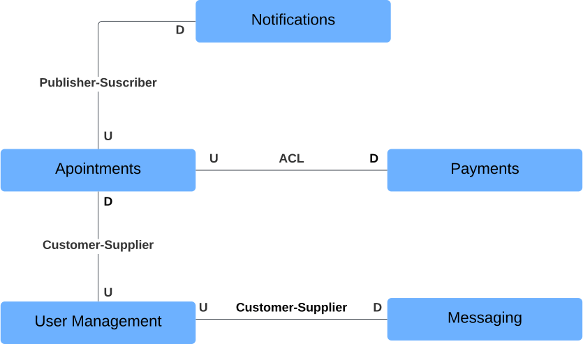
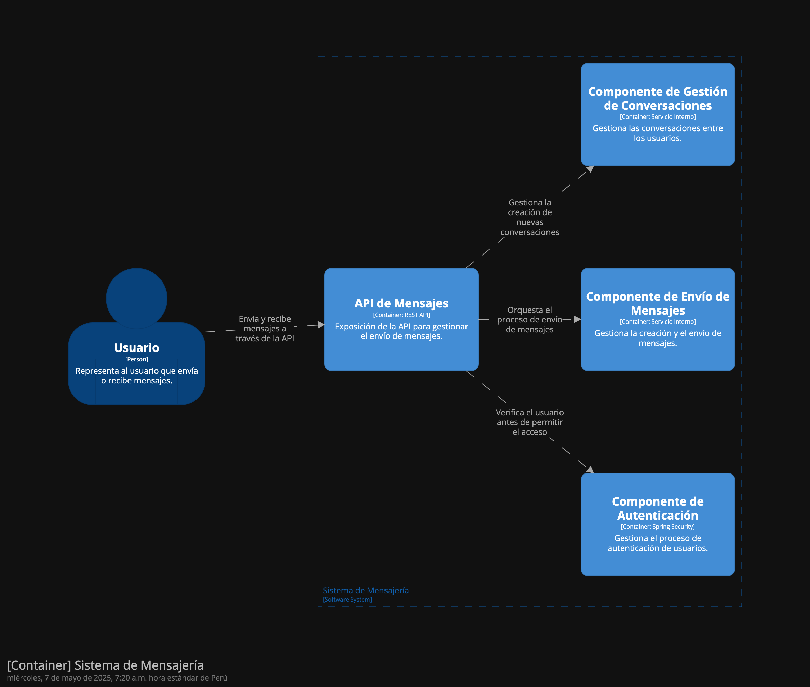
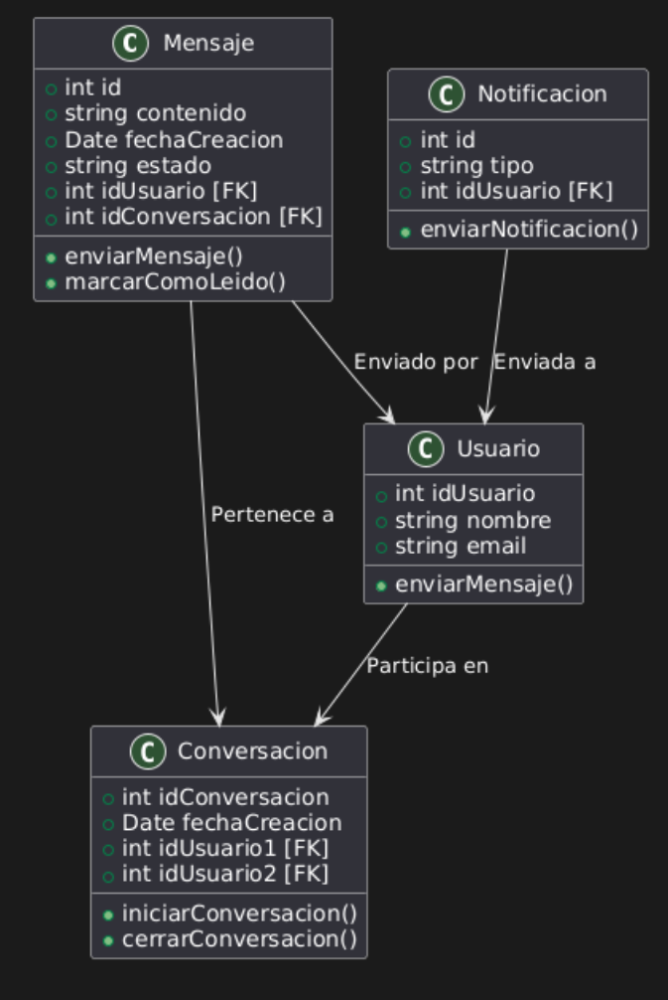
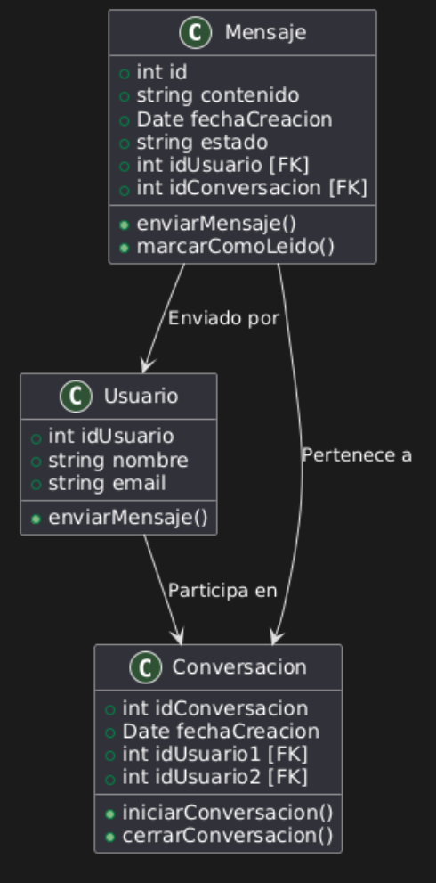
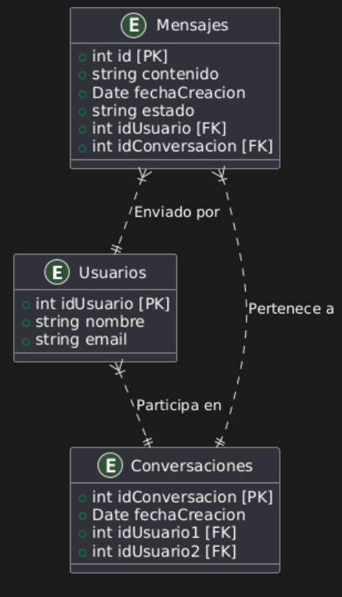

# COURSE PROJECT

---

    <strong>Universidad Peruana de Ciencias Aplicadas (UPC)</strong>     
    </img> 
    <strong>Carrera de Ingeniería de Software - Ciclo VI</strong>  
    <strong>Aplicaciones para Dispositivos Móviles - 1ACC0238</strong> 
     <strong>Profesor: Eduardo Martin Reyes Rodriguez</strong> 
     <strong><b>INFORME DEL TRABAJO FINAL</strong></b> 

    <strong>Startup del Proyecto: SafeGroup</strong> 
    <strong>Producto: SafeChild</strong> 

    <h3 align="center">Team Members:</h3>

    <table align="center">
        <tr>
            <th style="text-align:center;">Member</th>
            <th style="text-align:center;">Code</th>
        </tr>
        <tr>
            <td>Bernaola Pérez, André Arturo</td>
            <td>U202114192 </td>
        </tr>
        <tr>
            <td>Gutierrez Garcia, Jose Eduardo</td>
            <td>U202221518</td>
        </tr>
        <tr>
            <td>Sanchez Ignacio, Jefrey Martin</td>
            <td>U202113324</td>
        </tr>
        <tr>
            <td>Velarde Luyo, Piero Alberto</td>
            <td>U20211A620</td>
        </tr>
    </table>
    

</body>

 <strong>2025-01</strong>

 

---
# Registro de Versiones del Informe

| Versión | Fecha | Autor | Descripción de la modificación |
|----|----|----|----|
| TB1 | 25/04/2025 | SafeGroup | Redacción de los Capítulos I: Presentación, II: Requirements Elicitation & Analysis, III: Requirements Specification, IV: Solution Software Design. |

# Project Report Collaboration Insights

**TB1**: Las tareas correspondientes a la TB1 han sido completadas y están debidamente documentadas en el repositorio de GitHub para SafeGroup-Report. Puedes acceder al repositorio a través del siguiente enlace: [https://github.com/upc-pre-202501-1acc0238-356-SafeGroup/SafeGroup-report.git](https://github.com/upc-pre-202501-1acc0238-356-SafeGroup/SafeGroup-report.git)

Durante la fase de elaboración del informe, se realizaron las siguientes actividades:

- Se crearon y redactaron los contenidos asignados a cada miembro utilizando formato Markdown, y se realizaron "Conventional Commits" para registrar el progreso en el repositorio.

-  Se generaron los recursos necesarios y agregaron las imagenes al repositorio en la carpeta "assets" en cada rama del informe.

- Se organizaron reuniones para coordinar el avance de los componentes del informe y para proporcionar actualizaciones sobre los progresos del Sprint 1, que se centró en el desarrollo del diseño del software.  

# Contenido
## Tabla de contenidos
- [**Registro de Versiones del Informe**](#registro-de-versiones-del-informe)
- [**Project Report Collaboration Insights**](#project-report-collaboration-insights)
- [**Contenido**](#contenido)
    - [Tabla de contenidos](#tabla-de-contenidos)
- [**Student Outcome**](#student-outcome)
- [**Objetivos SMART**](#objetivos-smart)
- ## [ **Capítulo I: Introducción** ](#-capítulo-i-introducción-)
  - [**1.1. Startup Profile**](#11-startup-profile)
    - [**1.1.1. Descripción de la Startup**](#111-descripción-de-la-startup)
    - [**1.1.2. Perfiles de integrantes del equipo**](#112-perfiles-de-integrantes-del-equipo)
  - [**1.2. Solution Profile**](#12-solution-profile)
    - [**1.2.1 Antecedentes y problemática**](#121-antecedentes-y-problemática)
    - [What (¿Qué?)](#what-qué)
    - [Who (¿Quién?)](#who-quién)
    - [Where (¿Dónde?)](#where-dónde)
    - [When (¿Cuándo?)](#when-cuándo)
    - [Why (¿Por qué?)](#why-por-qué)
    - [How (¿Cómo?)](#how-cómo)
    - [How much (¿Cuánto?)](#how-much-cuánto)
    - [**1.2.2 Lean UX Process**](#122-lean-ux-process)
    - [**1.2.2.1. Lean UX Problem Statements**](#1221-lean-ux-problem-statements)
    - [**1.2.2.2. Lean UX Assumptions**](#1222-lean-ux-assumptions)
    - [**1.2.2.3. Lean UX Hypothesis Statements**](#1223-lean-ux-hypothesis-statements)
    - [**1.2.2.4. Lean UX Canvas**](#1224-lean-ux-canvas)
  - [**1.3. Segmentos objetivo**](#13-segmentos-objetivo)
- ## [ **Capítulo II: Requirements Elicitation \& Analysis**](#-capítulo-ii-requirements-elicitation--analysis)
  - [**2.1. Competidores**](#21-competidores)
    - [**2.1.1. Análisis competitivo**](#211-análisis-competitivo)
    - [**2.1.2. Estrategias y tácticas frente a competidores**](#212-estrategias-y-tácticas-frente-a-competidores)
  - [**2.2. Entrevistas**](#22-entrevistas)
    - [**2.2.1. Diseño de entrevistas**](#221-diseño-de-entrevistas)
    - [**2.2.2. Registro de entrevistas**](#222-registro-de-entrevistas)
    - [**2.2.3. Análisis de entrevistas**](#223-análisis-de-entrevistas)
  - [**2.3. Needfinding**](#23-needfinding)
    - [**2.3.1. User Personas**](#231-user-personas)
    - [**2.3.2. User Task Matrix**](#232-user-task-matrix)
    - [**2.3.3. User Journey Mapping**](#233-user-journey-mapping)
    - [**2.3.4. Empathy Mapping**](#234-empathy-mapping)
    - [**2.3.5. As-is Scenario Mapping**](#235-as-is-scenario-mapping)
  - [**2.4. Ubiquitous Language**](#24-ubiquitous-language)
- ## [ **Capítulo III: Requirements Specification**](#-capítulo-iii-requirements-specification)
  - [**3.1. To-Be Scenario Mapping**](#31-to-be-scenario-mapping)
  - [**3.2. User Stories**](#32-user-stories)
  - [**3.3. Impact Mapping**](#33-impact-mapping)
  - [**3.4. Product Backlog**](#34-product-backlog)
- ## [**Capítulo IV: Solution Software Design**](#capítulo-iv-solution-software-design)
  - [**4.1. Strategic-Level Domain-Driven Design**](#41-strategic-level-domain-driven-design)
    - [**4.1.1. EventStorming**](#411-eventstorming)
      - [**4.1.1.1. Candidate Context Discovery**](#4111-candidate-context-discovery)
      - [**4.1.1.2. Domain Message Flows Modeling**](#4112-domain-message-flows-modeling)
      - [**4.1.1.3. Bounded Context Canvases**](#4113-bounded-context-canvases)
  - [**4.1.2. Context Mapping**](#412-context-mapping)
  - [**4.1.3. Software Architecture.**](#413-software-architecture)
      - [**4.1.3.1. Software Architecture Context Level Diagrams.**](#4131-software-architecture-context-level-diagrams)
      - [**4.1.3.2. Software Architecture Container Level Diagrams.**](#4132-software-architecture-context-level-diagrams)
      - [**4.1.3.3. Software Architecture Deploymnet Diagrams.**](#4133-software-architecture-deploymnet-diagrams)
  - [**4.2.Tactical-Level Domain-Driven Design**](#42-tactical-level-domain-driven-design)
    - [**4.2.1. Bounded Context: Bounded Context: User Managment**](#421-bounded-context:-user-managment)
      - [**4.2.1.1. Domain Layer**](#4211-domain-layer)
      - [**4.2.1.2. Interface Layer**](#4212-interface-layer)
      - [**4.2.1.3. Application Layer**](#4213-application-layer)
      - [**4.2.1.4. Infrastructure Layer**](#4214-infrastructure-layer)
      - [**4.2.1.5. Bounded Context Software Architecture Component Level Diagrams**](#4215-bounded-context-software-architecture-component-level-diagrams)
      - [**4.2.1.6. Bounded Context Software Architecture Code Level Diagrams**](#4216-bounded-context-software-architecture-code-level-diagrams)
        - [**4.2.1.6.1. Bounded Context Domain Layer Class Diagrams**](#42161-bounded-context-domain-layer-class-diagrams)
        - [**4.2.1.6.2. Bounded Context Database Design Diagram**](#42162-bounded-context-database-design-diagram)
    - [**4.2.2. Bounded Context: Bounded Context: Payments**](#422-bounded-context:payments)
      - [**4.2.2.1. Domain Layer**](#4221-domain-layer)
      - [**4.2.2.2. Interface Layer**](#4222-interface-layer)
      - [**4.2.2.3. Application Layer**](#4223-application-layer)
      - [**4.2.2.4. Infrastructure Layer**](#4224-infrastructure-layer)
      - [**4.2.2.5. Bounded Context Software Architecture Component Level Diagrams**](#4225-bounded-context-software-architecture-component-level-diagrams)
      - [**4.2.2.6. Bounded Context Software Architecture Code Level Diagrams**](#4226-bounded-context-software-architecture-code-level-diagrams)
        - [**4.2.2.6.1. Bounded Context Domain Layer Class Diagrams**](#42261-bounded-context-domain-layer-class-diagrams)
        - [**4.2.2.6.2. Bounded Context Database Design Diagram**](#42262-bounded-context-database-design-diagram)
    - [**4.2.3. Bounded Context: Bounded Context: Appoiments**](#423-bounded-context:-appoiments)
      - [**4.2.3.1. Domain Layer**](#4231-domain-layer)
      - [**4.2.3.2. Interface Layer**](#4232-interface-layer)
      - [**4.2.3.3. Application Layer**](#4233-application-layer)
      - [**4.2.3.4. Infrastructure Layer**](#4234-infrastructure-layer)
      - [**4.2.3.5. Bounded Context Software Architecture Component Level Diagrams**](#4235-bounded-context-software-architecture-component-level-diagrams)
      - [**4.2.3.6. Bounded Context Software Architecture Code Level Diagrams**](#4236-bounded-context-software-architecture-code-level-diagrams)
        - [**4.2.3.6.1. Bounded Context Domain Layer Class Diagrams**](#42361-bounded-context-domain-layer-class-diagrams)
        - [**4.2.3.6.2. Bounded Context Database Design Diagram**](#42362-bounded-context-database-design-diagram)
    - [**4.2.4. Bounded Context: Bounded Context: Messaging**](#424-bounded-context:-messaging)
      - [**4.2.4.1. Domain Layer**](#4241-domain-layer)
      - [**4.2.4.2. Interface Layer**](#4242-interface-layer)
      - [**4.2.4.3. Application Layer**](#4243-application-layer)
      - [**4.2.4.4. Infrastructure Layer**](#4244-infrastructure-layer)
      - [**4.2.4.5. Bounded Context Software Architecture Component Level Diagrams**](#4245-bounded-context-software-architecture-component-level-diagrams)
      - [**4.2.4.6. Bounded Context Software Architecture Code Level Diagrams**](#4246-bounded-context-software-architecture-code-level-diagrams)
        - [**4.2.4.6.1. Bounded Context Domain Layer Class Diagrams**](#42461-bounded-context-domain-layer-class-diagrams)
        - [**4.2.4.6.2. Bounded Context Database Design Diagram**](#42462-bounded-context-database-design-diagram)
- ## [**Capítulo V: Solution UI/UX Design**](#capítulo-v-solution-ui/ux-design)
  - [**5.1. Product Design**](#51-product-design)
    - [**5.1.1. Style Guidelines**](#511-style-guidelines)
      - [**5.1.1.1. General Style Guidelines**](#5111-general-style-guidelines)
    - [**5.1.2. Information Architecture**](#512-information-architecture)
      - [**5.1.2.1. Organization Systems**](#5121-organization-systems)
      - [**5.1.2.2. Labeling Systems**](#51212-labeling-systems)
      - [**5.1.2.3. SEO Tags and Meta Tags**](#51213-seo-tags-and-meta-tags)
      - [**5.1.2.4. Searching Systems**](#51214-searching-systems)
      - [**5.1.2.5. Navigation Systems**](#51215-navigation-systems)
    - [**5.1.3. Landing Page UI Design**](#513-landing-page-ui-design)
      - [**5.1.3.1. Landing Page Wireframe**](#5131-landing-page-wireframe)
      - [**5.1.3.2. Landing Page Mock-up**](#5132-landing-page-mock-up)
    - [**5.1.4. Mobile Applications UX/UI Design**](#514-mobile-applications-uxui-design)
    - [**5.1.4.1. Mobile Applications Wireframes**](#5141-mobile-applications-wireframes)
    - [**5.1.4.2. Mobile Applications Wireflow Diagrams**](#5142-mobile-applications-wireflow-diagrams)
    - [**5.1.4.3. Mobile Applications Mock-ups**](#5143-mobile-applications-mock-ups)
    - [**5.1.4.4. Mobile Applications User Flow Diagrams**](#5144-mobile-applications-user-flow-diagrams)
    - [**5.1.4.5. Mobile Applications Prototyping**](#5145-mobile-applications-prototyping)
- ## [**Capítulo VI: Product Implementation, Validation & Deployment**](#capítulo-vi-product-implementation-validation-&-deployment)
  - [**6.1. Software Configuration Management**](#61-software-configuration-management)
    - [**6.1.1. Software Development Environment Configuration**](#611-software-development-environment-configuration)
    - [**6.1.2. Source Code Management**](#612-source-code-management)
    - [**6.1.3. Source Code Style Guide & Conventions**](#613-source-code-style-guide--conventions)
    - [**6.1.4. Software Deployment Configuration**](#614-software-deployment-configuration)
  - [**6.2. Landing Page, Services & Mobile Application Implementation**](#52-landing-page-services--mobile-application-implementation)
    - [**6.2.1. Sprint 1**](#621-sprint-1)
    - [**6.2.1.1. Sprint Planning 1**](#6211-sprint-planning-1)
    - [**6.2.1.2. Sprint Backlog 1**](#6212-sprint-backlog-1)
    - [**6.2.1.3. Development Evidence for Sprint Review**](#6213-development-evidence-for-sprint-review)
    - [**6.2.1.4. Testing Suite Evidence for Sprint Review**](#6214-testing-suite-evidence-for-sprint-review)
    - [**6.2.1.5. Execution Evidence for Sprint Review**](#6215-execution-evidence-for-sprint-review)
    - [**6.2.1.6. Services Documentation Evidence for Sprint Review**](#6216-services-documentation-evidence-for-sprint-review)
    - [**6.2.1.7. Software Deployment Evidence for Sprint Review**](#6217-software-deployment-evidence-for-sprint-review)
    - [**6.2.1.8. Team Collaboration Insights during Sprint**](#6218-team-collaboration-insights-during-sprint)
- [**Conclusiones**](#conclusiones)
- [**Conclusiones y recomendaciones**](#conclusiones-y-recomendaciones)
- [**Bibliografía**](#bibliografía)
- [**Anexos**](#anexos)

# Student Outcome

| Criterio específico | Acciones realizadas | Conclusiones |
|----|----|----|
|Actualiza conceptos y conocimientos necesarios para su desarrollo profesional y en especial para su proyecto en soluciones de software.| **Bernaola Pérez, André Arturo** *TB1* TEXTO.  **Gutierrez Garcia, Jose Eduardo** *TB1* TEXTO  **Sanchez Ignacio, Jefrey Martin** *TB1* TEXTO.    **Velarde Luyo, Piero Alberto** *TB1* TEXTO. | TB1:   TEXTO.|

| Criterio específico | Acciones realizadas | Conclusiones |
|----|----|----|
|Reconoce la necesidad del aprendizaje permanente para el desempeño profesional y el desarrollo de proyectos en soluciones de software.|**Bernaola Pérez, André Arturo** *TB1* TEXTO.  **Gutierrez Garcia, Jose Eduardo** *TB1* TEXTO  **Sanchez Ignacio, Jefrey Martin** *TB1* TEXTO.    **Velarde Luyo, Piero Alberto** *TB1* TEXTO. | TB1:   TEXTO.|

----

# Objetivos SMART

----

# Capítulo I: Introducción

## 1.1. Startup Profile

### 1.1.1. Descripción de la Startup  
### 1.1.2. Perfiles de integrantes del equipo  

## 1.2. Solution Profile

### 1.2.1. Antecedentes y problemática  
### 1.2.2. Lean UX Process  
#### 1.2.2.1. Lean UX Problem Statements  
#### 1.2.2.2. Lean UX Assumptions  
#### 1.2.2.3. Lean UX Hypothesis Statements  
#### 1.2.2.4. Lean UX Canvas  

## 1.3. Segmentos objetivo  

----

# Capítulo II: Requirements Elicitation & Analysis

## 2.1. Competidores  
### 2.1.1. Análisis competitivo  
### 2.1.2. Estrategias y tácticas frente a competidores  

## 2.2. Entrevistas  
### 2.2.1. Diseño de entrevistas  
### 2.2.2. Registro de entrevistas  
### 2.2.3. Análisis de entrevistas  

## 2.3. Needfinding  
### 2.3.1. User Personas  
### 2.3.2. User Task Matrix  
### 2.3.3. User Journey Mapping  
### 2.3.4. Empathy Mapping  
### 2.3.5. As-is Scenario Mapping  

## 2.4. Ubiquitous Language  

----

# Capítulo III: Requirements Specification

## 3.1. To-Be Scenario Mapping  
## 3.2. User Stories  
## 3.3. Product Backlog  
## 3.4. Impact Mapping

----

## Capítulo IV: Product Design

## 4.1. Strategic-Level Domain-Driven Design

### 4.1.1. EventStorming
Durante la sesión de Event Storming, el equipo de desarrollo llevó a cabo una reunión en la que compartimos propuestas sobre las funciones y características que debería tener el proyecto. A lo largo del encuentro, se establecieron diversas ideas para la plataforma, así como los primeros esbozos de los bounded context.

- **Step 01: Collect Domain Events**

   En esta etapa inicial, el equipo recopiló los eventos de dominio a partir de conversaciones colaborativas, centrándose en acciones clave que ocurren dentro del sistema, como "Solicitud de servicio creada", "Solicitud aceptada" o "Pago confirmado". Estos eventos representan hechos importantes que tienen significado dentro del negocio y sirven como base para entender cómo fluye la información entre los distintos actores del sistema.

  

- **Step 02: Timelines**

   En esta fase, los eventos detectados se organizaron en conjuntos jerarquizados, donde cada conjunto fue liderado por un evento principal que representa la funcionalidad central del grupo. Se distinguieron flujos exitosos (happy paths) que reflejan interacciones óptimas, así como flujos alternos o fallidos (unhappy paths) que visibilizan posibles fricciones en el proceso. Esta estructuración permitió entender con mayor claridad la lógica temporal del sistema.
  
- **Step 03: Pain Points**
  
   Aquí se identificaron los puntos críticos donde los usuarios —tanto cuidadores como padres— podrían enfrentar dificultades al interactuar con la plataforma. Estos insights resultan fundamentales para replantear procesos y mejorar la usabilidad general del sistema.
  
- **Step 04: Pivotal Points**

   Se destacaron eventos que representan momentos determinantes en el flujo de interacción, ya sea por su impacto en la toma de decisiones, validación de acuerdos o activación de funcionalidades relevantes. Estos eventos ayudan a centrar la atención en aspectos esenciales del comportamiento del sistema.
  
- **Step 05 & 6: Commands and Polices**

   Durante esta fase, se establecieron los comandos que desencadenan los eventos dentro del sistema, así como las políticas que regulan su ejecución. Cada comando fue vinculado a un actor específico (como un padre de familia o un cuidador) y se definieron las condiciones bajo las cuales dichos comandos pueden ser ejecutados. Estas políticas incluyeron validaciones de negocio, restricciones de acceso y reglas que aseguran la integridad de las operaciones, como verificar la disponibilidad del cuidador antes de confirmar una solicitud o validar los datos antes de generar un pago. Esta combinación permitió comprender tanto la intención detrás de cada acción como las reglas que la gobiernan.
  
- **Step 07: Read /View Models**

   Se diseñaron modelos de consulta para exponer la información relevante a cada tipo de usuario. Estos modelos fueron pensados para optimizar el acceso a datos como historiales de servicios, disponibilidad de cuidadores o solicitudes pendientes, garantizando eficiencia y claridad.
  
- **Step 08: External Systems**

   Se identificó un sistema externo con el que será necesario integrar la plataforma, el servicio externo a considerar es stripe, nos brindará interfaces con funcionalidades de pasarelas de pago. Se definieron también las interfaces necesarias para lograr una integración fluida y segura.
  
- **Step 09: Aggregates**

   Se definieron agregados que agrupan entidades relacionadas en torno a transacciones coherentes, asegurando consistencia en operaciones como la creación de contratos, evaluaciones del servicio o gestión de perfiles. Estos agregados estructuran el dominio de manera robusta frente a cambios o escalabilidad.
  

### 4.1.1.1. Candidate Context Discovery
Para este punto decidimos identificar los valores principales de la aplicación móvil lo que, por consecuencia, nos dió una mayor claridad.

**Identificación de Valores del Negocio**

El desarrollo de la aplicación móvil tiene como propósito principal facilitar la conexión entre padres de familia y cuidadores de confianza para la atención de sus hijos. En este contexto, se han identificado los siguientes valores clave del negocio:

- Confianza y seguridad en el servicio: Se busca garantizar que los usuarios, tanto padres como cuidadores, cuenten con una plataforma segura y confiable, donde el proceso de verificación de identidades, historial y reputación sea claro y transparente.
- Facilidad en la gestión de citas: El sistema debe permitir que la programación, modificación y seguimiento de citas se realicen de manera eficiente e intuitiva, reduciendo la fricción en la coordinación entre usuarios.
- Eficiencia en el proceso de pagos: Se promueve una experiencia fluida al momento de realizar transacciones por los servicios, incluyendo la automatización de pagos, confirmaciones y reportes financieros.
- Comunicación efectiva: Facilitar la interacción entre padres y cuidadores, especialmente una vez que se ha confirmado una cita, es esencial para asegurar una buena experiencia de usuario y una atención adecuada.
- Experiencia de usuario optimizada: La aplicación debe brindar una interfaz amigable, accesible y centrada en las necesidades de los usuarios, priorizando la rapidez y claridad en cada proceso.

**Identificación de Funcionalidades Clave**

Las funcionalidades esenciales que contribuyen directamente a la entrega de los valores de negocio anteriormente mencionados son las siguientes:

- Gestión de usuarios (User Management): Registro, autenticación y validación de usuarios (padres y cuidadores), incluyendo verificación de identidad y roles.
- Agenda de citas (Appointments): Creación, aceptación, rechazo y programación de citas, permitiendo la visualización y administración de agendas personalizadas.
- Sistema de notificaciones (Notifications): Envío automático de recordatorios, confirmaciones y alertas relevantes respecto a citas y mensajes.
- Gestión de pagos (Payments): Procesamiento seguro de pagos, registro de transacciones y aplicación de tarifas según el servicio ofrecido.
- Mensajería interna (Messaging): Canal de comunicación en tiempo real entre padres y cuidadores, habilitado solo cuando existe una cita aceptada, promoviendo la coordinación y confianza.

**Candidate para Bounded Context: User Management**

Este contexto está enfocado en gestionar el ciclo de vida de los usuarios dentro de la aplicación, incluyendo tanto a los padres de familia como a los cuidadores. Se encarga del proceso de registro, validación de identidad y administración de roles, asegurando una experiencia segura y personalizada según el tipo de usuario.

Posibles responsabilidades del Bounded Context:

- Gestionar el registro y autenticación de nuevos usuarios.
- Validar la identidad de los cuidadores mediante documentos o procesos adicionales de verificación.
- Administrar los roles y permisos según el tipo de usuario (padre o cuidador).
- Implementar estándares de seguridad para el acceso, como autenticación con tokens JWT.

**Candidate para Bounded Context: Notifications**

Este contexto está encargado de gestionar todas las notificaciones relevantes del sistema, especialmente aquellas relacionadas con la creación, actualización o cancelación de citas. Asegura que los usuarios estén informados de eventos importantes en tiempo real.

Posibles responsabilidades del Bounded Context:

- Enviar notificaciones push sobre citas creadas, modificadas o canceladas.
- Gestionar la configuración de notificaciones personalizadas por usuario.
- Integrarse con el sistema de citas y el sistema de mensajería para alertar sobre mensajes nuevos o recordatorios.
- Monitorear la entrega y recepción de notificaciones para garantizar la comunicación efectiva.

**Candidate para Bounded Context: Payments**

Este contexto gestiona el proceso de pago entre padres y cuidadores por los servicios acordados en una cita. Se encarga de validar transacciones, aplicar comisiones y mantener un historial financiero confiable.

Posibles responsabilidades del Bounded Context:

- Procesar pagos seguros a través de plataformas externas (como Stripe).
- Registrar el estado de pagos: pendiente, realizado, fallido o reembolsado.
- Aplicar políticas de tarifas y comisiones según el tipo de servicio o duración de la cita.
- Generar reportes financieros y comprobantes de pago para los usuarios.

**Candidate para Bounded Context: Appointments**

Este contexto centraliza la lógica relacionada a la gestión de citas, incluyendo su creación, aceptación, rechazo y programación. Asegura que tanto padres como cuidadores tengan control y visibilidad sobre sus agendas.

Posibles responsabilidades del Bounded Context:

- Permitir la creación y solicitud de nuevas citas por parte de los padres.
- Gestionar las respuestas de los cuidadores (aceptación o rechazo).
- Coordinar los horarios y disponibilidad de ambas partes.
- Registrar el estado de cada cita y su historial asociado.

**Candidate para Bounded Context: Messaging**

Este contexto habilita la comunicación directa entre padres y cuidadores únicamente cuando una cita ha sido aceptada, promoviendo la coordinación y confianza entre las partes.

Posibles responsabilidades del Bounded Context:

- Proveer un sistema de mensajería en tiempo real dentro de la aplicación.
- Activar el canal de comunicación únicamente para citas aceptadas.
- Almacenar el historial de mensajes por cita, asegurando la privacidad y trazabilidad.
- Notificar sobre mensajes nuevos mediante el sistema de notificaciones.

La siguiente image muestra la vista general de los bounded contexts.

### 4.1.1.2. Domain Message Flows Modeling

Una vez definidos los Bounded Contexts en la etapa previa, el equipo llevó a cabo una sesión de Domain Storytelling con el objetivo de modelar la interacción entre estos contextos para abordar distintos escenarios del negocio. Esta metodología facilitó una comprensión clara de los flujos de comunicación entre contextos, así como del comportamiento esperado del sistema desde el punto de vista de los usuarios. Durante la sesión, se enfocaron principalmente en el análisis de dos casos de uso significativos.

**Usuario:**
Usuario Final

**Scenario:**
El usuario desea iniciar sesión en la plataforma.

**Explicación del proceso**

El flujo de inicio de sesión permite que el usuario autentique sus credenciales y obtenga acceso a la aplicación. Primero, el usuario ingresa su información en la interfaz; luego la app la envía al servicio IAM, que a su vez valida la información contra su base de datos. Si las credenciales son correctas, el servicio IAM devuelve un token y los datos de usuario autenticado, y la aplicación muestra la pantalla principal al usuario.

**Identificación de Actores**

- Usuario (actor principal)

- Aplicación Web/Móvil (interfaz de usuario)

- Servicio de Autenticación (IAM) (gestiona credenciales y emite tokens)

- Base de Datos de Usuarios (almacena credenciales y roles)

**Explicación del escenario**

Este diagrama modela el proceso de inicio de sesión en la plataforma:

El Usuario ingresa sus credenciales en la Aplicación.

La Aplicación envía un AuthRequest al Servicio IAM, que delega la validación al almacén de usuarios.

La Base de Datos de Usuarios responde si las credenciales son válidas.

El Servicio IAM construye un AuthResponse con un token y los datos de usuario autenticado.

La Aplicación muestra el resultado al Usuario, permitiéndole acceder si la autenticación fue exitosa.

**Usuario:**
Usuario (Cliente que desea reservar una niñera)

**Scenario:**
El usuario desea reservar una niñera a través de la aplicación móvil.

**Explicación del proceso**

El usuario introduce la fecha y hora que necesita el servicio de niñera en la app. La aplicación envía esa información al backend, que consulta la base de datos para filtrar niñeras disponibles. A continuación muestra las opciones al usuario, permite que seleccione una niñera y confirma su disponibilidad. Si es necesario, procesa el pago y finalmente notifica al usuario con los detalles finales de la reserva.

**Identificación de Actores**

- Usuario (cliente que reserva)

- Aplicación Móvil (interfaz de usuario)

- Backend (servicio de mensajería interna y lógica de negocio)

- Base de Datos (almacena disponibilidad y reservas)

- Sistema de Pagos (procesa el cobro)

**Definición de los eventos y mensajes clave**

1. RequestAvailability

Origen: Usuario

Destino: Aplicación Móvil

Datos:
- Fecha
- Hora

2. AvailabilityRequest

Origen: Aplicación Móvil

Destino: Backend

Datos:
- Fecha
- Hora

3. FilterBabysitters

Origen: Backend

Destino: Base de Datos

Datos:
- Fecha
- Hora

4. AvailableBabysittersList

Origen: Backend

Destino: Aplicación Móvil

Datos:
- [ { NiñeraID, Nombre, Experiencia, Precio }… ]

5. BookingRequest

Origen: Aplicación Móvil

Destino: Backend

Datos:
- UsuarioID
- NiñeraID
- Fecha
- Hora

6. ConfirmAvailability

Origen: Backend

Destino: Base de Datos

Datos:
- NiñeraID
- Fecha
- Hora

7. AvailabilityConfirmed

Origen: Backend

Destino: Aplicación Móvil

Datos:
- ReservaID
- Estado: “confirmada”

**Explicación del escenario**

Este diagrama modela detalladamente cómo viaja la información desde que el Usuario solicita niñeras disponibles hasta que recibe la confirmación de reserva. Muestra claramente:

Solicitud de disponibilidad

Filtrado de niñeras en la base de datos

Selección y confirmación de reserva

Procesamiento del pago

Notificación final con todos los detalles

**Usuario:**
Tutor

**Scenario:**
Comunicación entre Tutor y Cuidador a través de la plataforma.

**Explicación del proceso**

El Tutor, ya autenticado en la aplicación móvil, accede a la función de mensajería para iniciar o continuar una conversación con un Cuidador. La app solicita al backend el historial de mensajes, lo muestra al Tutor y le permite redactar y enviar nuevos mensajes. Cada envío se guarda en la base de datos y dispara una notificación al Cuidador, quien a su vez recibe el aviso y puede responder en tiempo real.

**Identificación de Actores**
 - Tutor (actor principal)

- Aplicación Móvil (interfaz de usuario)

- Servicio de Mensajería (Backend) (gestiona persistencia y distribución)

- Base de Datos (almacena los mensajes)

- Servicio de Notificaciones (envía alertas push/in-app)

- Cuidador (receptor y emisor de respuestas)

**Definición de los eventos y mensajes clave**
1. RequestConversations

Origen: Aplicación Móvil

Destino: Servicio de Mensajería

Datos:
 - TutorID

 2. ConversationsList

Origen: Servicio de Mensajería

Destino: Aplicación Móvil

Datos: 
- [ { CuidadorID, MensajesPrevios… } ]

3. SendMessage

Origen: Aplicación Móvil

Destino: Servicio de Mensajería

Datos:
- TutorID
- CuidadorID
- Contenido

4. SaveMessage

Origen: Servicio de Mensajería

Destino: Base de Datos

Datos:
- MensajeID
- TutorID
- CuidadorID
- Contenido
- Timestamp

5. NotifyCaregiver

Origen: Servicio de Mensajería

Destino: Servicio de Notificaciones

Datos:
- CuidadorID
- MensajeID
- PushPayload

6. NotificationReceived

Origen: Servicio de Notificaciones

Destino: Cuidador

Datos:
- MensajeID

**Explicación del escenario**

Este modelo de flujos documenta cómo el Tutor y el Cuidador intercambian mensajes de forma fiable y en tiempo real. Permite entender qué componentes intervienen (app, backend, base de datos, notificaciones), qué datos viajan en cada paso y cómo se detona la alerta al Cuidador para mantener siempre activa la comunicación bidireccional.

### 4.1.1.3. Bounded Context Canvases

#### **User Management**
**Explicación de diseño:**  
El diseño del bounded context de User Management se basa en la gestión de identidad y acceso (Identity & Access Management). Este contexto es esencial para administrar usuarios, manejar la autenticación, autorización y control de acceso dentro del sistema. Es fundamental para garantizar la seguridad y privacidad de los datos de la plataforma. Separar esta funcionalidad permite una mejor modularidad y escalabilidad del sistema, facilitando además la implementación de políticas de seguridad robustas.

**Propósito (Purpose):**  
El objetivo principal de este contexto es administrar la creación, registro y autenticación de usuarios en la plataforma, asegurando que los usuarios puedan acceder de manera segura y conforme a las políticas definidas.

**Clasificación Estratégica (Strategic Classification):**
- Dominio: generic
- Modelo de Negocio: compliance
- Evolución: product

**Roles del Dominio (Domain Roles):**  
Execution Context

**Comunicación Entrante (Inbound Communication):**
- **Colaborador principal:** Mobile UI
    - Mensajes:
        - `Usuario Creado`
        - `Usuario Registrado`
        - `Usuario Autenticado`

**Comunicación Saliente (Outbound Communication):**
- Mensajes:
    - `Usuario Creado`
    - `Usuario Autenticado`
- Colaboradores: Messaging, Appointments, Payments

**Lenguaje Ubicuo (Ubiquitous Language):**
- **User:** Persona que se registra en la plataforma, ya sea como padre de familia o cuidador.
- **Autenticación:** Proceso de verificar la identidad de un usuario que accede al sistema, generalmente mediante credenciales.

**Decisiones de Negocio (Business Decisions):**
- “El usuario no puede solicitar servicios hasta haber completado una verificación de identidad.”
- “El token de sesión expira tras 72 horas de inactividad.”
- “Solo los roles ‘Cuidador’ y ‘Padres’ pueden acceder a funcionalidades específicas.”

**Suposiciones (Assumptions):**
- Todos los usuarios deben pasar por un proceso de autenticación seguro antes de interactuar con otras funcionalidades.
- Los roles de usuario determinan los accesos permitidos en el sistema.

**Métricas de Verificación (Verification Metrics):**
- Número de usuarios registrados y autenticados exitosamente.
- Tasa de expiración de tokens por inactividad.

#### **Appointments**

**Explicación de diseño:**  
El contexto de Appointments está diseñado para orquestar todo el ciclo de vida de una cita de cuidado: desde la solicitud inicial hasta su aceptación, rechazo o cancelación. Su responsabilidad principal es gestionar la disponibilidad de los cuidadores y sincronizar los estados de las solicitudes con el resto de la plataforma. Al separarlo como un bounded context independiente, se garantiza que la lógica de agenda sea modular, escalable y susceptible de evolucionar sin afectar otros componentes.

**Propósito (Purpose):**  
Facilitar la creación, aceptación, rechazo y seguimiento de citas de cuidado entre padres y cuidadores.

**Clasificación Estratégica (Strategic Classification):**
- Dominio: core
- Modelo de Negocio: engagement
- Evolución: custom built

**Roles del Dominio (Domain Roles):**  
Draft Context

**Comunicación Entrante (Inbound Communication):**
- **Colaborador principal:** Web/Mobile UI
    - Mensajes:
        - `Crear cita`
        - `Aceptar cita`
        - `Cancelar cita`

**Comunicación Saliente (Outbound Communication):**
- Mensajes:
    - `Cita creada`
    - `Cita aceptada`
    - `Cita cancelada`
- Colaboradores: Notifications, Messaging, Payments

**Lenguaje Ubicuo (Ubiquitous Language):**
- **Cita:** Solicitud de cuidado en una fecha y franja horaria concreta.
- **Disponibilidad:** Horarios libres declarados por el cuidador.
- **Estado de cita:** “pendiente”, “aceptada” o “cancelada”.

**Decisiones de Negocio (Business Decisions):**
- “No se puede aceptar una cita fuera del horario definido por el cuidador.”
- “Al aceptar una cita, se habilita el canal de mensajería entre padre y cuidador.”
- “Cancelar una cita con menos de 24 h de antelación genera penalización.”

**Suposiciones (Assumptions):**
- Los cuidadores actualizan su disponibilidad en su perfil.
- Los padres pueden reservar con hasta 7 días de antelación.
- Cada franja horaria admite una única cita por cuidador.

**Métricas de Verificación (Verification Metrics):**
- Número de citas creadas por semana.
- Tasa de aceptación de citas.
- Porcentaje de cancelaciones.

APPOINTMENTS
#### **Notifications**

**Explicación de diseño:**  
Notifications se encarga de orquestar el envío de alertas y recordatorios a los usuarios, suscribiéndose a los eventos críticos generados por los demás contextos. Al implementarse como un bounded context autónomo, permite definir y evolucionar las reglas de notificación (canales, formatos, reintentos) sin interferir en la lógica de dominio principal.

**Propósito (Purpose):**  
Orquestar el envío de alertas y recordatorios a los usuarios sobre eventos críticos de la plataforma.

**Clasificación Estratégica (Strategic Classification):**
- Dominio: supporting
- Modelo de Negocio: engagement
- Evolución: commodity

**Roles del Dominio (Domain Roles):**  
Gateway Context

**Comunicación Entrante (Inbound Communication):**
- Appointments → `Cita creada`, `Cita aceptada`, `Cita cancelada`
- Messaging   → `Mensaje enviado`

**Comunicación Saliente (Outbound Communication):**
- Mensajes:
    - `Notificación enviada`
    - `Notificación fallida`
- Colaborador: Web/Mobile UI

**Lenguaje Ubicuo (Ubiquitous Language):**
- **Notificación:** Alerta push, email o SMS que informa de un evento.
- **Canal:** Medio de envío (push, email, SMS).
- **Preferencias de notificación:** Configuración de tipos y frecuencia por usuario.

**Decisiones de Negocio (Business Decisions):**
- “Solo se envían notificaciones para eventos críticos: nueva cita, mensaje o cancelación.”
- “Si falla el envío push, reintentar vía email hasta dos veces.”
- “El usuario puede desactivar notificaciones no críticas.”

**Suposiciones (Assumptions):**
- Cada usuario dispone de un token de dispositivo válido.
- Se utiliza un servicio externo (p. ej. FCM/APNs).
- Las preferencias se almacenan y aplican en tiempo real.

**Métricas de Verificación (Verification Metrics):**
- Tasa de entrega exitosa.
- Tasa de apertura (open rate).
- Tiempo medio de envío.

#### **Payments**

**Explicación de diseño:**  
El contexto de Payments abstrae la gestión de transacciones económicas mediante la integración con un gateway externo (Stripe). Su diseño como bounded context independiente protege la lógica de negocio de cobros y comisiones, permitiendo evolucionar políticas de tarifas y flujos de reembolso sin impactar otros dominios.

**Propósito (Purpose):**  
Procesar y validar transacciones económicas a través de un gateway externo, manteniendo historial y aplicando tarifas.

**Clasificación Estratégica (Strategic Classification):**
- Dominio: core
- Modelo de Negocio: revenue
- Evolución: product

**Roles del Dominio (Domain Roles):**  
Gateway Context

**Comunicación Entrante (Inbound Communication):**
- Appointments  → `Pago Procesado`
- Web/Mobile UI → `Pago confirmado`

**Comunicación Saliente (Outbound Communication):**
- Mensajes:
    - `Procesar pago`
    - `Confirmar pago`
- Colaboradores: Appointments, Web/Mobile UI

**Lenguaje Ubicuo (Ubiquitous Language):**
- **Transacción:** Intento de cobro a través de Stripe.
- **Estado de pago:** “pendiente”, “realizado”, “fallido” o “reembolsado”.
- **Tarifa:** Monto calculado según duración y tipo de servicio.

**Decisiones de Negocio (Business Decisions):**
- “El pago debe aprobarse antes de confirmar la cita como ‘aceptada’.”
- “Aplicar comisión del 5 % por gestión de plataforma.”
- “Reembolsos solo si la cancelación ocurre con > 24 h de antelación.”

**Suposiciones (Assumptions):**
- Integración activa con Stripe.
- Todas las transacciones en moneda local.
- Los reembolsos se procesan en < 48 h.

**Métricas de Verificación (Verification Metrics):**
- Tasa de éxito de transacciones.
- Tiempo medio de liquidación.
- Ingresos generados por periodo.

#### **Messaging**

**Explicación de diseño:**  
Messaging proporciona el canal de comunicación en tiempo real entre padres y cuidadores, habilitado únicamente tras la aceptación de una cita. Como bounded context separado, encapsula la lógica de chat (envío, reintentos, almacenamiento) y puede escalar o evolucionar el servicio de mensajería sin afectar la gestión de citas o notificaciones.

**Propósito (Purpose):**  
Habilitar y garantizar la comunicación en tiempo real entre padres y cuidadores una vez aceptada una cita.

**Clasificación Estratégica (Strategic Classification):**
- Dominio: supporting
- Modelo de Negocio: engagement
- Evolución: commodity

**Roles del Dominio (Domain Roles):**  
Analysis Context

**Comunicación Entrante (Inbound Communication):**
- Appointments    → `Activar canal de mensajería`
- Web/Mobile UI   → `Enviar mensaje`

**Comunicación Saliente (Outbound Communication):**
- Mensajes:
    - `Mensajes enviados`
    - `Mensajes fallidos`
- Colaboradores: Notifications, Web/Mobile UI

**Lenguaje Ubicuo (Ubiquitous Language):**
- **Mensaje:** Texto o multimedia enviado entre padre y cuidador.
- **Canal habilitado:** Chat disponible solo tras aceptación de cita.
- **Historial:** Registro cronológico de mensajes por cita.

**Decisiones de Negocio (Business Decisions):**
- “El chat solo se activa cuando la cita está en estado ‘aceptada’.”
- “Cada mensaje fallido se reintenta hasta 3 veces.”
- “Los mensajes se archivan tras 30 días.”

**Suposiciones (Assumptions):**
- Conexión WebSocket establecida durante la sesión.
- Historial almacenado en base de datos.
- Tamaño máximo de archivos adjuntos: 5 MB.

**Métricas de Verificación (Verification Metrics):**
- Mensajes intercambiados por cita.
- Tasa de fallos en envío de mensajes.
- Tiempo medio de respuesta del interlocutor.

### 4.1.2. Context Mapping
A partir del proceso de EventStorming se identificaron cinco bounded contexts: User Management, Appointments, Notifications, Payments y Messaging. Para definir sus interacciones, se optó por aplicar los siguientes patrones de integración:

1. Appointments ↔ Notifications

Patrón: Publisher-Suscriber

Explicación: El contexto de Appointments publica eventos relacionados con la creación, modificación o cancelación de appointments. El contexto de Notifications se suscribe a estos eventos para enviar recordatorios o alertas a los usuarios. Esta relación permite una integración desacoplada, donde Appointments no necesita conocer los detalles internos de Notifications.

2. Appointments ↔ Payments

Patrón: Anticurroption Layer

Explicación: El contexto de Appointments necesita consultar o interactuar con el sistema de Payments para validar pagos realizados por appointments. Para evitar acoplarse directamente al modelo interno del contexto Payments, Appointments implementa una capa anti-corrupción que traduce las solicitudes y respuestas, protegiendo su modelo de dominio del modelo ajeno.

3. User Management ↔ Appointments

Patrón: Customer-Supplier

Explicación: El contexto de Appointments actúa como customer al requerir datos del contexto User Management (información del usuario y roles). User Management, como supplier, expone endpoints que Appointments consume para asociar los appointments al perfil correcto del usuario. Ambos contextos evolucionan de forma independiente, pero coordinan sus contratos para no afectarse mutuamente.

4. User Management ↔ Messaging

Patrón: Customer-Supplier

Explicación: El contexto de Messaging requiere información del contexto User Management, como identificadores de los usuarios. Ambos equipos colaboran para garantizar que los servicios ofrecidos por User Management satisfacen los requerimientos funcionales de Messaging. Por tanto, Messaging actúa como customer e influye activamente en las interfaces que User Management, como supplier, expone.

### 4.1.3. Software Architecture
En los apartados siguientes se podrá visualizar los diagramas C4 que detallan la arquitectura de nuestra aplicación.

### 4.1.3.1. Software Architecture Context Level Diagrams
Los elementos que están presentes en la capa de contexto son:
- Tutors (Padres o tutores): Interactua con el software.
- Nannies and Teachers (Cuidadores): Interactua con el software.
- SafeChild: Software que utilizan los usuarios.
  

### 4.1.3.2. Software Architecture Container Level Diagrams
Los elementos presentes en esta capa de contenedores son:
- Tutors (Padres o tutores): Interactua con la landing page o la aplicación móvil.
- Nannies and Teachers (Cuidadores): Interactua con la landing page o la aplicación móvil.
- Landing Page: Página de presentación de nuestro producto, redirecciona a los visitantes a la aplicación móvil.
- Mobile App: Frontend donde los usuarios interactúan con la aplicación móvil.
- API Application: Conexión entre el Frontend y el Backend.
- Database: Base de datos donde se almacenarán toda la información concerniente al software.
  

### 4.1.3.3. Software Architecture Deployment Diagrams

El diagrama ilustra el despliegue de un sistema distribuido conformado por distintos componentes: una aplicación móvil, una API back-end, una base de datos y una landing page, organizados según sus respectivos nodos de despliegue. Los elementos principales son:

- Landing Page (HTML, CSS, JavaScript): Se ejecuta en el navegador web del cliente (Chrome, Firefox, Safari o Edge). Su función principal es redirigir al usuario a la descarga de la aplicación móvil mediante un llamado a acción (CTA).

- Aplicación Móvil (Kotlin y Flutter): Se instala directamente en el dispositivo del usuario (iOS o Android). Esta aplicación interactúa con el back-end realizando peticiones a la API a través de JSON sobre HTTP.

- API Back-End (Spring Boot): Está desplegada en Azure mediante contenedores Docker, alojados en un Azure App Service. Esta API funciona como intermediario entre la aplicación móvil y la base de datos, gestionando la lógica del negocio y el acceso a datos.

- Base de Datos (MySQL): Implementada en Azure utilizando Azure Database for MySQL Flexible Server. Es responsable del almacenamiento y recuperación de datos, mantiene una comunicación directa con la API a través de JDBC.

## 4.2. Tactical-Level Domain-Driven Design 

### 4.2.1.   Bounded Context: Bounded Context: User Management
### 4.2.1.1. Domain Layer   
### 4.2.1.2.  Interface Layer 
### 4.2.1.3.  Application Layer 
### 4.2.1.4. Infrastructure Layer 
### 4.2.1.5. Bounded Context Software Architecture Component Level Diagrams 
### 4.2.1.6. Bounded Context Software Architecture Code Level Diagrams 
### 4.2.1.6.1. Bounded Context Domain Layer Class Diagrams 
### 4.2.1.6.2. Bounded Context Database Design Diagram

### 4.2.2. Bounded Context: Payments

En este bounded context aplicado mediante un patrón en capas con CQRS, se modela todo el ciclo de vida de una transacción financiera: desde su creación hasta la facturación, el reembolso y la conciliación con un gateway de pagos genérico. Cada capa tiene responsabilidades claras y se mantiene la separación entre comandos y consultas.

### 4.2.2.1. Domain Layer

En la capa de dominio de este contexto reside la lógica de negocio pura: entidades, agregados, objetos de valor y servicios de dominio que garantizan invariantes como idempotencia, validación de límites y políticas de reembolso.

| **Elemento**                       | **Descripción**                                                                                       |
|------------------------------------|-------------------------------------------------------------------------------------------------------|
| **Aggregate: Payment**             | Raíz que encapsula una transacción: atributos (monto, método, estado) y comportamientos (authorize, capture, refund). |
| **Entity: Invoice**                | Documento de cargo asociado a un pago exitoso; calcula total = subtotal + comisión.                   |
| **Entity: Refund**                 | Registro de devolución; valida elegibilidad según política.                                           |
| **Value Object: Money**            | Representa de modo inmutable monto y moneda.                                                          |
| **Value Object: PaymentMethod**    | Encapsula detalles del medio de pago (tipo, token).                                                   |
| **Value Object: PaymentStatus**    | Enum de estados: PENDING, SUCCEEDED, FAILED, REFUNDED.                                                |
| **Domain Service: FeeCalculator**  | Calcula la comisión aplicable a un `Payment`.                                                         |
| **Domain Service: ReconciliationService** | Compara registros internos vs. reportes del gateway para detectar discrepancias.                |

### 4.2.2.2. Interface Layer

La capa de interfaz expone la API REST que consumen las aplicaciones móviles (y otros sistemas) y define los contratos de entrada. No contiene lógica de negocio, sino validaciones sintácticas y mapeo a comandos/consultas.

| **Controlador**            | **Ruta**                         | **Verbo HTTP** | **Funcionalidad**                              |
|----------------------------|----------------------------------|----------------|------------------------------------------------|
| `PaymentsController`       | `/api/v1/payments`               | POST           | `CreatePaymentRequest` → genera comando CreatePaymentCommand. |
| `PaymentsController`       | `/api/v1/payments/{id}`          | GET            | `GetPaymentByIdQuery` → retorna estado y detalles. |
| `PaymentsController`       | `/api/v1/payments/{id}/refund`   | POST           | `RefundPaymentRequest` → genera comando RefundPaymentCommand. |

### 4.2.2.3. Application Layer

Aquí se orquesta CQRS:
- **Command Handlers** reciben y procesan comandos que modifican el estado.
- **Query Handlers** atienden consultas de lectura.

No aplican reglas de negocio complejas (estas residen en el Domain Layer), pero coordinan servicios de dominio e infraestructura.

#### Command Handlers

| **Clase**                         | **Responsabilidad**                                                                 |
|-----------------------------------|-------------------------------------------------------------------------------------|
| `CreatePaymentCommandHandler`     | Valida comando, crea `Payment` e `Invoice`, pide autorización al gateway.          |
| `ConfirmPaymentCommandHandler`    | Maneja resultado de autorización, marca `Payment` como SUCCEEDED, publica evento.   |
| `RefundPaymentCommandHandler`     | Valida política de reembolso, crea `Refund`, solicita operación al gateway.         |

#### Query Handlers

| **Clase**                       | **Responsabilidad**                                           |
|---------------------------------|---------------------------------------------------------------|
| `GetPaymentByIdQueryHandler`    | Recupera y devuelve el estado y los detalles de un `Payment`. |
| `GetAllPaymentsQueryHandler`    | Lista pagos de un usuario o de todo el sistema.              |

---

### 4.2.2.4. Infrastructure Layer

Implementa los repositorios (persistencia) y adaptadores a servicios externos (gateway genérico, mensajería, notificaciones).

| **Componente**               | **Tipo**             | **Responsabilidad**                                                     |
|------------------------------|----------------------|-------------------------------------------------------------------------|
| `PaymentRepositoryImpl`      | Repositorio (JPA)    | Persiste y consulta entidades `Payment`.                                |
| `InvoiceRepositoryImpl`      | Repositorio (JPA)    | Persiste y consulta entidades `Invoice`.                                |
| `RefundRepositoryImpl`       | Repositorio (JPA)    | Persiste y consulta entidades `Refund`.                                 |
| `PaymentGatewayAdapter`      | Servicio externo     | Envía solicitudes de authorization, capture y refund a gateway genérico. |
| `NotificationServiceImpl`    | Servicio interno     | Envía notificaciones push o mensajes a otros bounded contexts.           |
| `EventPublisherImpl`         | Bus de mensajes      | Publica eventos de dominio (PaymentCreated, PaymentSucceeded, etc.).     |

### 4.2.1.5. Bounded Context Software Architecture Component Level Diagrams

El diagrama de componentes muestra la arquitectura del bounded context de Payments, incluyendo los módulos y sus interacciones. Se muestra el uso del patrón CQRS, donde los comandos y consultas están separados.

### 4.2.1.6. Bounded Context Software Architecture Code Level Diagrams
### 4.2.1.6.1. Bounded Context Domain Layer Class Diagrams

Se han definido las siguientes clases en el Domain Layer para este bounded context:

Adicionalmente, se han definido las siguientes clases en la Infrastructure Layer:

### 4.2.1.6.2. Bounded Context Database Design Diagram

Se han definido las siguientes tablas en la base de datos para este bounded context:

### 4.2.3.   Bounded Context: Appointments
### 4.2.3.1. Domain Layer   
Esta capa representa el núcleo de la lógica de negocio de nuestra aplicación en lo referente a la gestión de citas. En este contexto específico, el dominio de Appointments abarca las entidades fundamentales y las reglas de negocio esenciales que definen cómo las citas son creadas, aceptadas, rechazadas y canceladas entre padres y cuidadores dentro de nuestro sistema.

### Entidades Clave

Dentro de este dominio, algunas entidades son cruciales para su funcionamiento:

* **Cita (Appointment):** Esta es la entidad central. Una cita encapsula el acuerdo programado para el cuidado de un niño, incluyendo el padre que la solicita, el cuidador que la acepta, la fecha y hora de inicio y fin, la ubicación y su estado actual (por ejemplo, pendiente, aceptada, cancelada). Además, puede contener información relevante como un identificador único, notas especiales o el precio acordado.

* **Disponibilidad (Availability):** Representa los periodos de tiempo en los que un cuidador ha indicado que está disponible para ser agendado. Incluye la fecha y hora de inicio y fin de la disponibilidad, el cuidador al que pertenece y si la disponibilidad es recurrente.

* **Solicitud de Cita (AppointmentRequest):** Representa la intención de un padre de solicitar un cuidador para un periodo específico. Contiene la fecha y hora deseada, la duración, la ubicación y el padre que realiza la solicitud. Su estado puede ser (por ejemplo, pendiente, enviada a cuidadores, respondida).

### Reglas de Negocio

Para asegurar la integridad y el correcto funcionamiento del sistema de gestión de citas, se aplican las siguientes reglas de negocio:

* **Validación de Disponibilidad para Aceptar Cita:** Una cita solo puede ser aceptada si el periodo de tiempo solicitado se encuentra dentro de la disponibilidad declarada por el cuidador.

* **Habilitación de Comunicación al Aceptar Cita:** Cuando el estado de una cita cambia a "aceptada", se debe activar la posibilidad de comunicación entre el padre y el cuidador a través del bounded context de Messaging.

* **Aplicación de Política de Cancelación:** La cancelación de una cita dentro de un cierto periodo de tiempo previo a su inicio puede generar una penalización, lo que involucra al bounded context de Payments.

* **Restricción de Reserva Anticipada:** Los padres solo pueden crear solicitudes de cita con una antelación máxima de 7 días.

* **Garantizar Unicidad de Cita en Franja Horaria:** Un cuidador no puede tener múltiples citas aceptadas que se solapen en el mismo periodo de tiempo.

### Responsabilidad del Domain Layer

La principal responsabilidad del Domain Layer es contener la lógica de negocio pura relacionada con las citas. Esto significa definir las reglas que dictan cómo y por qué se pueden crear, aceptar o cancelar citas, y cómo se relacionan las entidades de Cita, Disponibilidad y Solicitud de Cita entre sí. Además, aquí se definen las entidades que modelan la realidad de la gestión de citas y las interacciones que se dan entre ellas.

### 4.2.3.2.  Interface Layer 

Esta capa está específicamente diseñada para facilitar la interacción directa de los usuarios (padres y cuidadores) con nuestro sistema de gestión de citas. Actúa como la puerta de entrada a la aplicación, proporcionando los medios a través de los cuales los usuarios pueden acceder y utilizar la lógica subyacente de las citas.

### Elementos Clave

* **Interfaz de Usuario (UI):** Implementada utilizando Flutter en nuestra aplicación móvil, la UI ofrecerá un entorno visual intuitivo para que los usuarios interactúen con la plataforma de citas. A través de ella, los padres podrán crear solicitudes de cita y revisar el estado de sus citas, mientras que los cuidadores podrán gestionar su disponibilidad y aceptar o rechazar citas.

* **API de Citas:** Esta capa expondrá una serie de endpoints de la API (Application Programming Interface) para que la aplicación móvil se comunique con el sistema de gestión de citas de manera eficiente. Ejemplos incluyen un endpoint `POST /appointments/requests` para crear una nueva solicitud, `POST /appointments/{id}/accept` para aceptar una cita, y `POST /appointments/{id}/cancel` para cancelar una cita.

* **Notificaciones:** Se encarga de la presentación de alertas sobre eventos importantes relacionados con las citas a los usuarios en tiempo real. Esto se logrará a través de sistemas de notificaciones push que informarán sobre nuevas solicitudes, aceptaciones o cancelaciones de citas.

### Responsabilidad del Interface Layer

La principal responsabilidad del Interface Layer radica en presentar la información del sistema de citas de una manera clara y fácilmente comprensible para el usuario. Esto implica mostrar las citas programadas, las solicitudes pendientes y proporcionar los mecanismos necesarios, como formularios y botones, para que puedan realizar acciones como crear solicitudes, aceptar o cancelar citas. Adicionalmente, esta capa tiene la tarea de tomar las acciones e intenciones del usuario y traducirlas en comandos concretos que serán posteriormente procesados por la Capa de Aplicación.

### 4.2.3.3.  Application Layer 

Esta capa actúa como el cerebro coordinador entre las interacciones del usuario y la lógica fundamental de nuestro negocio de gestión de citas. Es importante destacar que aquí no reside la lógica de negocio en sí misma, sino que esta capa se dedica a orquestar los diversos servicios que interactúan directamente con la Capa de Dominio para llevar a cabo operaciones específicas solicitadas por el usuario.

### Elementos Clave

* **Servicios de Aplicación:** Estos son los responsables de gestionar los flujos de trabajo y la lógica de negocio de alto nivel relacionados con las citas. Ejemplos ilustrativos serían un "Servicio de Agendamiento de Citas" que coordina la creación y aceptación de citas, un "Servicio de Gestión de Cancelaciones" que aplica la política correspondiente, y un "Servicio de Gestión de Disponibilidad" que permite a los cuidadores actualizar sus horarios.

* **Gestión de Estado:** El seguimiento y la actualización del estado de las citas y las solicitudes se gestionan en esta capa. Por ejemplo, cuando una cita es aceptada por un cuidador, este componente se encarga de actualizar su estado a "aceptada" y de coordinar la notificación al padre.

* **Notificaciones y Alertas:** La gestión de las notificaciones que informan a los usuarios sobre eventos importantes de las citas (nuevas solicitudes, citas aceptadas o canceladas) es otra responsabilidad clave de esta capa. Esto implicará la creación y el envío de notificaciones push a través del servicio correspondiente.

### Responsabilidad del Application Layer

El Application Layer tiene la responsabilidad fundamental de orquestar la ejecución de los diferentes casos de uso del sistema de gestión de citas. Esto incluye acciones como la creación de solicitudes, la aceptación y cancelación de citas, y la actualización de sus estados a medida que avanzan por el sistema. En esencia, esta capa actúa como un intermediario, coordinando las interacciones entre la Capa de Interfaz (donde el usuario interactúa) y la Capa de Dominio (donde reside la lógica de negocio), sin implementar directamente las reglas de negocio que son la competencia de la capa de dominio.

### 4.2.3.4. Infrastructure Layer 

Esta capa fundamental proporciona la base técnica necesaria para el correcto funcionamiento de todas las demás capas de nuestro sistema de gestión de citas. Aquí se gestionan aspectos cruciales como la persistencia de los datos y la integración con otros bounded contexts para funcionalidades como la mensajería y los pagos.

Elementos Clave

* **Repositorios:** Los repositorios son los responsables de la persistencia de las entidades definidas en la Capa de Dominio de Appointments. Esto incluiría un Repositorio de Citas para guardar y recuperar la información de las citas, un Repositorio de Disponibilidad para gestionar la disponibilidad de los cuidadores, y un Repositorio de Solicitudes de Cita para administrar las solicitudes de los padres. Su función principal es abstraer la forma en que los datos se almacenan y se acceden en la base de datos.

* **Integración con Otros Bounded Contexts:** Esta capa se encarga de gestionar la comunicación con los bounded contexts de Messaging (para habilitar la conversación al aceptar una cita) y Payments (para procesar pagos o penalizaciones por cancelación). Esto podría implicar el uso de eventos de dominio, colas de mensajes o llamadas a APIs de otros contextos.
  
* **Bases de Datos:** La configuración y gestión de las bases de datos son una parte integral de esta capa. Estas bases de datos son las encargadas de almacenar de forma segura y eficiente todos los datos esenciales del sistema de gestión de citas, incluyendo las citas, la disponibilidad y las solicitudes.

### Responsabilidad del Infrastructure Layer

La principal responsabilidad del Infrastructure Layer es asegurar que los datos del sistema de gestión de citas sean almacenados, recuperados y procesados de manera eficiente y confiable. Además, se encarga de establecer y mantener las conexiones necesarias con otros bounded contexts que son fundamentales para el funcionamiento del sistema de citas. Esto también incluye la configuración y administración de los servidores, las bases de datos y cualquier otro servicio esencial que proporcione el entorno de ejecución para nuestra aplicación.

### 4.2.3.5. Bounded Context Software Architecture Component Level Diagrams 

### 4.2.3.6. Bounded Context Software Architecture Code Level Diagrams 
### 4.2.3.6.1. Bounded Context Domain Layer Class Diagrams 

### 4.2.3.6.2. Bounded Context Database Design Diagram

### 4.2.4.   Bounded Context: Bounded Context: Messaging
### 4.2.4.1. Domain Layer  
Esta capa representa el núcleo de la lógica de negocio de nuestra aplicación. En este contexto específico, el dominio de mensajería abarca las entidades fundamentales y las reglas de negocio esenciales que definen cómo los mensajes son creados, enviados y recibidos entre los usuarios de nuestro sistema.

### Entidades Clave

Dentro de este dominio, algunas entidades son cruciales para su funcionamiento:

* **Mensaje:** Esta es la entidad central. Un mensaje encapsula la información que un usuario desea comunicar, incluyendo el texto en sí, el destinatario al que va dirigido, la fecha en que fue creado y su estado actual (por ejemplo, pendiente de envío, ya enviado, leído por el destinatario). Además, puede contener información adicional relevante, como un identificador único para rastrearlo o etiquetas para categorizarlo.

* **Usuario:** Representa a cualquier actor dentro del sistema que tiene la capacidad de enviar o recibir mensajes. En nuestro caso, estos usuarios pueden ser tanto Padres como Cuidadores. Cada usuario se identifica por atributos como su nombre, dirección de correo electrónico, preferencias sobre cómo recibir notificaciones y un registro de todas sus interacciones previas.

* **Conversación:** Un mensaje nunca existe de forma aislada; siempre está vinculado a una conversación. Una conversación representa una interacción continua entre dos o más usuarios a lo largo del tiempo. Cada conversación puede contener múltiples mensajes, y cada usuario puede participar en diversas conversaciones simultáneamente.

### Reglas de Negocio

Para asegurar la integridad y el correcto funcionamiento del sistema de mensajería, se aplican las siguientes reglas de negocio:

* **Autenticación y Autorización:** Un mensaje solo puede ser enviado si el usuario que intenta hacerlo ha sido correctamente autenticado dentro del sistema y tiene la autorización necesaria para realizar esta acción.

* **Gestión de Estado del Mensaje:** Los mensajes atraviesan un ciclo de vida con diferentes estados. Estos estados reflejan su progreso dentro del sistema (por ejemplo, inicialmente "pendiente" hasta que se envía, luego "enviado" y finalmente, potencialmente, "entregado" o "leído").

* **Validación de Mensajes:** Antes de que un mensaje sea enviado, debe pasar por un proceso de validación. Esto asegura que cumple con ciertos criterios predefinidos, como no exceder una longitud máxima establecida o no contener palabras que hayan sido marcadas como prohibidas.

* **Registro de Actividad:** Se mantiene un registro detallado de cada mensaje que se envía y se recibe. Este historial es fundamental para tener trazabilidad y para futuras auditorías o consultas.

### Responsabilidad del Domain Layer

La principal responsabilidad del Domain Layer es contener la lógica de negocio pura. Esto significa definir las reglas que dictan cómo y por qué ocurren ciertos eventos dentro del sistema, como la creación de un nuevo mensaje o la conclusión de una conversación. Además, aquí se definen las entidades que modelan la realidad de nuestro sistema de mensajería y las interacciones que se dan entre ellas.

### 4.2.4.2.  Interface Layer 
Esta capa está específicamente diseñada para facilitar la interacción directa de los usuarios con nuestro sistema. Actúa como la puerta de entrada a la aplicación, proporcionando los medios a través de los cuales los usuarios pueden acceder y utilizar la lógica subyacente.

### Elementos Clave

Dentro de Interface Layer, encontramos los siguientes elementos esenciales:

* **Interfaz de Usuario (UI):** Implementada utilizando tecnologías modernas y reactivas como React o Flutter, la UI ofrece un entorno visual intuitivo para que los usuarios interactúen con la plataforma. A través de ella, los usuarios pueden realizar acciones clave como enviar mensajes, revisar el historial de conversaciones, visualizar notificaciones importantes y gestionar sus preferencias de configuración, incluyendo cómo desean recibir las notificaciones.

* **API de Mensajes:** En el caso de que nuestro sistema siga una arquitectura RESTful, esta capa también expone una serie de endpoints de la API (Application Programming Interface). Estos endpoints definen cómo las aplicaciones, tanto móviles como web, pueden comunicarse con el sistema de mensajería de manera eficiente. Ejemplos incluyen un endpoint `POST /messages` para la acción de enviar un nuevo mensaje y un endpoint `GET /conversations` para recuperar la lista de todas las conversaciones en las que un usuario participa.

* **Notificaciones:** Una funcionalidad crucial para mantener a los usuarios informados es el sistema de notificaciones. Esta capa se encarga de la presentación de alertas sobre nuevos mensajes a los usuarios en tiempo real. Esto puede lograrse a través de sistemas de notificaciones push que llegan directamente a sus dispositivos o mediante notificaciones visuales integradas dentro de la propia aplicación.

### Responsabilidad del Interface Layer

La principal responsabilidad del Interface Layer radica en presentar la información del sistema de una manera clara y fácilmente comprensible para el usuario. Esto implica mostrar los mensajes que han recibido, las notificaciones relevantes y proporcionar los mecanismos necesarios, como formularios, para que puedan iniciar nuevas comunicaciones. Adicionalmente, esta capa tiene la tarea de tomar las acciones e intenciones del usuario y traducirlas en comandos concretos que serán posteriormente procesados por la Capa de Aplicación.

### 4.2.4.3.  Application Layer 
Esta capa actúa como el cerebro coordinador entre las interacciones del usuario y la lógica fundamental de nuestro negocio. Es importante destacar que aquí no reside la lógica de negocio en sí misma, sino que esta capa se dedica a orquestar los diversos servicios que interactúan directamente con la Capa de Dominio para llevar a cabo operaciones específicas solicitadas por el usuario.

### Elementos Clave

Dentro del Application Layer, identificamos los siguientes componentes principales:

* **Servicios de Aplicación:** Estos son los responsables de gestionar los flujos de trabajo y la lógica de negocio de alto nivel. Un ejemplo ilustrativo sería un "Servicio de Envío de Mensajes". Este servicio no solo se encarga de la creación del mensaje, sino que también coordina su envío, gestiona el proceso de validación para asegurar su corrección y realiza el seguimiento para confirmar que el mensaje ha sido entregado exitosamente al destinatario.

* **Gestión de Estado:** El seguimiento y la actualización del estado de las conversaciones y los mensajes se gestionan en esta capa. Por ejemplo, una vez que el "Servicio de Envío de Mensajes" confirma que un mensaje ha sido enviado, este componente se encarga de actualizar su estado a "enviado" y, potencialmente, de desencadenar una notificación para el receptor.

* **Notificaciones y Alertas:** La gestión de las notificaciones que informan a los usuarios sobre la llegada de nuevos mensajes es otra responsabilidad clave de esta capa. Esto puede implicar la creación y el envío de notificaciones push a sus dispositivos móviles o el envío de alertas a través de correo electrónico, dependiendo de las preferencias del usuario y la configuración del sistema.

### Responsabilidad del Application Layer

El Application Layer tiene la responsabilidad fundamental de orquestar la ejecución de los diferentes casos de uso del sistema. Esto incluye acciones como el envío de mensajes, el registro de nuevas conversaciones y la actualización del estado de los mensajes a medida que avanzan por el sistema. En esencia, esta capa actúa como un intermediario, coordinando las interacciones entre la Capa de Interfaz (donde el usuario interactúa) y la Capa de Dominio (donde reside la lógica de negocio), sin implementar directamente las reglas de negocio que son la competencia de la capa de dominio.

### 4.2.4.4. Infrastructure Layer 
Esta capa fundamental proporciona la base técnica necesaria para el correcto funcionamiento de todas las demás capas de nuestro sistema. Aquí se gestionan aspectos cruciales como la persistencia de los datos, la integración con servicios externos (como el envío de correos electrónicos o notificaciones push) y la configuración de toda la infraestructura subyacente, incluyendo servidores y otras dependencias técnicas.

### Elementos Clave

Dentro del Infrastructure Layer, encontramos los siguientes componentes esenciales:

* **Repositorios:** Los repositorios son los responsables de la persistencia de las entidades definidas en la Capa de Dominio. En nuestro contexto de mensajería, esto podría incluir un Repositorio de Mensajes encargado de guardar y recuperar la información de los mensajes, un Repositorio de Usuarios para gestionar la información de los usuarios, y un Repositorio de Conversaciones para administrar los datos relacionados con las conversaciones. Su función principal es abstraer la forma en que los datos se almacenan y se acceden en la base de datos.

* **Servicios de Mensajería Externa:** Si nuestro sistema requiere la interacción con servicios de terceros para funcionalidades como el envío de mensajes SMS o correos electrónicos, Infrastructure Layer se encarga de gestionar la integración con estos servicios externos, proporcionando las interfaces necesarias para su uso por parte de las otras capas.

* **Bases de Datos:** La configuración y gestión de las bases de datos son una parte integral de esta capa. Estas bases de datos son las encargadas de almacenar de forma segura y eficiente todos los datos esenciales del sistema, incluyendo los mensajes, las conversaciones y las preferencias de los usuarios. La elección entre una base de datos relacional (como PostgreSQL o MySQL) o una base de datos NoSQL (como MongoDB o Cassandra) dependerá de las necesidades específicas de nuestro sistema en términos de escalabilidad, estructura de datos y rendimiento.

### Responsabilidad del Infraestructure Layer

La principal responsabilidad del Infraestructure Layer es asegurar que los datos del sistema sean almacenados, recuperados y procesados de manera eficiente y confiable. Además, se encarga de establecer y mantener las conexiones necesarias con cualquier servicio externo que sea fundamental para el funcionamiento del sistema. Esto también incluye la configuración y administración de los servidores, las bases de datos y cualquier otro servicio esencial que proporcione el entorno de ejecución para nuestra aplicación.

### 4.2.4.5. Bounded Context Software Architecture Component Level Diagrams 

### 4.2.4.6. Bounded Context Software Architecture Code Level Diagrams 

### 4.2.4.6.1. Bounded Context Domain Layer Class Diagrams 

### 4.2.4.6.2. Bounded Context Database Design Diagram

----

## Conclusiones
### Conclusiones y Recomendaciones

## Bibliografía

Del Rosario Rivero Pérez, M., & De Educación, P. M. (2013). _El valor educativo de los cuidados infantiles: para la atención de los niños y niñas de 0 a 3 años. Guía de orientación_. En Ministerio de Educación eBooks. [http://disde.minedu.gob.pe/handle/20.500.12799/5177](http://disde.minedu.gob.pe/handle/20.500.12799/5177)

Marin, H. M. (2022, 23 junio). “Uno de los grandes desafíos es reducir la brecha entre los niños que atendemos y los que aún nos necesitan”. _El Comercio Perú_. [https://elcomercio.pe/lima/sucesos/aldeas-infantiles-uno-de-los-grandes-desafios-es-reducir-la-brecha-entre-los-ninos-que-atendemos-y-los-que-aun-nos-necesitan-dereje-wordofa-presidente-internacional-de-aldeas-infantiles-sos-peru-noticia/](https://elcomercio.pe/lima/sucesos/aldeas-infantiles-uno-de-los-grandes-desafios-es-reducir-la-brecha-entre-los-ninos-que-atendemos-y-los-que-aun-nos-necesitan-dereje-wordofa-presidente-internacional-de-aldeas-infantiles-sos-peru-noticia/)

Condiciones de vida en el Perú: impacto económico de los servicios de cuidado infantil. (2021). En Instituto Nacional de Estadística E Informática (INEI). Recuperado 22 de agosto de 2024, de https://www.inei.gob.pe

## Anexos
