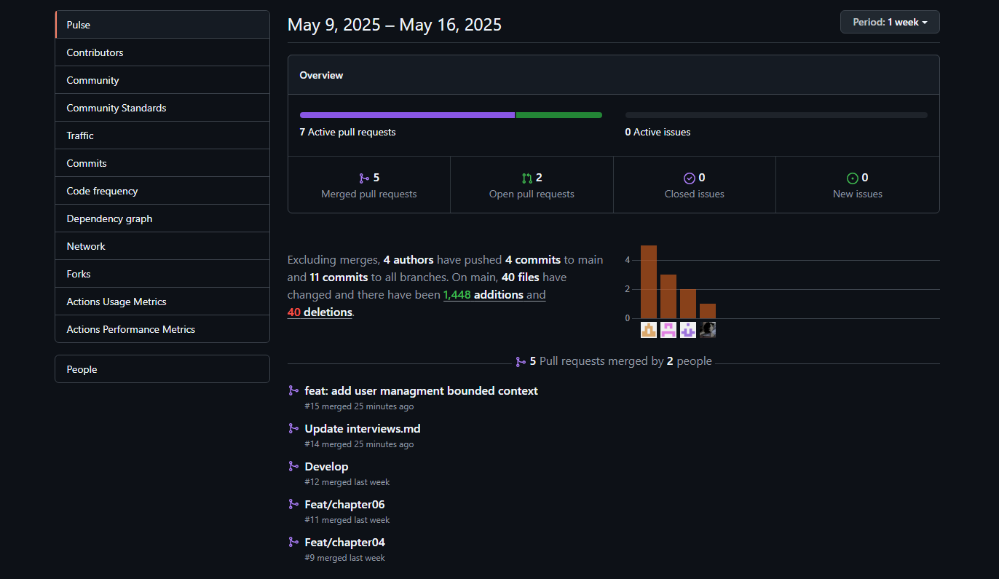
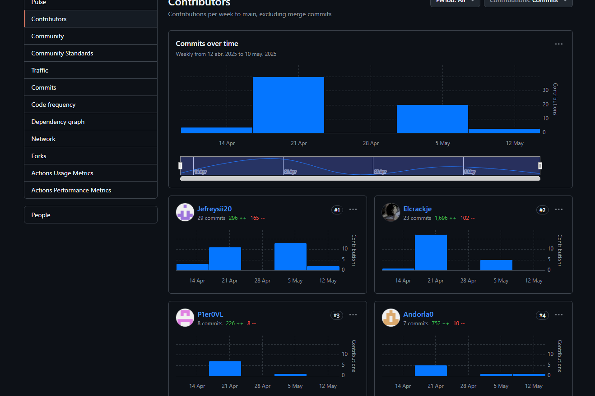
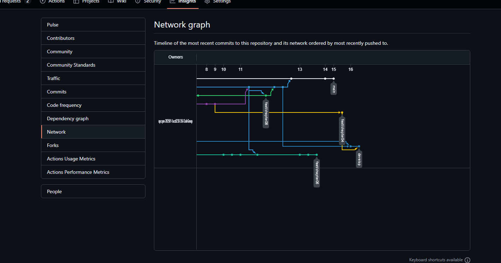
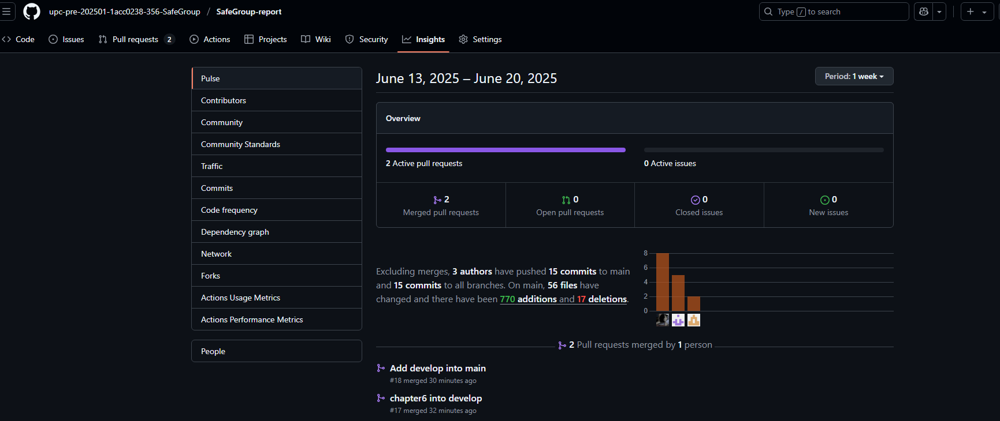
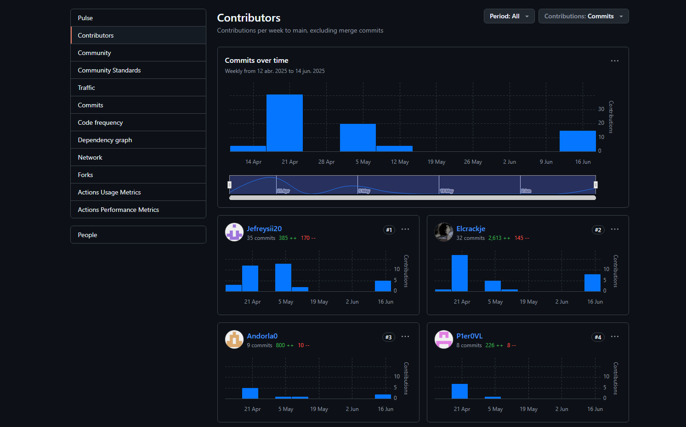
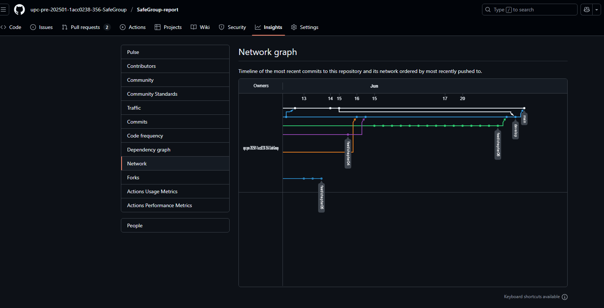

# COURSE PROJECT

---

    <strong>Universidad Peruana de Ciencias Aplicadas (UPC)</strong>     
    </img> 
    <strong>Carrera de Ingeniería de Software - Ciclo VI</strong>  
    <strong>Aplicaciones para Dispositivos Móviles - 1ACC0238</strong> 
     <strong>Profesor: Eduardo Martin Reyes Rodriguez</strong> 
     <strong><b>INFORME DEL TRABAJO FINAL</strong></b> 

    <strong>Startup del Proyecto: SafeGroup</strong> 
    <strong>Producto: SafeChild</strong> 

    <h3 align="center">Team Members:</h3>

    <table align="center">
        <tr>
            <th style="text-align:center;">Member</th>
            <th style="text-align:center;">Code</th>
        </tr>
        <tr>
            <td>Bernaola Pérez, André Arturo</td>
            <td>U202114192 </td>
        </tr>
        <tr>
            <td>Gutierrez Garcia, Jose Eduardo</td>
            <td>U202221518</td>
        </tr>
        <tr>
            <td>Sanchez Ignacio, Jefrey Martin</td>
            <td>U202113324</td>
        </tr>
        <tr>
            <td>Velarde Luyo, Piero Alberto</td>
            <td>U20211A620</td>
        </tr>
    </table>
    

</body>

 <strong>2025-01</strong>

 

---
# Registro de Versiones del Informe

| Versión | Fecha | Autor | Descripción de la modificación |
|----|----|----|----|
| TB1 | 25/04/2025 | SafeGroup | Redacción de los Capítulos I: Presentación, II: Requirements Elicitation & Analysis, III: Requirements Specification, IV: Solution Software Design. |
| TP1 | 10/05/2025 | SafeGroup | Redacción de el Capítulo IV: Solution Software Design, 4.2. Tactical-Level Domain-Driven Design, Capítulo V: Solution UI/UX Design, Capítulo VI: Product Implementation, Validation & Deployment, 6.1. Software Configuration Management, 6.2. Landing Page & Mobile Application Implementation 
6.2.1. Sprint 1 |

# Project Report Collaboration Insights

**TB1**: Las tareas correspondientes a la TB1 han sido completadas y están debidamente documentadas en el repositorio de GitHub para SafeGroup-Report. Puedes acceder al repositorio a través del siguiente enlace: [https://github.com/upc-pre-202501-1acc0238-356-SafeGroup/SafeGroup-report.git](https://github.com/upc-pre-202501-1acc0238-356-SafeGroup/SafeGroup-report.git)

Durante la fase de elaboración del informe, se realizaron las siguientes actividades:

- Se crearon y redactaron los contenidos asignados a cada miembro utilizando formato Markdown, y se realizaron "Conventional Commits" para registrar el progreso en el repositorio.

-  Se generaron los recursos necesarios y agregaron las imagenes al repositorio en la carpeta "assets" en cada rama del informe.

- Se organizaron reuniones para coordinar el avance de los componentes del informe y para proporcionar actualizaciones sobre los progresos del Sprint 1, que se centró en el desarrollo del diseño del software.  

**TP1** Las tareas asignadas para la entrega del TP1 han sido completadas y documentadas de manera exhaustiva en el repositorio de GitHub de la organización del equipo: [https://github.com/upc-pre-202501-1acc0238-356-SafeGroup/SafeGroup-report.git](https://github.com/upc-pre-202501-1acc0238-356-SafeGroup/SafeGroup-report.git)

Se redactaron y diagramaron los contenidos asignados a cada integrante en formato Markdown, con commits regulares para mantener un seguimiento preciso del progreso en el repositorio.

Además, se han generado los artefactos necesarios utilizando las herramientas recomendadas, y se llevaron a cabo reuniones periódicas para coordinar el avance de los elementos del informe y comunicar los progresos del Sprint 1, centrado en el desarrollo de la aplicación Movil.

# Contenido
## Tabla de contenidos
- [**Registro de Versiones del Informe**](#registro-de-versiones-del-informe)
- [**Project Report Collaboration Insights**](#project-report-collaboration-insights)
- [**Contenido**](#contenido)
    - [Tabla de contenidos](#tabla-de-contenidos)
- [**Student Outcome**](#student-outcome)
- [**Objetivos SMART**](#objetivos-smart)
- ## [ **Capítulo I: Introducción** ](#-capítulo-i-introducción-)
  - [**1.1. Startup Profile**](#11-startup-profile)
    - [**1.1.1. Descripción de la Startup**](#111-descripción-de-la-startup)
    - [**1.1.2. Perfiles de integrantes del equipo**](#112-perfiles-de-integrantes-del-equipo)
  - [**1.2. Solution Profile**](#12-solution-profile)
    - [**1.2.1 Antecedentes y problemática**](#121-antecedentes-y-problemática)
    - [What (¿Qué?)](#what-qué)
    - [Who (¿Quién?)](#who-quién)
    - [Where (¿Dónde?)](#where-dónde)
    - [When (¿Cuándo?)](#when-cuándo)
    - [Why (¿Por qué?)](#why-por-qué)
    - [How (¿Cómo?)](#how-cómo)
    - [How much (¿Cuánto?)](#how-much-cuánto)
    - [**1.2.2 Lean UX Process**](#122-lean-ux-process)
    - [**1.2.2.1. Lean UX Problem Statements**](#1221-lean-ux-problem-statements)
    - [**1.2.2.2. Lean UX Assumptions**](#1222-lean-ux-assumptions)
    - [**1.2.2.3. Lean UX Hypothesis Statements**](#1223-lean-ux-hypothesis-statements)
    - [**1.2.2.4. Lean UX Canvas**](#1224-lean-ux-canvas)
  - [**1.3. Segmentos objetivo**](#13-segmentos-objetivo)
- ## [ **Capítulo II: Requirements Elicitation \& Analysis**](#-capítulo-ii-requirements-elicitation--analysis)
  - [**2.1. Competidores**](#21-competidores)
    - [**2.1.1. Análisis competitivo**](#211-análisis-competitivo)
    - [**2.1.2. Estrategias y tácticas frente a competidores**](#212-estrategias-y-tácticas-frente-a-competidores)
  - [**2.2. Entrevistas**](#22-entrevistas)
    - [**2.2.1. Diseño de entrevistas**](#221-diseño-de-entrevistas)
    - [**2.2.2. Registro de entrevistas**](#222-registro-de-entrevistas)
    - [**2.2.3. Análisis de entrevistas**](#223-análisis-de-entrevistas)
  - [**2.3. Needfinding**](#23-needfinding)
    - [**2.3.1. User Personas**](#231-user-personas)
    - [**2.3.2. User Task Matrix**](#232-user-task-matrix)
    - [**2.3.3. User Journey Mapping**](#233-user-journey-mapping)
    - [**2.3.4. Empathy Mapping**](#234-empathy-mapping)
    - [**2.3.5. As-is Scenario Mapping**](#235-as-is-scenario-mapping)
  - [**2.4. Ubiquitous Language**](#24-ubiquitous-language)
- ## [ **Capítulo III: Requirements Specification**](#-capítulo-iii-requirements-specification)
  - [**3.1. To-Be Scenario Mapping**](#31-to-be-scenario-mapping)
  - [**3.2. User Stories**](#32-user-stories)
  - [**3.3. Impact Mapping**](#33-impact-mapping)
  - [**3.4. Product Backlog**](#34-product-backlog)
- ## [**Capítulo IV: Solution Software Design**](#capítulo-iv-solution-software-design)
  - [**4.1. Strategic-Level Domain-Driven Design**](#41-strategic-level-domain-driven-design)
    - [**4.1.1. EventStorming**](#411-eventstorming)
      - [**4.1.1.1. Candidate Context Discovery**](#4111-candidate-context-discovery)
      - [**4.1.1.2. Domain Message Flows Modeling**](#4112-domain-message-flows-modeling)
      - [**4.1.1.3. Bounded Context Canvases**](#4113-bounded-context-canvases)
  - [**4.1.2. Context Mapping**](#412-context-mapping)
  - [**4.1.3. Software Architecture.**](#413-software-architecture)
      - [**4.1.3.1. Software Architecture Context Level Diagrams.**](#4131-software-architecture-context-level-diagrams)
      - [**4.1.3.2. Software Architecture Container Level Diagrams.**](#4132-software-architecture-context-level-diagrams)
      - [**4.1.3.3. Software Architecture Deploymnet Diagrams.**](#4133-software-architecture-deploymnet-diagrams)
  - [**4.2.Tactical-Level Domain-Driven Design**](#42-tactical-level-domain-driven-design)
    - [**4.2.1. Bounded Context: Bounded Context: User Managment**](#421-bounded-context:-user-managment)
      - [**4.2.1.1. Domain Layer**](#4211-domain-layer)
      - [**4.2.1.2. Interface Layer**](#4212-interface-layer)
      - [**4.2.1.3. Application Layer**](#4213-application-layer)
      - [**4.2.1.4. Infrastructure Layer**](#4214-infrastructure-layer)
      - [**4.2.1.5. Bounded Context Software Architecture Component Level Diagrams**](#4215-bounded-context-software-architecture-component-level-diagrams)
      - [**4.2.1.6. Bounded Context Software Architecture Code Level Diagrams**](#4216-bounded-context-software-architecture-code-level-diagrams)
        - [**4.2.1.6.1. Bounded Context Domain Layer Class Diagrams**](#42161-bounded-context-domain-layer-class-diagrams)
        - [**4.2.1.6.2. Bounded Context Database Design Diagram**](#42162-bounded-context-database-design-diagram)
    - [**4.2.2. Bounded Context: Bounded Context: Payments**](#422-bounded-context:payments)
      - [**4.2.2.1. Domain Layer**](#4221-domain-layer)
      - [**4.2.2.2. Interface Layer**](#4222-interface-layer)
      - [**4.2.2.3. Application Layer**](#4223-application-layer)
      - [**4.2.2.4. Infrastructure Layer**](#4224-infrastructure-layer)
      - [**4.2.2.5. Bounded Context Software Architecture Component Level Diagrams**](#4225-bounded-context-software-architecture-component-level-diagrams)
      - [**4.2.2.6. Bounded Context Software Architecture Code Level Diagrams**](#4226-bounded-context-software-architecture-code-level-diagrams)
        - [**4.2.2.6.1. Bounded Context Domain Layer Class Diagrams**](#42261-bounded-context-domain-layer-class-diagrams)
        - [**4.2.2.6.2. Bounded Context Database Design Diagram**](#42262-bounded-context-database-design-diagram)
    - [**4.2.3. Bounded Context: Bounded Context: Appoiments**](#423-bounded-context:-appoiments)
      - [**4.2.3.1. Domain Layer**](#4231-domain-layer)
      - [**4.2.3.2. Interface Layer**](#4232-interface-layer)
      - [**4.2.3.3. Application Layer**](#4233-application-layer)
      - [**4.2.3.4. Infrastructure Layer**](#4234-infrastructure-layer)
      - [**4.2.3.5. Bounded Context Software Architecture Component Level Diagrams**](#4235-bounded-context-software-architecture-component-level-diagrams)
      - [**4.2.3.6. Bounded Context Software Architecture Code Level Diagrams**](#4236-bounded-context-software-architecture-code-level-diagrams)
        - [**4.2.3.6.1. Bounded Context Domain Layer Class Diagrams**](#42361-bounded-context-domain-layer-class-diagrams)
        - [**4.2.3.6.2. Bounded Context Database Design Diagram**](#42362-bounded-context-database-design-diagram)
    - [**4.2.4. Bounded Context: Bounded Context: Messaging**](#424-bounded-context:-messaging)
      - [**4.2.4.1. Domain Layer**](#4241-domain-layer)
      - [**4.2.4.2. Interface Layer**](#4242-interface-layer)
      - [**4.2.4.3. Application Layer**](#4243-application-layer)
      - [**4.2.4.4. Infrastructure Layer**](#4244-infrastructure-layer)
      - [**4.2.4.5. Bounded Context Software Architecture Component Level Diagrams**](#4245-bounded-context-software-architecture-component-level-diagrams)
      - [**4.2.4.6. Bounded Context Software Architecture Code Level Diagrams**](#4246-bounded-context-software-architecture-code-level-diagrams)
        - [**4.2.4.6.1. Bounded Context Domain Layer Class Diagrams**](#42461-bounded-context-domain-layer-class-diagrams)
        - [**4.2.4.6.2. Bounded Context Database Design Diagram**](#42462-bounded-context-database-design-diagram)
- ## [**Capítulo V: Solution UI/UX Design**](#capítulo-v-solution-ui/ux-design)
  - [**5.1. Product Design**](#51-product-design)
    - [**5.1.1. Style Guidelines**](#511-style-guidelines)
      - [**5.1.1.1. General Style Guidelines**](#5111-general-style-guidelines)
    - [**5.1.2. Information Architecture**](#512-information-architecture)
      - [**5.1.2.1. Organization Systems**](#5121-organization-systems)
      - [**5.1.2.2. Labeling Systems**](#51212-labeling-systems)
      - [**5.1.2.3. SEO Tags and Meta Tags**](#51213-seo-tags-and-meta-tags)
      - [**5.1.2.4. Searching Systems**](#51214-searching-systems)
      - [**5.1.2.5. Navigation Systems**](#51215-navigation-systems)
    - [**5.1.3. Landing Page UI Design**](#513-landing-page-ui-design)
      - [**5.1.3.1. Landing Page Wireframe**](#5131-landing-page-wireframe)
      - [**5.1.3.2. Landing Page Mock-up**](#5132-landing-page-mock-up)
    - [**5.1.4. Mobile Applications UX/UI Design**](#514-mobile-applications-uxui-design)
    - [**5.1.4.1. Mobile Applications Wireframes**](#5141-mobile-applications-wireframes)
    - [**5.1.4.2. Mobile Applications Wireflow Diagrams**](#5142-mobile-applications-wireflow-diagrams)
    - [**5.1.4.3. Mobile Applications Mock-ups**](#5143-mobile-applications-mock-ups)
    - [**5.1.4.4. Mobile Applications User Flow Diagrams**](#5144-mobile-applications-user-flow-diagrams)
    - [**5.1.4.5. Mobile Applications Prototyping**](#5145-mobile-applications-prototyping)
- ## [**Capítulo VI: Product Implementation, Validation & Deployment**](#capítulo-vi-product-implementation-validation-&-deployment)
  - [**6.1. Software Configuration Management**](#61-software-configuration-management)
    - [**6.1.1. Software Development Environment Configuration**](#611-software-development-environment-configuration)
    - [**6.1.2. Source Code Management**](#612-source-code-management)
    - [**6.1.3. Source Code Style Guide & Conventions**](#613-source-code-style-guide--conventions)
    - [**6.1.4. Software Deployment Configuration**](#614-software-deployment-configuration)
  - [**6.2. Landing Page, Services & Mobile Application Implementation**](#52-landing-page-services--mobile-application-implementation)
    - [**6.2.1. Sprint 1**](#621-sprint-1)
    - [**6.2.1.1. Sprint Planning 1**](#6211-sprint-planning-1)
    - [**6.2.1.2. Sprint Backlog 1**](#6212-sprint-backlog-1)
    - [**6.2.1.3. Development Evidence for Sprint Review**](#6213-development-evidence-for-sprint-review)
    - [**6.2.1.4. Testing Suite Evidence for Sprint Review**](#6214-testing-suite-evidence-for-sprint-review)
    - [**6.2.1.5. Execution Evidence for Sprint Review**](#6215-execution-evidence-for-sprint-review)
    - [**6.2.1.6. Services Documentation Evidence for Sprint Review**](#6216-services-documentation-evidence-for-sprint-review)
    - [**6.2.1.7. Software Deployment Evidence for Sprint Review**](#6217-software-deployment-evidence-for-sprint-review)
    - [**6.2.1.8. Team Collaboration Insights during Sprint**](#6218-team-collaboration-insights-during-sprint)
- [**Conclusiones**](#conclusiones)
- [**Conclusiones y recomendaciones**](#conclusiones-y-recomendaciones)
- [**Bibliografía**](#bibliografía)
- [**Anexos**](#anexos)

# Student Outcome

| Criterio específico | Acciones realizadas | Conclusiones |
|----|----|----|
|Actualiza conceptos y conocimientos necesarios para su desarrollo profesional y en especial para su proyecto en soluciones de software.| **Bernaola Pérez, André Arturo** *TB1* Aprendí a profundizar en el enfoque Lean UX y reforcé mis conocimientos sobre Problem Statements, Assumptions y Hypothesis Statements. Me aseguré de actualizar mis técnicas de investigación rápida, formulé hipótesis claras y utilicé el Lean UX Canvas para estructurar de forma efectiva el Capítulo I: Presentación. Durante el proceso puse en práctica herramientas colaborativas como Miro para diseñar flujos de usuario y validé mis ideas con el equipo antes de plasmarlas en el documento.  *TP1* Aprendí a profundizar en Domain‑Driven Design táctico al modelar el Bounded Context de Payments, actualicé mis conocimientos sobre las cuatro capas (Domain, Interface, Application, Infrastructure) y sobre diagramas de componentes y clases. Apliqué estas prácticas al diseñar en Figma las pantallas de pago y luego las implementé en React Native, integrando la lógica de transacciones y validación.  **Gutierrez Garcia, Jose Eduardo** *TB1* Actualicé mis habilidades de investigación de usuarios aprendiendo nuevas metodologías de entrevistas y análisis competitivo. Apliqué Needfinding en el Capítulo II, creando User Personas, User Journey Maps y Empathy Maps que reflejan los hallazgos de las entrevistas. Aprendí a sintetizar datos cuantitativos y cualitativos para definir el Ubiquitous Language y asegurarme de que todos los términos del dominio estuvieran claros y alineados con las necesidades reales de padres y cuidadores.  *TP1* Actualicé mis habilidades de gestión ágil al liderar la Sprint 1: planifiqué el sprint, definí el backlog, documenté evidencias de desarrollo, pruebas y despliegue, y configuré el pipeline de CI/CD. Aprendí a estructurar la Information Architecture y el Product Design (wireframes, mock‑ups y guías de estilo) y llevé esos conceptos a la implementación de la landing page y la app móvil.  **Sanchez Ignacio, Jefrey Martin** *TB1* Actualicé mis conocimientos de Impact Mapping y priorización de funcionalidades, traduciendo los hallazgos de la etapa de análisis en User Stories y un Product Backlog consistente. Aprendí a definir To-Be Scenarios y a organizar el backlog por valor de negocio en el Capítulo III. En este proceso profundicé en técnicas de estimación ágil y priorización MoSCoW, asegurando que cada historia estuviera correctamente refinada y alineada con los objetivos SMART del proyecto.  *TP1* Aprendí nuevas técnicas avanzadas de UX/UI al crear wireflows, wireframes, user flow diagrams y prototipos interactivos en Figma, siguiendo las Style Guidelines. Apliqué estos conocimientos implementando los componentes de interfaz en React Native, validando su usabilidad y ajustando el diseño según el feedback recogido en pruebas rápidas.   **Velarde Luyo, Piero Alberto** *TB1* Aprendí y apliqué prácticas avanzadas de Domain Driven Design: realicé EventStorming para descubrir Candidate Contexts, modelé Domain Message Flows y elaboré Bounded Context Canvases. Además, actualicé mis competencias en context mapping y diseñé diagramas de arquitectura de software en niveles de contexto, contenedor y despliegue para el Capítulo IV. Esto me permitió entender mejor cómo se comunican los distintos módulos y cómo garantizar la escalabilidad y mantenibilidad de la solución.  *TP1*  Reconocí la importancia del refinamiento de prototipos y navegación al mejorar los mock‑ups y la arquitectura de flujos de la app en Figma. Actualicé mis competencias en integración de notificaciones push y gestión de reservas, y apliqué estos conceptos programando la lógica de navegación y la conexión con el backend dentro de la aplicación móvil.| TB1:   Como equipo, actualizamos y aplicamos de manera integrada conceptos de Lean UX, investigación de usuarios, modelado de dominio y arquitectura de software. Cada uno fortaleció tanto su perfil profesional—desde entrevistas y mapeos hasta diseño de flujos de mensajes y diagramas de despliegue como nuestra capacidad colectiva para construir una plataforma móvil robusta y centrada en las necesidades reales de padres y cuidadores. Este aprendizaje conjunto nos ha preparado para afrontar con metodología y rigor el desarrollo de la solución, mejorando nuestra colaboración, comunicación y alineación estratégica.   TP1:   Como equipo, hemos consolidado y actualizado simultáneamente conceptos de Domain‑Driven Design táctico, UI/UX y prácticas de implementación y despliegue. Cada uno amplió su expertise desde la definición de arquitecturas y diagramas, pasando por el diseño de experiencias y la gestión de sprints, hasta la codificación de la app móvil lo que fortalece nuestro perfil profesional y garantiza una solución coherente, escalable y alineada con las necesidades de padres y cuidadores.|

| Criterio específico | Acciones realizadas | Conclusiones |
|----|----|----|
|Reconoce la necesidad del aprendizaje permanente para el desempeño profesional y el desarrollo de proyectos en soluciones de software.|**Bernaola Pérez, André Arturo** *TB1* Aprendí a identificar tendencias emergentes en UX y metodologías ágiles revisando artículos y estudios de caso semanalmente, lo que me permitió actualizar mis técnicas en Lean UX y validación rápida; luego compartí estos aprendizajes con el equipo en sesiones quincenales de retroalimentación.  *TP1* Reconoció que las prácticas de Domain‑Driven Design evolucionan constantemente, por lo que se suscribió a newsletters y asistió a webinars mensuales sobre patrones tácticos y microservicios. Documentó cada nueva técnica—como sagas y anti‑corrupción layers—y compartió resúmenes quincenales con el equipo para mantenernos al día.  **Gutierrez Garcia, Jose Eduardo** *TB1* Reconocí la importancia de profundizar en investigación de usuarios, por lo que me inscribí en un curso avanzado de entrevistas cualitativas, exploré Figma y Miro con tutoriales diarios y documenté plantillas reutilizables para mapas de empatía y user journeys en nuestra wiki interna.  *TP1*  Identificó la importancia de dominar DevOps y pipelines de CI/CD, así que completó un curso avanzado de GitHub Actions y Docker, actualizó nuestro entorno de despliegue con contenedores optimizados y escribió un tutorial interno para que todo el equipo siga las buenas prácticas.  **Sanchez Ignacio, Jefrey Martin** *TB1* Aprendí nuevas prácticas de priorización de backlog al participar en un workshop de Product Discovery y actualicé mis conocimientos en Impact Mapping y Scrum; apliqué metodologías de estimación ágil (Planning Poker) en nuestras sesiones de sprint para mejorar la precisión de los compromisos.  *TP1* Entendió que las tendencias de UX/UI y accesibilidad cambian con rapidez, por lo que participó en un workshop de diseño inclusivo y en un bootcamp de Figma avanzado. Apliqué lo aprendido mejorando la propiedad de estilos en nuestros mock‑ups.   **Velarde Luyo, Piero Alberto** *TB1* Reconocí la necesidad de dominar Domain Driven Design y me uní a un grupo de estudio sobre EventStorming, lo que me permitió actualizar mis competencias en context mapping y arquitectura de microservicios; luego modelé flujos de mensajes complejos y documenté cada bounded context en nuestra herramienta colaborativa.  *TP1* Reconoció la evolución de las plataformas de mensajería y notificaciones push, investigó Firebase Cloud Messaging y APNs, actualizó nuestra estrategia de notificaciones en tiempo real y creó ejemplos de código reutilizables para el equipo, facilitando la adopción de estas tecnologías. | TB1:   Como equipo, reafirmamos que el aprendizaje permanente es fundamental para mantenernos competitivos y mejorar la calidad de nuestro proyecto. Cada integrante adoptó hábitos de actualización continua y aplicó nuevas metodologías, fortaleciendo nuestras habilidades técnicas y nuestra capacidad de adaptación, colaboración y crecimiento conjunto en el desarrollo de la plataforma móvil de cuidado infantil.   TP1:   El equipo demostró un compromiso activo con el aprendizaje permanente, integrando nuevas metodologías y herramientas en su flujo de trabajo desde patrones de arquitectura y DevOps hasta diseño inclusivo y mensajería—lo que no solo fortalece nuestras competencias individuales, sino que garantiza que el proyecto evolucione con prácticas actuales y de alta calidad.|

----

# Objetivos SMART

----

# Capítulo I: Introducción

## 1.1. Startup Profile

### 1.1.1. Descripción de la Startup  
### 1.1.2. Perfiles de integrantes del equipo  

## 1.2. Solution Profile

### 1.2.1. Antecedentes y problemática  
### 1.2.2. Lean UX Process  
#### 1.2.2.1. Lean UX Problem Statements  
#### 1.2.2.2. Lean UX Assumptions  
#### 1.2.2.3. Lean UX Hypothesis Statements  
#### 1.2.2.4. Lean UX Canvas  

## 1.3. Segmentos objetivo  

----

# Capítulo II: Requirements Elicitation & Analysis

## 2.1. Competidores  
### 2.1.1. Análisis competitivo  
### 2.1.2. Estrategias y tácticas frente a competidores  

## 2.2. Entrevistas  
### 2.2.1. Diseño de entrevistas  
### 2.2.2. Registro de entrevistas  
### 2.2.3. Análisis de entrevistas  

## 2.3. Needfinding  
### 2.3.1. User Personas  
### 2.3.2. User Task Matrix  
### 2.3.3. User Journey Mapping  
### 2.3.4. Empathy Mapping  
### 2.3.5. As-is Scenario Mapping  

## 2.4. Ubiquitous Language  

----

# Capítulo III: Requirements Specification

## 3.1. To-Be Scenario Mapping  
## 3.2. User Stories  
## 3.3. Product Backlog  
## 3.4. Impact Mapping

----

# Capítulo IV: Solution Software Design

## 4.1. Strategic-Level Domain-Driven Design

### 4.1.1. EventStorming
### 4.1.1.1. Candidate Context Discovery
### 4.1.1.2. Domain Message Flows Modeling
### 4.1.1.3. Bounded Context Canvases

### 4.1.2. Context Mapping

### 4.1.3. Software Architecture
### 4.1.3.1. Software Architecture Context Level Diagrams
### 4.1.3.2. Software Architecture Container Level Diagrams
### 4.1.3.3. Software Architecture Deployment Diagrams

## 4.2. Tactical-Level Domain-Driven Design 

### ### 4.2.1.   Bounded Context: Bounded Context: User Managmentt
### 4.2.1.1. Domain Layer   
### 4.2.1.2.  Interface Layer 
### 4.2.1.3.  Application Layer 
### 4.2.1.4. Infrastructure Layer 
### 4.2.1.5. Bounded Context Software Architecture Component Level Diagrams 
### 4.2.1.6. Bounded Context Software Architecture Code Level Diagrams 
### 4.2.1.6.1. Bounded Context Domain Layer Class Diagrams 
### 4.2.1.6.2. Bounded Context Database Design Diagram

### 4.2.2.   Bounded Context: Bounded Context: Payments
### 4.2.2.1. Domain Layer   
### 4.2.2.2.  Interface Layer 
### 4.2.2.3.  Application Layer 
### 4.2.2.4. Infrastructure Layer 
### 4.2.2.5. Bounded Context Software Architecture Component Level Diagrams 
### 4.2.2.6. Bounded Context Software Architecture Code Level Diagrams 
### 4.2.2.6.1. Bounded Context Domain Layer Class Diagrams 
### 4.2.2.6.2. Bounded Context Database Design Diagram

### 4.2.3.   Bounded Context: Bounded Context: Appoiments
### 4.2.3.1. Domain Layer   
### 4.2.3.2.  Interface Layer 
### 4.2.3.3.  Application Layer 
### 4.2.3.4. Infrastructure Layer 
### 4.2.3.5. Bounded Context Software Architecture Component Level Diagrams 
### 4.2.3.6. Bounded Context Software Architecture Code Level Diagrams 
### 4.2.3.6.1. Bounded Context Domain Layer Class Diagrams 
### 4.2.3.6.2. Bounded Context Database Design Diagram

### 4.2.4.   Bounded Context: Bounded Context: Messaging
### 4.2.4.1. Domain Layer   
### 4.2.4.2.  Interface Layer 
### 4.2.4.3.  Application Layer 
### 4.2.4.4. Infrastructure Layer 
### 4.2.4.5. Bounded Context Software Architecture Component Level Diagrams 
### 4.2.4.6. Bounded Context Software Architecture Code Level Diagrams 
### 4.2.4.6.1. Bounded Context Domain Layer Class Diagrams 
### 4.2.4.6.2. Bounded Context Database Design Diagram

----

# Capítulo V: Solution UI/UX Design

## 5.1. Product design 
### 5.1.1. Style Guidelines 
### 5.1.1.1. General Style Guidelines 
### 5.1.2. Information Architecture 
### 5.1.2.1. Organization Systems 
### 5.1.2.2. Labelling Systems 
### 5.1.2.3. SEO Tags and Meta Tags 
### 5.1.2.4. Searching Systems 
### 5.1.2.5. Navigation Systems 
### 5.1.3. Landing Page UI Design 
### 5.1.3.1. Landing Page Wireframe 
### 5.1.3.2. Landing Page Mock-up 
### 5.1.4. Mobile Applications UX/UI Design 
### 5.1.4.1. Mobile Applications Wireframes 
### 5.1.4.2. Mobile Applications Wireflow Diagrams 
### 5.1.4.3. Mobile Applications Mock-ups 
### 5.1.4.4. Mobile Applications User Flow Diagrams 
### 5.1.4.5. Mobile Applications Prototyping 

----

# Capítulo VI: Product Implementation, Validation & Deployment

## 6.1. Software Configuration Management

### 6.1.1. Software Development Environment Configuration 
### 6.1.2. Source Code Management 
### 6.1.3. Source Code Style Guide & Conventions 
### 6.1.4. Software Deployment Configuration 

## 6.2. Landing Page & Mobile Application Implementation 

### 6.2.1. Sprint 1
### 6.2.1.1. Sprint Planning 1
### 6.2.1.2. Sprint Backlog 1
### 6.2.1.3. Development Evidence for Sprint Review 
### 6.2.1.4. Testing Suite Evidence for Sprint Review 
### 6.2.1.5. Execution Evidence for Sprint Review 
### 6.2.1.6. Services Documentation Evidence for Sprint Review 
### 6.2.1.7. Software Deployment Evidence for Sprint Review 
### 6.2.1.8. Team Collaboration Insights during Sprint

----

## Conclusiones
### Conclusiones y Recomendaciones

**Conlusiones**

El equipo ha demostrado una sólida adopción del aprendizaje continuo al integrar nuevas metodologías (Lean UX, investigación cualitativa, DDD y estimaciones ágiles) en el proyecto, lo que ha mejorado nuestra capacidad de colaboración, la calidad de los entregables y la alineación con las necesidades de padres y cuidadores.

La incorporación de hábitos de aprendizaje continuo a lo largo del proyecto ha fortalecido nuestras capacidades técnicas y metodológicas, permitiéndonos adaptarnos ágilmente a nuevas herramientas y prácticas (DDD, DevOps, UX inclusivo, mensajería en tiempo real). Este compromiso con la actualización permanente ha elevado la calidad del entregable y ha consolidado una cultura colaborativa de mejora constante.

**Recomendación**
Establecer un ritual mensual de “lunch & learn” interno en el que cada miembro comparta un concepto, herramienta o práctica reciente y cómo aplicarla al proyecto, asegurando así la difusión constante de conocimiento y la retroalimentación colectiva.

Formalizar un programa de aprendizaje continuo: destinar horas mensuales de “tiempo de innovación” para formación, establecer objetivos de desarrollo individual y grupal, y crear un seguimiento periódico (por ejemplo, un dashboard de competencias) que garantice la evolución sostenida de habilidades y la aplicación directa de nuevos conocimientos al proyecto.

## Bibliografía

Del Rosario Rivero Pérez, M., & De Educación, P. M. (2013). _El valor educativo de los cuidados infantiles: para la atención de los niños y niñas de 0 a 3 años. Guía de orientación_. En Ministerio de Educación eBooks. [http://disde.minedu.gob.pe/handle/20.500.12799/5177](http://disde.minedu.gob.pe/handle/20.500.12799/5177)

Marin, H. M. (2022, 23 junio). “Uno de los grandes desafíos es reducir la brecha entre los niños que atendemos y los que aún nos necesitan”. _El Comercio Perú_. [https://elcomercio.pe/lima/sucesos/aldeas-infantiles-uno-de-los-grandes-desafios-es-reducir-la-brecha-entre-los-ninos-que-atendemos-y-los-que-aun-nos-necesitan-dereje-wordofa-presidente-internacional-de-aldeas-infantiles-sos-peru-noticia/](https://elcomercio.pe/lima/sucesos/aldeas-infantiles-uno-de-los-grandes-desafios-es-reducir-la-brecha-entre-los-ninos-que-atendemos-y-los-que-aun-nos-necesitan-dereje-wordofa-presidente-internacional-de-aldeas-infantiles-sos-peru-noticia/)

Condiciones de vida en el Perú: impacto económico de los servicios de cuidado infantil. (2021). En Instituto Nacional de Estadística E Informática (INEI). Recuperado 22 de agosto de 2024, de https://www.inei.gob.pe

## Anexos

**Anexo 1:**

**Entrevias de Needfinding**

Entrevistas Segmento Padres/Tutores: 
- [``]()
- [``]()
- [``]()

Entrevistas Cuidadores/Educadores: 
- [``]()
- [``]()
- [``]()

**Anexo 2:**

Link de la organizacion en GitHub SafeGroup:  
[https://github.com/upc-pre-202501-1acc0238-356-SafeGroup](https://github.com/upc-pre-202501-1acc0238-356-SafeGroup)

**Anexo 3:**

Repositorio en GitHub para el reporte:  
[https://github.com/upc-pre-202501-1acc0238-356-SafeGroup/SafeGroup-report](https://github.com/upc-pre-202501-1acc0238-356-SafeGroup/SafeGroup-report)

**Anexo 4:**

Repositorio en GitHub para la Landing Page: 

**Anexo 5:**
Repositorio para el BackEnd de la Aplicación Mobile: 

**Anexo 6:**
Deployments: 
- **Landing Page**: 
- **Backend**: 

**Anexo 7:**
Figma para la Landing Page y Mobile 
