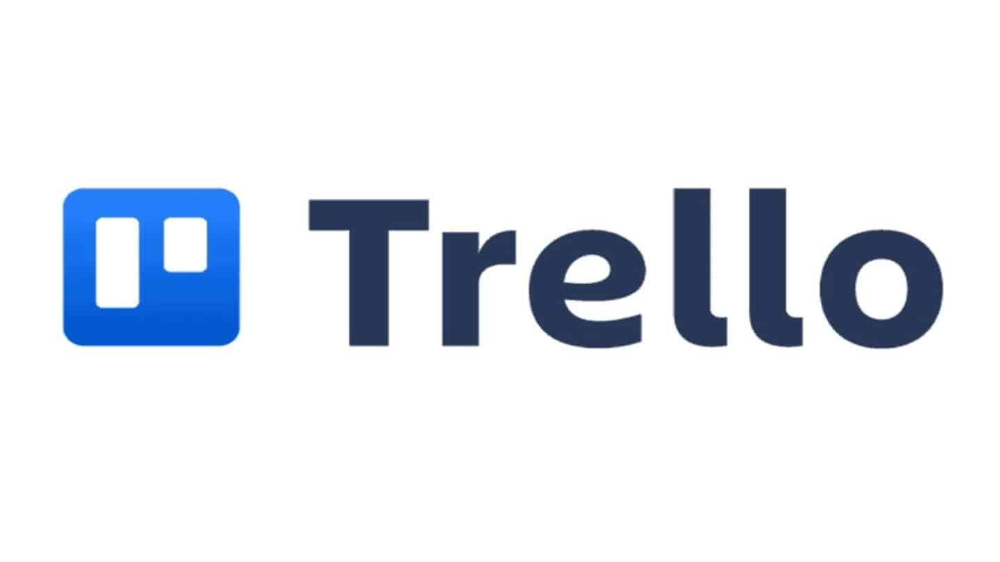
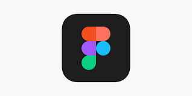
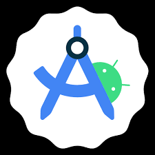

# COURSE PROJECT

---

<p align="center">
    <strong>Universidad Peruana de Ciencias Aplicadas (UPC)</strong><br>    
    </img><br>
    <strong>Carrera de Ingeniería de Software - Ciclo VI</strong><br><br>
    <strong>Aplicaciones para Dispositivos Móviles - 1ACC0238</strong><br>
    <br><strong>Profesor: Eduardo Martin Reyes Rodriguez</strong><br>
    <br><strong><b>INFORME DEL TRABAJO FINAL</strong></b><br>
</p>

<p align="center">
    <strong>Startup del Proyecto: SafeGroup</strong><br>
    <strong>Producto: SafeChild</strong><br>
</p>

<div>
    <h3 align="center">Team Members:</h3>
</div>

<div>
    <table align="center">
        <tr>
            <th style="text-align:center;">Member</th>
            <th style="text-align:center;">Code</th>
        </tr>
        <tr>
            <td>Bernaola Pérez, André Arturo</td>
            <td>U202114192 </td>
        </tr>
        <tr>
            <td>Gutierrez Garcia, Jose Eduardo</td>
            <td>U202221518</td>
        </tr>
        <tr>
            <td>Sanchez Ignacio, Jefrey Martin</td>
            <td>U202113324</td>
        </tr>
        <tr>
            <td>Velarde Luyo, Piero Alberto</td>
            <td>U20211A620</td>
        </tr>
    </table>
    </div>
</body>

<p align="center">
<br><strong>2025-01</strong></p>
<br>

---
# Registro de Versiones del Informe

| Versión | Fecha | Autor | Descripción de la modificación |
|----|----|----|----|
| TB1 | 25/04/2025 | SafeGroup | Redacción de los Capítulos I: Presentación, II: Requirements Elicitation & Analysis, III: Requirements Specification, IV: Solution Software Design. |

# Project Report Collaboration Insights

**TB1**: Las tareas correspondientes a la TB1 han sido completadas y están debidamente documentadas en el repositorio de GitHub para SafeGroup-Report. Puedes acceder al repositorio a través del siguiente enlace: [https://github.com/upc-pre-202501-1acc0238-356-SafeGroup/SafeGroup-report.git](https://github.com/upc-pre-202501-1acc0238-356-SafeGroup/SafeGroup-report.git)

Durante la fase de elaboración del informe, se realizaron las siguientes actividades:

- Se crearon y redactaron los contenidos asignados a cada miembro utilizando formato Markdown, y se realizaron "Conventional Commits" para registrar el progreso en el repositorio.

-  Se generaron los recursos necesarios y agregaron las imagenes al repositorio en la carpeta "assets" en cada rama del informe.

- Se organizaron reuniones para coordinar el avance de los componentes del informe y para proporcionar actualizaciones sobre los progresos del Sprint 1, que se centró en el desarrollo del diseño del software. <br>


# Contenido
## Tabla de contenidos
- [**Registro de Versiones del Informe**](#registro-de-versiones-del-informe)
- [**Project Report Collaboration Insights**](#project-report-collaboration-insights)
- [**Contenido**](#contenido)
    - [Tabla de contenidos](#tabla-de-contenidos)
- [**Student Outcome**](#student-outcome)
- [**Objetivos SMART**](#objetivos-smart)
- ## [ **Capítulo I: Introducción** ](#-capítulo-i-introducción-)
  - [**1.1. Startup Profile**](#11-startup-profile)
    - [**1.1.1. Descripción de la Startup**](#111-descripción-de-la-startup)
    - [**1.1.2. Perfiles de integrantes del equipo**](#112-perfiles-de-integrantes-del-equipo)
  - [**1.2. Solution Profile**](#12-solution-profile)
    - [**1.2.1 Antecedentes y problemática**](#121-antecedentes-y-problemática)
    - [What (¿Qué?)](#what-qué)
    - [Who (¿Quién?)](#who-quién)
    - [Where (¿Dónde?)](#where-dónde)
    - [When (¿Cuándo?)](#when-cuándo)
    - [Why (¿Por qué?)](#why-por-qué)
    - [How (¿Cómo?)](#how-cómo)
    - [How much (¿Cuánto?)](#how-much-cuánto)
    - [**1.2.2 Lean UX Process**](#122-lean-ux-process)
    - [**1.2.2.1. Lean UX Problem Statements**](#1221-lean-ux-problem-statements)
    - [**1.2.2.2. Lean UX Assumptions**](#1222-lean-ux-assumptions)
    - [**1.2.2.3. Lean UX Hypothesis Statements**](#1223-lean-ux-hypothesis-statements)
    - [**1.2.2.4. Lean UX Canvas**](#1224-lean-ux-canvas)
  - [**1.3. Segmentos objetivo**](#13-segmentos-objetivo)
- ## [ **Capítulo II: Requirements Elicitation \& Analysis**](#-capítulo-ii-requirements-elicitation--analysis)
  - [**2.1. Competidores**](#21-competidores)
    - [**2.1.1. Análisis competitivo**](#211-análisis-competitivo)
    - [**2.1.2. Estrategias y tácticas frente a competidores**](#212-estrategias-y-tácticas-frente-a-competidores)
  - [**2.2. Entrevistas**](#22-entrevistas)
    - [**2.2.1. Diseño de entrevistas**](#221-diseño-de-entrevistas)
    - [**2.2.2. Registro de entrevistas**](#222-registro-de-entrevistas)
    - [**2.2.3. Análisis de entrevistas**](#223-análisis-de-entrevistas)
  - [**2.3. Needfinding**](#23-needfinding)
    - [**2.3.1. User Personas**](#231-user-personas)
    - [**2.3.2. User Task Matrix**](#232-user-task-matrix)
    - [**2.3.3. User Journey Mapping**](#233-user-journey-mapping)
    - [**2.3.4. Empathy Mapping**](#234-empathy-mapping)
    - [**2.3.5. As-is Scenario Mapping**](#235-as-is-scenario-mapping)
  - [**2.4. Ubiquitous Language**](#24-ubiquitous-language)
- ## [ **Capítulo III: Requirements Specification**](#-capítulo-iii-requirements-specification)
  - [**3.1. To-Be Scenario Mapping**](#31-to-be-scenario-mapping)
  - [**3.2. User Stories**](#32-user-stories)
  - [**3.3. Impact Mapping**](#33-impact-mapping)
  - [**3.4. Product Backlog**](#34-product-backlog)
- ## [**Capítulo IV: Solution Software Design**](#capítulo-iv-solution-software-design)
  - [**4.1. Strategic-Level Domain-Driven Design**](#41-strategic-level-domain-driven-design)
    - [**4.1.1. EventStorming**](#411-eventstorming)
      - [**4.1.1.1. Candidate Context Discovery**](#4111-candidate-context-discovery)
      - [**4.1.1.2. Domain Message Flows Modeling**](#4112-domain-message-flows-modeling)
      - [**4.1.1.3. Bounded Context Canvases**](#4113-bounded-context-canvases)
  - [**4.1.2. Context Mapping**](#412-context-mapping)
  - [**4.1.3. Software Architecture.**](#413-software-architecture)
      - [**4.1.3.1. Software Architecture Context Level Diagrams.**](#4131-software-architecture-context-level-diagrams)
      - [**4.1.3.2. Software Architecture Container Level Diagrams.**](#4132-software-architecture-context-level-diagrams)
      - [**4.1.3.3. Software Architecture Deploymnet Diagrams.**](#4133-software-architecture-deploymnet-diagrams)
- [**Conclusiones**](#conclusiones)
- [**Conclusiones y recomendaciones**](#conclusiones-y-recomendaciones)
- [**Bibliografía**](#bibliografía)
- [**Anexos**](#anexos)

# Student Outcome

| Criterio específico | Acciones realizadas | Conclusiones |
|----|----|----|
|Actualiza conceptos y conocimientos necesarios para su desarrollo profesional y en especial para su proyecto en soluciones de software.| **Bernaola Pérez, André Arturo**<br>*TB1*<br>TEXTO.<br></br>**Gutierrez Garcia, Jose Eduardo**<br>*TB1*<br>TEXTO<br></br>**Sanchez Ignacio, Jefrey Martin**<br>*TB1*<br>TEXTO. <br></br> **Velarde Luyo, Piero Alberto**<br>*TB1*<br>TEXTO. | TB1: <br> TEXTO.|

| Criterio específico | Acciones realizadas | Conclusiones |
|----|----|----|
|Reconoce la necesidad del aprendizaje permanente para el desempeño profesional y el desarrollo de proyectos en soluciones de software.|**Bernaola Pérez, André Arturo**<br>*TB1*<br>TEXTO.<br></br>**Gutierrez Garcia, Jose Eduardo**<br>*TB1*<br>TEXTO<br></br>**Sanchez Ignacio, Jefrey Martin**<br>*TB1*<br>TEXTO. <br></br> **Velarde Luyo, Piero Alberto**<br>*TB1*<br>TEXTO. | TB1: <br> TEXTO.|

----

# Objetivos SMART
### André
Objetivo 1:
- Finalizar un programa intensivo especializado en desarrollo full-stack (como los ofrecidos por freeCodeCamp o The Odin Project) dentro de los primeros ocho meses posteriores a la graduación, con el propósito de fortalecer mi perfil técnico e incrementar mi competitividad en el mercado laboral.

Objetivo 2:
- Acceder a un programa de especialización en arquitectura de software dentro de los dos primeros años tras concluir la carrera, como parte de mi proyección profesional hacia el rol de arquitecto de software.

### Jose
- Objetivo 1:
Obtener una certificación reconocida en tecnologías de desarrollo backend (por ejemplo, Node.js o Java Spring) en un plazo no mayor a seis meses después de la graduación, con el fin de potenciar mi perfil profesional y acceder a oportunidades laborales en el área de desarrollo de software.

- Objetivo 2:
Participar activamente en al menos tres proyectos de código abierto en plataformas colaborativas como GitHub durante el primer año posterior a mi egreso, con el objetivo de adquirir experiencia práctica y establecer vínculos con la comunidad tecnológica.

### Jefrey
- Objetivo 1:
Asistir a un mínimo de dos talleres o cursos especializados en tecnologías frontend (como React o Vue.js) en los seis meses siguientes a la finalización de la carrera, a fin de complementar mis conocimientos previos en HTML, CSS y JavaScript y consolidar mis habilidades en desarrollo web.

- Objetivo 2:
Obtener una posición como desarrollador junior, ya sea mediante una pasantía o empleo formal, en un periodo no mayor a cuatro meses después de egresar, para iniciar mi trayectoria profesional y aplicar de forma práctica los conocimientos adquiridos en la universidad.

### Piero
- Objetivo 1:
Matricularme en un curso especializado en tecnologías emergentes (como inteligencia artificial o blockchain) en el transcurso del primer año posterior a la graduación, con la finalidad de mantenerme actualizado respecto a las innovaciones tecnológicas y explorar nuevas áreas de especialización.

- Objetivo 2:
Diseñar, desarrollar y publicar una aplicación (móvil o web) dentro de los primeros diez meses luego de finalizar mis estudios, con el objetivo de construir un portafolio profesional sólido que refleje mis competencias técnicas y creatividad en el desarrollo de software.
----

# Capítulo I: Introducción

## 1.1. Startup Profile

### 1.1.1. Descripción de la Startup

"SafeGroup" es una empresa emergente en el ámbito del desarrollo de software, comprometida con la creación de soluciones tecnológicas a medida y de alta calidad. Nació de la iniciativa de un grupo de ingenieros de software, quienes se formaron en la Universidad Peruana de Ciencias Aplicadas.
SafeGroup se distingue por su enfoque centrado en el cliente, colaborando estrechamente con ellos para identificar sus necesidades y ofrecer soluciones tecnológicas que se alineen con sus objetivos específicos.

El equipo de SafeGroup está conformado por desarrolladores, diseñadores creativos y analistas de negocios altamente capacitados, que trabajan de manera conjunta para desarrollar soluciones escalables y personalizadas. Entre sus servicios destacan el desarrollo de software a medida, la creación de aplicaciones móviles y el diseño de sitios web. SafeGroup utiliza tecnologías de última generación y sigue un enfoque ágil en sus procesos, asegurando que las soluciones que ofrece sean robustas, eficientes y adaptables. Además, la empresa brinda soporte continuo y servicios de mantenimiento para garantizar la operación óptima de las soluciones entregadas.

**Visión:**
La visión de SafeGroup es consolidarse como un referente global en el desarrollo de software, proporcionando soluciones personalizadas y de alta calidad que impulsen el éxito de empresas y organizaciones a nivel mundial.

**Misión:**
La misión de SafeGroup es diseñar y desarrollar soluciones tecnológicas innovadoras y adaptadas a las necesidades de sus clientes, contribuyendo al crecimiento y eficiencia de empresas en una amplia gama de sectores.

### 1.1.2. Perfiles de integrantes del equipo

|                    Photo                        |                                                                                                                                                                                                                                                                                                    Description                                                                                                                                                                                                                                                                                                    |
| :------------------------------------------------: | :---------------------------------------------------------------------------------------------------------------------------------------------------------------------------------------------------------------------------------------------------------------------------------------------------------------------------------------------------------------------------------------------------------------------------------------------------------------------------------------------------------------------------------------------------------------------------------------------------------------: |
|  |                                                                         Soy André Bernaola, estudiante de Ingeniería de Software con interés en videojuegos y aprendizaje constante. Mi objetivo profesional es desarrollarme como full-stack y luego como arquitecto de software.                                                                                                                         |
|    | Mi nombre es Jose Gutierrez, tengo 21 años, actualmente me encuentro cruzando mi 6to ciclo de la carrera de ingeniería de software en la UPC. Me gusta jugar videojuegos y practicar natación, soy un gran aficionado de la tecnología y del ensamblaje de computadoras. Me considero una persona dispuesta siempre a aprender tecnologías nuevas, creativa y responsable.|
|   | Mi nombre es Jefrey Sanchez, me considero una persona amable, que trabaja en equipo, tengo habilidades en html, css, javascript, C++. Estoy con muchas ganas de aprender del curso y de mis compañeros.|
|    |                                                                                                                              Soy Piero, estudio la carrera de ingeniería de software en la Universidad Peruana de Ciencias Aplicadas. Escogí esta carrera por mi facilidad en el uso de las computadoras. Asimismo, por mi interés en el funcionamiento de las anteriores mencionadas y todo respecto a la programación y las tecnologías emergentes.|

## 1.2. Solution Profile

Ante esta problemática, proponemos una plataforma digital que conecte de forma rápida, segura y eficiente a familias con cuidadores infantiles calificados. Esta solución busca reducir las barreras de acceso al cuidado infantil confiable, ofreciendo herramientas como perfiles verificados, reseñas de usuarios, filtros de búsqueda personalizados y opciones de reserva y pago en línea. Además, se prioriza la inclusión de cuidadores certificados y se promueve la formación continua para garantizar un servicio de calidad. De esta manera, la plataforma no solo atiende las necesidades de los padres, sino que también genera oportunidades laborales formales para los cuidadores en un mercado en crecimiento.

### 1.2.1. Antecedentes y problemática 

### What (¿Qué?)

La creciente demanda de servicios de cuidado infantil y la falta de acceso a cuidadores calificados y confiables representan un problema importante en el Perú. Las familias, en especial aquellas con varios hijos o encabezadas por padres que trabajan, se ven afectadas por la escasez de opciones que garanticen la seguridad y el desarrollo adecuado de los niños. Esta problemática tiene graves consecuencias, incluyendo el aumento del estrés parental y posibles efectos negativos en el desarrollo infantil.

### Who (¿Quién?)

El problema afecta principalmente a los padres, madres solteras y tutores que necesitan equilibrar sus responsabilidades laborales y familiares. También impacta a los cuidadores potenciales, como niñeras y tutores, que tienen dificultades para conectarse con las familias que requieren sus servicios. Los niños, quienes dependen de un entorno de cuidado seguro y estimulante para su desarrollo, también se ven afectados por esta situación.

### Where (¿Dónde?)

Este problema es más evidente en áreas urbanas y suburbanas de Perú, donde la densidad poblacional dificulta el acceso a cuidadores calificados. En estas zonas, las familias enfrentan mayores dificultades logísticas para encontrar cuidadores que se adapten a sus necesidades y expectativas..

### When (¿Cuándo?)

La problemática ha sido más notable desde la pandemia de COVID-19, que ha exacerbado las dificultades de las familias para encontrar cuidadores confiables debido a cambios en las dinámicas laborales y el distanciamiento social. Sin embargo, la necesidad de servicios de cuidado infantil es una constante que ha ido creciendo en los últimos años debido a las presiones económicas y familiares.

### Why (¿Por qué?)

Este problema es el resultado de varios factores: el cambio en las estructuras familiares, el aumento de hogares monoparentales y la falta de redes de apoyo locales. Además, la escasez de cuidadores capacitados y los altos costos del servicio limitan las opciones disponibles para muchas familias. Esta situación afecta desproporcionadamente a las familias de ingresos bajos y medios, que enfrentan barreras económicas para acceder a servicios de calidad (FasterCapital, 2024).

### How (¿Cómo?)

La falta de una plataforma eficiente para conectar a los cuidadores con las familias que necesitan sus servicios agrava el problema. La búsqueda de cuidadores calificados suele ser lenta y poco efectiva, lo que aumenta la incertidumbre de los padres y reduce las oportunidades de trabajo para los cuidadores. Las familias también enfrentan dificultades al no contar con información clara y accesible sobre los servicios de cuidado infantil disponibles.

### How much (¿Cuánto?)

El impacto económico es significativo. Muchas familias no pueden permitirse los costos elevados del cuidado infantil, lo que a menudo las obliga a tomar decisiones que pueden comprometer el bienestar de sus hijos. La escasez de cuidadores capacitados también incrementa los precios, lo que hace que el cuidado infantil de calidad esté fuera del alcance de muchas familias, perpetuando desigualdades socioeconómicas.

### 1.2.2. Lean UX Process 

#### 1.2.2.1. Lean UX Problem Statements

Nuestra plataforma "SafeChild" busca abordar un problema significativo en el cuidado infantil al conectar a padres con cuidadores confiables. Los padres enfrentan dificultades para encontrar opciones de cuidado infantil y educación de calidad en el hogar, lo que genera un alto nivel de estrés y afecta su capacidad para equilibrar responsabilidades laborales y familiares. Al mismo tiempo, los cuidadores y educadores a menudo tienen dificultades para encontrar familias que necesiten sus servicios, lo que limita sus oportunidades laborales y afecta la disponibilidad de servicios adecuados para las familias.

¿Cómo podemos resolver la falta de conexión eficiente entre padres que necesitan cuidado infantil de calidad y cuidadores que buscan oportunidades laborales? Al comprender las barreras que enfrentan ambos grupos, nuestro objetivo es superar estos obstáculos mediante una plataforma que facilite la conexión y mejora la disponibilidad y calidad del cuidado infantil, beneficiando tanto a los padres como a los cuidadores.

#### 1.2.2.2. Lean UX Assumptions

**Business Assumptions**

<ul> <li>Los padres estarán dispuestos a adoptar una plataforma digital para encontrar cuidadores confiables, especialmente si la plataforma ofrece perfiles verificados y opciones personalizadas para el cuidado infantil.</li> <li>La demanda de servicios de cuidado infantil de calidad está creciendo debido al aumento de la preocupación por la seguridad y el desarrollo infantil en el hogar.</li> <li>Los cuidadores estarán interesados en unirse a una plataforma que les permita conectarse con familias que buscan sus servicios, especialmente si la plataforma facilita la visibilidad y las oportunidades de empleo.</li> <li>Existe una capacidad técnica y recursos disponibles para desarrollar y mantener la plataforma SafeChild, asegurando su funcionalidad y escalabilidad.</li> <li>La accesibilidad y la usabilidad serán características clave para el éxito de la plataforma, garantizando que tanto padres como cuidadores puedan utilizarla de manera efectiva sin importar su nivel de experiencia tecnológica.</li> <li>El mercado de servicios de cuidado infantil está en crecimiento y presenta oportunidades para el éxito comercial de SafeChild.</li> <li>La seguridad y la privacidad de los datos de los usuarios serán aspectos fundamentales, y los usuarios confiarán en que sus datos estarán protegidos y manejados de manera responsable.</li> <li>La plataforma será capaz de adaptarse a diferentes necesidades de cuidado infantil y educativo, lo que atraerá a una amplia variedad de padres y cuidadores que buscan opciones personalizadas y de calidad.</li> </ul>

**User Assumptions**

<ul> <li><b>¿Quién es el usuario?:</b> Nuestro segmento objetivo incluye a padres que buscan cuidadores confiables para el cuidado infantil en en el hogar, así como a los mismo cuidadores que desean ofrecer sus servicios a estas familias.</li> <li><b>¿Dónde encaja nuestro producto, en su trabajo o vida?:</b> SafeChild encaja en la vida diaria de los padres que necesitan encontrar y gestionar servicios de cuidado infantil, y en la vida profesional de los cuidadores que buscan oportunidades para ofrecer sus servicios.</li> <li><b>¿Qué problemas tiene nuestro producto y cómo se pueden resolver?:</b> SafeChild enfrenta desafíos como la necesidad de verificar la calidad y la fiabilidad de los cuidadores y educadores, la integración de actualizaciones en tiempo real sobre las actividades de los niños, y la retención de usuarios a través de recursos educativos y seguimiento del desarrollo. Estos problemas pueden abordarse mediante un sistema de verificación riguroso, características de seguimiento y comunicación en tiempo real, y la oferta de recursos educativos valiosos tanto para padres como para cuidadores.</li> <li><b>¿Cuándo y cómo es usado nuestro producto?:</b> SafeChild se utiliza cuando los padres necesitan encontrar y gestionar servicios de cuidado infantil, y cuando los cuidadores buscan oportunidades laborales y conexión con familias. La plataforma se usa para reservas, comunicación y seguimiento de actividades.</li> <li><b>¿Qué características son importantes?:</b> Es crucial que SafeChild ofrezca perfiles verificados de cuidadores, opciones de personalización para adaptarse a las necesidades específicas de cada familia, actualizaciones en tiempo real sobre las actividades de los niños, y recursos educativos útiles.</li> <li><b>¿Cómo debe verse nuestro producto y cómo debe comportarse?:</b> SafeChild debe presentar una interfaz intuitiva y fácil de usar que facilite la búsqueda y reserva de servicios, la comunicación entre padres y cuidadores, y el acceso a recursos educativos. La plataforma debe ofrecer una experiencia de usuario segura y confiable, asegurando que tanto padres como cuidadores puedan navegar y utilizar sus funciones con facilidad.</li> </ul>

#### 1.2.2.3. Lean UX Hypothesis Statements

<ol> <li><b>Creemos que</b> los padres estarán satisfechos con la capacidad de buscar y seleccionar cuidadores verificados de acuerdo con sus necesidades específicas. <b>Sabremos que</b> esta afirmación es cierta <b>cuando</b> observemos un alto índice de retención de usuarios y una frecuencia creciente en las reservas de servicios dentro de la plataforma.</li> <li><b>Creemos que</b> los cuidadores valorarán la facilidad de uso de la plataforma para conectarse con familias que buscan sus servicios. <b>Sabremos que</b> esta afirmación es cierta <b>cuando</b> veamos un aumento en el número de cuidadores registrados y activos, así como una alta tasa de interacción con los perfiles de las familias.</li> <li><b>Creemos que</b> la implementación de un proceso de verificación riguroso para los cuidadores y educadores fortalecerá la confianza de los padres en la plataforma. <b>Sabremos que</b> esta afirmación es cierta <b>cuando</b> notemos una disminución en las consultas relacionadas con la seguridad y un aumento en el número de usuarios que completan el proceso de registro y confirman sus reservas.</li> <li><b>Creemos que</b> ofrecer actualizaciones en tiempo real sobre las actividades de los niños será un factor decisivo para los padres al elegir utilizar la plataforma. <b>Sabremos que</b> esta afirmación es cierta <b>cuando</b> observemos una alta tasa de uso de la función de actualizaciones en tiempo real y una mayor satisfacción reportada por los padres en sus evaluaciones.</li> <li><b>Creemos que</b> la disponibilidad de recursos educativos y herramientas de seguimiento del desarrollo infantil mejorará la retención de usuarios tanto para padres como para cuidadores. <b>Sabremos que</b> esta afirmación es cierta <b>cuando</b> notemos un uso continuo de estos recursos y una mayor fidelización de usuarios a lo largo del tiempo.</li> </ol>

#### 1.2.2.4. Lean UX Canvas  

<table> <tr> <th valign="top"> <p><b>1. Business Problem</b></p>
 <p>La creciente demanda de servicios de cuidado infantil y la falta de acceso a cuidadores calificados y confiables en Perú afectan a padres y cuidadores. Las familias enfrentan estrés por la escasez de opciones seguras y adecuadas, mientras que los cuidadores luchan por encontrar oportunidades laborales. La falta de una plataforma eficiente para conectar estos dos grupos agrava el problema.</p> </th> <th valign="top"> <p><b>2. Business Outcomes</b></p> <p>- Aumento en la retención de usuarios (padres y cuidadores).</p> <p>- Incremento en la tasa de reservas repetidas.</p> <p>- Mejora en la satisfacción del usuario.</p> <p>- Expansión de la base de usuarios.</p> </th> <th rowspan="2" valign="top"> <p><b>5. Solutions</b></p> <p>- Desarrollo de una plataforma que conecte a padres con cuidadores verificados.</p> <p>- Funcionalidades como la programación de sesiones, actualizaciones en tiempo real, recursos educativos, y seguimiento del desarrollo infantil.</p> </th> </tr> <tr> <td valign="top"> <p><b>3. Users</b></p> <p>- Usuarios primarios: Padres que necesitan servicios de cuidado infantil y educación en el hogar.</p> <p>- Usuarios secundarios: Niñeras, tutores, y educadores en busca de oportunidades laborales.</p> <p>- Clientes: Familias que pagan por los servicios y cuidadores que pagan por publicidad o acceso a más oportunidades.</p> </td> <td valign="top"> <p><b>4. User Benefits</b></p> <p>- Padres: Acceso a perfiles verificados de cuidadores y educadores, posibilidad de programar servicios según sus necesidades, y recibir actualizaciones en tiempo real sobre las actividades de sus hijos.</p> <p>- Cuidadores: Oportunidades laborales directas y una plataforma que valida y promueve sus servicios.</p> </td> </tr> <tr> <td valign="top"> <p><b>6. Hypothesis</b></p> <p>- Creemos que los padres estarán satisfechos con la capacidad de buscar y seleccionar cuidadores verificados. Sabremos que esta afirmación es cierta cuando observemos un alto índice de retención de usuarios y una frecuencia creciente en las reservas.</p> <p>- Creemos que los cuidadores valorarán la facilidad de uso para conectarse con familias. Sabremos que esta afirmación es cierta cuando veamos un aumento en el número de cuidadores registrados y activos, así como una alta tasa de interacción con los perfiles de las familias.</p> <p>- Creemos que un proceso de verificación riguroso fortalecerá la confianza de los padres. Sabremos que esta afirmación es cierta cuando notemos una disminución en las consultas relacionadas con la seguridad y un aumento en el número de usuarios que completan el proceso de registro y confirman sus reservas.</p> <p>- Creemos que ofrecer actualizaciones en tiempo real será un factor decisivo para los padres. Sabremos que esta afirmación es cierta cuando observemos una alta tasa de uso de esta función y una mayor satisfacción reportada por los padres.</p> <p>- Creemos que la disponibilidad de recursos educativos y herramientas de seguimiento mejorará la retención de usuarios. Sabremos que esta afirmación es cierta cuando notemos un uso continuo de estos recursos y una mayor fidelización a lo largo del tiempo.</p> </td> <td valign="top"> <p><b>7. What’s the most important thing we need to learn first?</b></p> <p>Necesitamos validar si los usuarios valorarán la seguridad, personalización y la calidad del servicio proporcionado por la plataforma.</p> </td> <td valign="top"> <p><b>8. What’s the least amount of work we need to do to learn the next most important thing?</b></p> <p>Lanzaremos una versión beta con funcionalidades clave y analizaremos la adopción y el feedback para validar la propuesta de valor.</p> </td> </tr> </table>


## 1.3. Segmentos objetivo  

Nuestro segmento objetivo abarca a todos aquellos padres y tutores que buscan soluciones confiables y flexibles para el cuidado infantil permitiéndoles combinar sus responsabilidades laborales con la tranquilidad de saber que sus hijos están bien atendidos.Además, la plataforma también se dirige a cuidadores, tutores y educadores que desean expandir sus oportunidades laborales y generar ingresos a través de la prestación de servicios personalizados y verificados. A continuación, se presenta características demográficas relevantes y información estadística que respalda la importancia de cada segmento.

**1.Padres**

- Este segmento abarca a todos los padres y tutores que buscan soluciones confiables y flexibles para el cuidado infantil y la educacion para el hogar. Ademas, incluye a familias que buscan servicios de cuidado infantil y opciones educativas personalizadas en el hogar.

- #### Caracteristicas Demograficas
  - Edad: 20-45 años.
  - Estado Civil: Casados, en pareja, o monoparentales.
  - Motivaciones: Seguridad, conveniencia, eduación de calidad, flexibilidad del programa

**2.Cuidadores (Niñeras y Tutores)**

- Este segmento está abarca a todas las personas que trabajan como niñeras, cuidadoras infantiles, o asistentes domésticas. Son profesionales que buscan incrementar sus ingresos y expandir sus oportunidades laborales ofreciendo servicios de cuidado infantil de alta calidad. Estos cuidadores suelen estar altamente motivados por la flexibilidad laboral que les permite manejar su propio horario y trabajar en diferentes entornos.

- #### Caracteristicas Demograficas
  - **Edad:** 18-45 años.
  - **Educación:** Varía desde secundaria completa hasta educación superior, con algunos poseyendo certificaciones específicas en cuidado infantil.
  - **Estado Civil:** Casados, en pareja, o monoparentales.
  - **Motivaciones:** Flexibilidad de sus horarios, la posibilidad de trabajar con familias que valoran sus habilidades y para establecer relaciones laborales estables y duraderas con las familias a las que sirven.

----

# Capítulo II: Requirements Elicitation & Analysis

## 2.1. Competidores  
### 2.1.1. Análisis competitivo  
### 2.1.2. Estrategias y tácticas frente a competidores  

## 2.2. Entrevistas  
### 2.2.1. Diseño de entrevistas  
### 2.2.2. Registro de entrevistas  
### 2.2.3. Análisis de entrevistas  

## 2.3. Needfinding  
### 2.3.1. User Personas  
### 2.3.2. User Task Matrix  
### 2.3.3. User Journey Mapping  
### 2.3.4. Empathy Mapping  
### 2.3.5. As-is Scenario Mapping  

## 2.4. Ubiquitous Language  

----

# Capítulo III: Requirements Specification

## 3.1. To-Be Scenario Mapping  
## 3.2. User Stories  
## 3.3. Product Backlog  
## 3.4. Impact Mapping

----

## Capítulo IV: Solution Software Design

### 4.1. Strategic-Level Domain-Driven Design

### 4.1.1. EventStorming
### 4.1.1.1. Candidate Context Discovery
### 4.1.1.2. Domain Message Flows Modeling
### 4.1.1.3. Bounded Context Canvases

### 4.1.2. Context Mapping

### 4.1.3. Software Architecture
### 4.1.3.1. Software Architecture Context Level Diagrams
### 4.1.3.2. Software Architecture Container Level Diagrams
### 4.1.3.3. Software Architecture Deployment Diagrams

## 4.2. Tactical-Level Domain-Driven Design 

### ### 4.2.1.   Bounded Context: Bounded Context: User Managmentt
### 4.2.1.1. Domain Layer   
### 4.2.1.2.  Interface Layer 
### 4.2.1.3.  Application Layer 
### 4.2.1.4. Infrastructure Layer 
### 4.2.1.5. Bounded Context Software Architecture Component Level Diagrams 
### 4.2.1.6. Bounded Context Software Architecture Code Level Diagrams 
### 4.2.1.6.1. Bounded Context Domain Layer Class Diagrams 
### 4.2.1.6.2. Bounded Context Database Design Diagram

### 4.2.2.   Bounded Context: Bounded Context: Payments
### 4.2.2.1. Domain Layer   
### 4.2.2.2.  Interface Layer 
### 4.2.2.3.  Application Layer 
### 4.2.2.4. Infrastructure Layer 
### 4.2.2.5. Bounded Context Software Architecture Component Level Diagrams 
### 4.2.2.6. Bounded Context Software Architecture Code Level Diagrams 
### 4.2.2.6.1. Bounded Context Domain Layer Class Diagrams 
### 4.2.2.6.2. Bounded Context Database Design Diagram

### 4.2.3.   Bounded Context: Bounded Context: Appoiments
### 4.2.3.1. Domain Layer   
### 4.2.3.2.  Interface Layer 
### 4.2.3.3.  Application Layer 
### 4.2.3.4. Infrastructure Layer 
### 4.2.3.5. Bounded Context Software Architecture Component Level Diagrams 
### 4.2.3.6. Bounded Context Software Architecture Code Level Diagrams 
### 4.2.3.6.1. Bounded Context Domain Layer Class Diagrams 
### 4.2.3.6.2. Bounded Context Database Design Diagram

### 4.2.4.   Bounded Context: Bounded Context: Messaging
### 4.2.4.1. Domain Layer   
### 4.2.4.2.  Interface Layer 
### 4.2.4.3.  Application Layer 
### 4.2.4.4. Infrastructure Layer 
### 4.2.4.5. Bounded Context Software Architecture Component Level Diagrams 
### 4.2.4.6. Bounded Context Software Architecture Code Level Diagrams 
### 4.2.4.6.1. Bounded Context Domain Layer Class Diagrams 
### 4.2.4.6.2. Bounded Context Database Design Diagram

----

# Capítulo V: Solution UI/UX Design

## 5.1. Product design 
### 5.1.1. Style Guidelines 
### 5.1.1.1. General Style Guidelines 
### 5.1.2. Information Architecture 
### 5.1.2.1. Organization Systems 
### 5.1.2.2. Labelling Systems 
### 5.1.2.3. SEO Tags and Meta Tags 
### 5.1.2.4. Searching Systems 
### 5.1.2.5. Navigation Systems 
### 5.1.3. Landing Page UI Design 
### 5.1.3.1. Landing Page Wireframe 
### 5.1.3.2. Landing Page Mock-up 
### 5.1.4. Mobile Applications UX/UI Design 
### 5.1.4.1. Mobile Applications Wireframes 
### 5.1.4.2. Mobile Applications Wireflow Diagrams 
### 5.1.4.3. Mobile Applications Mock-ups 
### 5.1.4.4. Mobile Applications User Flow Diagrams 
### 5.1.4.5. Mobile Applications Prototyping 

----

# Capítulo VI: Product Implementation, Validation & Deployment

## 6.1. Software Configuration Management

### 6.1.1. Software Development Environment Configuration 

Esta sección aborda la configuración de las herramientas necesarias para el desarrollo del software, organizadas de acuerdo con las distintas fases y actividades del proyecto.

**Gestión de Proyectos**

Para planificar y coordinar el desarrollo del software, incluyendo la asignación de tareas y el seguimiento del progreso, utilizamos:

- Trello: Esta plataforma de gestión de proyectos basada en tableros nos ayuda a organizar tareas y colaborar en tiempo real, facilitando la visualización del avance y la coordinación entre los miembros del equipo.
<td></td>

  Link de Trello: [ Click aqui para ver el Trello](https://trello.com/invite/b/681b510bf50b705cf834a1d2/ATTI7e16229a5018f84fd61f1a2e59b3ed3a1CC3293D/agile-board-safechild-safegroup)

**Diseño UX/UI**

En esta sección nos centramos en la creación de interfaces atractivas e intuitivas, considerando las necesidades y preferencias de los usuarios. Las herramientas empleadas son:

- Figma: Permite diseñar y compartir interfaces de usuario de manera colaborativa y eficiente.

<td></td>

  Link de figma: [ Click aqui para ver el Figma](https://www.figma.com/design/OsdXkbtYPJ2961luVVtQa4/SafeChild-Figma?node-id=11-2&t=ChaHyaCZm2qRNwnH-1)

- Miro: Usado para la lluvia de ideas, definición de problemas y necesidades del cliente, así como la identificación de los Bounded Contexts del proyecto. Tambien se utlizó para crear diagramas UML y diagramas de flujo, ayudando a representar visualmente la arquitectura y los procesos del proyecto.

<td></td>

  Link de Miro:[ Click aqui para el Miro](https://miro.com/welcomeonboard/ejhTN05YVFhxa3p2b3IwTFdmWVI3R2p1TTJ0WXQ1N1RYZG5yY0xGVWI3a2xXOW5tR0JRamJ5YTVUREYxcjBUYzd3ZEZvR3ZzQW1XTlI0Zk5ITjlvZ044NThCUWdqSzB3MVB5aWU3UmJONi9XbTdZR2kybmNnemROVVo5MFNUSGRBS2NFMDFkcUNFSnM0d3FEN050ekl3PT0hdjE=?share_link_id=206065220670)

- UXpressia: Herramienta para crear User Personas, Empathy Maps, Journey Maps e Impact Maps, facilitando una comprensión más profunda de los usuarios y sus necesidades.

**Desarrollo de Software**

Para el proceso de creación y programación del software móvil, utilizamos las siguientes herramientas y tecnologías:

- Android Studio: Entorno de desarrollo oficial para Android que ofrece herramientas especializadas como emuladores, diseño visual de interfaces (UI), y compatibilidad directa con Kotlin. Permite una integración eficiente del ciclo de desarrollo, pruebas y despliegue de la aplicación móvil.

<td></td>

- GitHub: Plataforma para alojar el repositorio del proyecto y gestionar el control de versiones del código fuente y la documentación, facilitando la colaboración y el seguimiento de cambios.

<td></td>

  Link: <https://github.com/>


**Documentación de Software**

La documentación técnica es crucial para el mantenimiento y comprensión del software. Utilizamos:

- Markdown: Un lenguaje de marcado ligero y sencillo para crear documentos con formato, empleándose para redactar la documentación del proyecto de manera clara y estructurada.

<td></td>

### 6.1.2. Source Code Management

Durante el desarrollo de los sprints futuros, utilizaremos Git Flow para gestionar el desarrollo de nuevas características, realizar correcciones y preparar lanzamientos. Esta metodología proporciona una estructura organizada que mejora la colaboración y la comprensión del flujo de trabajo entre los desarrolladores. Al seguir Git Flow, garantizamos que todos los cambios se integren de manera eficiente, facilitando la coordinación del equipo y la entrega de un producto de alta calidad.

**Repositorios GitHub**

Los repositorios de GitHub que utilizaremos para cada uno de los productos del proyecto son los siguientes:

- **Landing Page:** [Repositorio de GitHub - Landing Page]()
- **Documentacion:** [Repositorio de GitHub - Report]()
- **BackEnd API:** [Repositorio de GitHub - Backend API]()

#### Implementación de Git Flow

Git Flow se implementará como el **workflow principal** de control de versiones para gestionar eficientemente el desarrollo del software. La estructura de Git Flow organiza las ramas de la siguiente manera:

- **Ramas Principales**:

  - `master` o `main`: Contiene el código estable y listo para el despliegue en producción.
  - `develop`: Rama de integración donde se consolidan las nuevas características que se preparan para el próximo lanzamiento.

- **Ramas de Soporte**:

  - **Feature branches:** Se crean desde `develop` para desarrollar nuevas características.

    - Convención de nombres: `feature/[nombre-de-la-caracteristica]`
    - Ejemplo:
      ```bash
      git checkout -b feature/autenticacion-usuario
      git add .
      git commit -m "feat: Implementa autenticación de usuario"
      git push -u origin feature/autenticacion-usuario
      ```

  - **Release branches:** Se crean cuando una versión está lista para ser lanzada, permitiendo preparar la rama para la producción.

    - Convención de nombres: `release/[version]`
    - Ejemplo:
      ```bash
      git checkout -b release/1.0.0
      ```

  - **Hotfix branches:** Se utilizan para corregir problemas críticos en la rama `master` sin interrumpir el trabajo en `develop`.
    - Convención de nombres: `hotfix/[version-fix]`
    - Ejemplo:
      ```bash
      git checkout -b hotfix/1.0.1
      git add .
      git commit -m "fix: Corrige error crítico en autenticación"
      git push -u origin hotfix/1.0.1
      ```

#### Flujo de Trabajo en Git Flow:

1. **Desarrollo de Características (Feature)**: Las nuevas funcionalidades se desarrollan en ramas `feature` creadas a partir de `develop`. Una vez finalizadas, se fusionan de nuevo en `develop`.
   ```bash
   git checkout -b feature/[nombre-de-la-caracteristica]
   git add .
   git commit -m "feat: [descripcion-de-la-caracteristica]"
   git push -u origin feature/[nombre-de-la-caracteristica]
   ```

**Convenciones de Commits**

Para los nombres de los commits, usamos el estándar Conventional Commits, que proporciona una estructura clara para los mensajes en los commits, facilitando la colaboración y el seguimiento de cambios:

- feat: Nueva característica

```
git commit -m "feat: [descripcion de la caracteristica]"
```

- fix: Corrección de errores

```
git commit -m "fix: [descripcion del error]"
```

- docs: Cambios en la documentación

```
git commit -m "docs: [descripcion de los cambios en la documentacion]"
```

- style: Cambios en el estilo

```
git commit -m "style: [descripcion de los cambios en el estilo que no afectan a la logica del codigo]"
```

- refactor: Refactorización del código

```
git commit -m "refactor: [descripcion de la refactorizacion]"
```

- test: Cambios en las pruebas

```
git commit -m "test: [descripcion de los cambios en las pruebas]"
```

- chore: Cambios en la configuración

```
git commit -m "chore: [descripcion de los cambios en la configuracion]"
```

Este modelo proporciona una estructura organizada que ayuda a los desarrolladores a entender el flujo de trabajo y colaborar de manera efectiva.


### 6.1.3. Source Code Style Guide & Conventions 

En el desarrollo de la app móvil de SafeChild utilizamos principalmente Kotlin, el Android SDK y librerías de Android Jetpack. Para garantizar la consistencia y calidad del código, se adoptan las siguientes convenciones:

**Lenguajes y tecnologías**

- **Kotlin:** <br> Lenguaje de programación moderno y conciso, totalmente interoperable con Java. Ofrece características de seguridad de tipo y null‑safety que reducen errores en tiempo de ejecución, junto con corutinas para manejo sencillo de operaciones asíncronas (por ejemplo llamadas a APIs o acceso a base de datos) sin bloqueos de la interfaz.
- **Android SDK:** (API nivel mínimo acorde al mercado objetivo)
<br>
Conjunto de librerías y APIs base que permiten acceder a funcionalidades nativas de Android —como gestión de ciclo de vida de Activity/Fragment, dibujo en pantalla, acceso a sensores (GPS, cámara), almacenamiento, y servicios en segundo plano— asegurando compatibilidad con la mayoría de dispositivos en el mercado.
- **Android Jetpack:** <br>Colección de bibliotecas y componentes recomendados por Google para simplificar patrones de arquitectura y acelerar el desarrollo: ViewModel, LiveData / StateFlow, Navigation, Hilt (DI), Retrofit (HTTP), Room (persistencia).
- **Jetpack Compose** (UI declarativa):<br> Nuevo toolkit declarativo para construir interfaces en Kotlin puro. Permite describir la UI como funciones @Composable que reaccionan automáticamente a cambios de estado, reduciendo el boilerplate de XML y mejorando la legibilidad. Integra fácilmente animaciones y theming.
- **XML Layouts** (UI tradicional):<br>
Sistema basado en archivos .xml donde se definen jerarquías de vistas (View, ViewGroup) y estilos. Requiere findViewById o View Binding/DataBinding para conectar con el código. Ofrece separación clara entre vista y lógica, y sigue siendo compatible con la mayoría de librerías y patrones existentes.

**Convenciones generales de Kotlin**

- **Indentación:** 4 espacios por nivel.
- **Sin punto y coma** al final de líneas.
- **Nombres de ficheros:** Deben coincidir con el nombre de la clase o función pública que contienen.

```
// Archivo: LoginViewModel.kt
class LoginViewModel @HiltViewModel constructor(
    private val authRepo: AuthRepository
) : ViewModel() { … }
'
```

**Clases y objetos:** UpperCamelCase.

**Funciones y propiedades:** lowerCamelCase.

**Constantes:** UPPER_SNAKE_CASE y declaradas en companion object o en un objeto separado.

```
companion object {
  const val BASE_URL = "https://api.safechild.com/"
}
```

**Paquetes:** todo en minúsculas, separados por puntos, reflejando la capa y la funcionalidad.

```
com.safechild.mobile.ui.login
com.safechild.mobile.data.payments
com.safechild.mobile.domain.appointments
```

**Arquitectura y organización de carpetas**

**Patrón MVVM**  (Model–View–ViewModel)

```

├─ data/           // Repositorios, mappers y fuentes de datos
├─ domain/         // Use cases, entidades y lógica de negocio
├─ ui/             // Activities/Fragments o Composables, adapters
├─ di/             // Módulos de Hilt para inyección de dependencias
└─ utils/          // Extensiones y helpers generales
```
**Feature modules (opcional):**  agrupar funcionalidades grandes en módulos Gradle independientes


**UI (Jetpack Compose o XML)** 
**Composables:** 

Funciones anotadas con @Composable, UpperCamelCase.

Parámetros nombrados y con valores por defecto cuando sea posible.

kotlin
Copiar
Editar

```
@Composable
fun ReservationItem(reservation: Reservation, onClick: () -> Unit) { … }
```

**Layouts XML:** 

Archivos en res/layout/ con nombre feature_action_screen.xml (snake_case).

IDs de vistas en snake_case: @+id/btn_confirm_reservation.

**Resumen**

- Estructura del Proyecto: Mantener una estructura clara y consistente para los módulos, componentes y servicios.
- Nombres de Archivos: Utilizar el formato kebab-case para nombres de archivos y carpetas.
- Servicios: Seguir el patrón de inyección de dependencias para gestionar servicios y mantener una alta cohesión y bajo acoplamiento.

### 6.1.4. Software Deployment Configuration
Para el despliegue de la página de inicio del proyecto, hemos optado por **GitHub Pages**, una plataforma que ofrece alojamiento gratuito para sitios web estáticos directamente desde un repositorio de GitHub. Este enfoque permite gestionar y publicar de manera sencilla las versiones del proyecto, garantizando que el sitio web esté accesible en todo momento. A continuación, se detallan los pasos específicos para configurar y realizar el despliegue.

#### Pasos para el despliegue en GitHub Pages:

1. **Creación del repositorio en GitHub:**

   - Primero, se debe crear un nuevo repositorio en GitHub. Asegúrate de que el repositorio sea público para que GitHub Pages pueda generar y alojar el sitio.
   - Clona el repositorio a tu máquina local para realizar los desarrollos necesarios.
   - **Ejemplo:**
     ```bash
     git clone https://github.com/landingmoviles

2. **Desarrollo del sitio estático:**

   - El desarrollo del **Landing Page** se realiza utilizando HTML, CSS y JavaScript. Estos archivos deben estar en la raíz del repositorio o en la carpeta `docs`, dependiendo de la configuración elegida para GitHub Pages.

3. **Configuración de GitHub Pages:**

   - Dirígete a la configuración del repositorio en GitHub:
     - Ve a la pestaña `Settings`.
     - Desplázate hacia abajo hasta la sección **GitHub Pages**.
     - En el menú desplegable "Source", selecciona la rama `main` o `master` y la carpeta raíz (`/root`) o `docs/` si los archivos están organizados dentro de esa carpeta.
   - Una vez seleccionado, GitHub Pages generará una URL para acceder a tu sitio web.

4. **Subir y actualizar los archivos al repositorio:**

   - Una vez que los archivos del proyecto estén listos, súbelos al repositorio. Para ello, puedes usar los siguientes comandos:
     ```bash
     git add .
     git commit -m "Subida inicial del proyecto"
     git push origin main
     ```

5. **Verificar el despliegue:**
   - Después de haber configurado GitHub Pages y haber subido los archivos, espera unos minutos para que el sitio se despliegue. GitHub te proporcionará un enlace donde podrás verificar que el sitio web está activo.
   - En este caso, el **Link del Landing Page desplegado** es:  
     [Landing Page SafeChild]()

## 6.2. Landing Page & Mobile Application Implementation 

### 6.2.1. Sprint 1
### 6.2.1.1. Sprint Planning 1
<table>
  <tr>
    <th> Sprint # </th>
    <th> Sprint 1 </th>
  </tr>
  <tr>
    <td style="font-weight: bold;" colspan="2"> Sprint Planning Background </td>
  </tr>
  <tr>
    <td style="font-weight: bold;"> Date </td>
    <td> 07/05/2025 </td>
  </tr>
  <tr>
    <td style="font-weight: bold;"> Time </td>
    <td> 19:00 horas (GMT-5) </td>
  </tr>
  <tr>
    <td style="font-weight: bold;"> Location </td>
    <td> Virtual (Google Meet) </td>
  </tr>
  <tr>
    <td style="font-weight: bold;"> Prepared By </td>
    <td> Gutierrez Garcia, Jose Eduardo </td>
  </tr>
  <tr>
    <td style="font-weight: bold;"> Attendees (to planning meeting) </td>
    <td>
      Bernaola Pérez, André Arturo<br>
      Gutierrez Garcia, Jose Eduardo<br>
      Sanchez Ignacio, Jefrey Martin<br>
      Velarde Luyo, Piero Alberto
    </td>
  </tr>
  <tr>
    <td style="font-weight: bold;"> Sprint 1 Review Summary </td>
    <td> Al este ser nuestro primer sprint de desarrollo no existe un review summary del sprint </td>
  </tr>
  <tr>
    <td style="font-weight: bold;"> Sprint 1 Retrospective Summary </td>
    <td> Ya que es nuestro primer sprint aún no identificamos ningun plane de mejora. </td>
  </tr>
  <tr>
    <td style="font-weight: bold;" colspan="2"> Sprint Goal & User Stories </td>
  </tr>
  <tr>
    <td style="font-weight: bold;"> Sprint 1 Goal </td>
    <td> Diseñar e implementar las secciones clave de la Landing Page y las pantallas de onboarding y registro en la app móvil, para que los usuarios puedan conocer la propuesta de valor de SafeChild y crear su cuenta desde el primer acceso. </td>
  </tr>
  <tr>
    <td style="font-weight: bold;"> Sprint 1 Velocity </td>
    <td> <strong>8 </strong><br> El equipo ha establecido una capacidad de 8 Story Points para este Sprint, en un tiempo de 2 semanas basada en la experiencia y la carga de trabajo estimada. </td>
  </tr>
  <tr>
    <td style="font-weight: bold;"> Sum of Story Points </td>
    <td> 8 </td>
  </tr>
</table>

### 6.2.1.2. Sprint Backlog 1

| id   | Title                  | Id  | Title                                                    | Description                                                                                                   | Estimations(Hours) | Assigned To   | Status(To-do /InProcess/ToReview/Done) |
| ---- | ---------------------- | --- | -------------------------------------------------------- | ------------------------------------------------------------------------------------------------------------- | ------------------ | ------------- | -------------------------------------- |
| US12 | Barra de navegación en la Landing Page     | TS01 |Barra de navegación en la Landing Page (Desarrollado en HTML, CSS y JS).| Implementación del header y la barra de navegación, desarrollados en HTML, CSS y JS con diseño responsive. | 8                  | Diego | Done                                   |
| US13 | Sección "Why Choose Us?"    | TS02 | Sección "Why Choose Us?" (Desarrollado en HTML, CSS y JS).|Implementación de la sección "Why Choose Us", con diseño responsive y optimización en HTML, CSS y JS. | 6                | David | Done                                   |
| US03 | Sección de suscripciones           | TS03 | Sección de suscripciones (Desarrollado en HTML, CSS y JS).| Desarrollo de la sección de suscripciones, con integración de opciones de pago, en HTML, CSS y JS.           | 4                 | Jose   | Done                                   |
| US04 | Reseñas de clientes | TS04 | Reseñas de clientes (Desarrollado en HTML, CSS y JS).| Implementación de la sección de reseñas de clientes, con diseño responsive en HTML, CSS y JS.| 4 | Ario & Gabriel | Done

Este enfoque asegura que el equipo se concentre en las partes esenciales de la Landing Page, permitiendo que los usuarios exploren la plataforma de manera efectiva.

### 6.2.1.3. Development Evidence for Sprint Review 

Durante el Sprint 1, se lograron avances significativos en la implementación de las principales secciones de la página de inicio del proyecto. El equipo se centró en completar las funcionalidades clave, incluyendo la sección Home, el Navbar, el apartado de "Why Choose Us?", las reseñas, el pie de página, y las suscripciones. Estos componentes son fundamentales para asegurar que el landing page esté listo para su despliegue en GitHub Pages. A continuación se detallan los commits correspondientes a las tareas implementadas en este sprint.

| **Repository** | **Branch** | **Commit Id**                            | **Commit Message**                                                 | **Commit Message Body**                                             | **Commited on (Date)** |
| -------------- | ---------- | ---------------------------------------- | ------------------------------------------------------------------ | ------------------------------------------------------------------- | ---------------------- |
| Landing-page   | Develop    | 55374c84feddb94a8ea197a2b0f0ee36ede9c450 | git commit                                              | Agrego el modelo del landing page y el apartado de reseñas y footer | 06/09/2024             |
| Landing-page   | Develop    | b0b34b6bdfd01cc0133ca3d9084c9b585af60b59 | git commit feat: implementation of the home section and the header | Se implementó la sección Home y el navbar                           | 09/04/2024             |
| Landing-page   | Develop    | 921d85b952c47c44c9151eed615b0c6eb32a544f | git commit feat: section subscription added                        | Se implementó la sección de suscripción                             | 13/03/2024             |
| Landing-page   | Develop    | 83c5dc7a9de846dcae063591e5fe48bc6a29de5e | feat: Update Landing                                               | Se implementó "Why Choose Us?"                                      | 09/09/2024             |

### 6.2.1.4. Testing Suite Evidence for Sprint Review


Durante el Sprint 1, se implementaron una serie de pruebas unitarias (Unit Tests) que verificaron el correcto funcionamiento de las principales funcionalidades desarrolladas para la página de inicio. Estas pruebas son fundamentales para asegurar la estabilidad del código y la integridad de las nuevas características introducidas, permitiendo identificar posibles fallos antes del despliegue final. A continuación se presenta un resumen de los commits relacionados con los tests desarrollados y una explicación detallada de cada uno.

| **Repository** | **Branch** | **Commit Id**                            | **Commit Message**                  | **Commit Message Body**                      | **Commited on (Date)** |
| -------------- | ---------- | ---------------------------------------- | ----------------------------------- | -------------------------------------------- | ---------------------- |
| Unit-Test      | main       | aed6eb913afc1e9a16dc81bf35b41423e90197eb | git commit feat: Unit test Sprint 1 | Se desarrollaron los Unit Tests del Sprint 1 | 09/09/2024             |

### **5.2.1.5. Execution Evidence for Sprint Review**

Durante el Sprint 1, el equipo logró desarrollar y desplegar la página de inicio (landing page) del proyecto. Las principales características implementadas incluyen el **Navbar**, la sección de **Home**, la sección **Why Choose Us?**, las **suscripciones**, las **reseñas**, y el **footer con el apartado de contacto**. Este progreso asegura que el sitio web cuenta con una estructura básica y funcional que puede ser mejorada en los sprints posteriores.

La implementación fue exitosa y se cumplió con el objetivo de entregar una versión funcional del landing page. El sitio fue desplegado utilizando GitHub Pages, permitiendo que el equipo de desarrollo y los stakeholders puedan visualizar los resultados directamente desde un navegador web.

A continuación, presentamos capturas de pantalla de las principales vistas implementadas en este Sprint:

- **Navbar**:

  

- **Home**:

  

- **Why Choose Us?**:

  

- **Subscriptions**:

  

- **Reviews**:

  

- **Footer and Contact**:

  

Link del landing page desplegado:

### 6.2.1.6. Services Documentation Evidence for Sprint Review 

En el alcance del sprint 1, se ha dado prioridad al desarrollo de la landing page y de la aplicación movil, lo que significa que en este sprint no se observa la utilización de servicios web.

### 6.2.1.7. Software Deployment Evidence for Sprint Review 

Durante este sprint, se ha completado el desarrollo de la landing page asi como la aplicación movil. Para el despliegue, se utilizaron las siguientes herramientas y servicios:

  <li>Git: Sistema de control de versiones que utilizamos para trabajar de forma colaborativa y monitorear las versiones de la aplicación web en un repositorio remoto.</li>
  <li>Gitflow: Este flujo de trabajo colaborativo nos ha permitido dividir el trabajo en ramas dentro de nuestro repositorio, lo que facilita la colaboración en el desarrollo.</li>
  <li>GitHub: La plataforma que nos proporcionó la herramienta para crear nuestro repositorio y almacenar las versiones de nuestro proyecto.</li>
  <li>GitHub Pages: Para desplegar la Landing page, el cual nos sirvio para, a partir de un código en un repositorio poder desplegar la página </li>

### 6.2.1.8. Team Collaboration Insights during Sprint

Para llevar a cabo este proyecto se usaron distintas herramientas como Visual Studio Code; junto con manejo de versiones en Git. En este caso se dividio la landing page y la aplicacion movil ambas mostradas anteriormente en sectores, a partir de esto cada uno presentó su parte y luego un miembro juntó las partes para finalmente tener el resultado deseado.


----

## Conclusiones
### Conclusiones y Recomendaciones

## Bibliografía

Del Rosario Rivero Pérez, M., & De Educación, P. M. (2013). _El valor educativo de los cuidados infantiles: para la atención de los niños y niñas de 0 a 3 años. Guía de orientación_. En Ministerio de Educación eBooks. [http://disde.minedu.gob.pe/handle/20.500.12799/5177](http://disde.minedu.gob.pe/handle/20.500.12799/5177)

Marin, H. M. (2022, 23 junio). “Uno de los grandes desafíos es reducir la brecha entre los niños que atendemos y los que aún nos necesitan”. _El Comercio Perú_. [https://elcomercio.pe/lima/sucesos/aldeas-infantiles-uno-de-los-grandes-desafios-es-reducir-la-brecha-entre-los-ninos-que-atendemos-y-los-que-aun-nos-necesitan-dereje-wordofa-presidente-internacional-de-aldeas-infantiles-sos-peru-noticia/](https://elcomercio.pe/lima/sucesos/aldeas-infantiles-uno-de-los-grandes-desafios-es-reducir-la-brecha-entre-los-ninos-que-atendemos-y-los-que-aun-nos-necesitan-dereje-wordofa-presidente-internacional-de-aldeas-infantiles-sos-peru-noticia/)

Condiciones de vida en el Perú: impacto económico de los servicios de cuidado infantil. (2021). En Instituto Nacional de Estadística E Informática (INEI). Recuperado 22 de agosto de 2024, de https://www.inei.gob.pe

## Anexos
