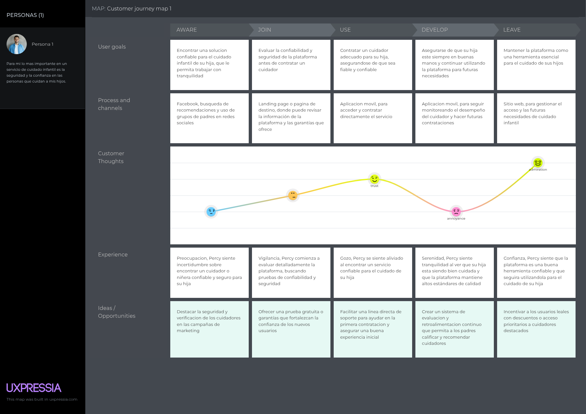

# COURSE PROJECT

---

<p align="center">
    <strong>Universidad Peruana de Ciencias Aplicadas (UPC)</strong><br>    
    </img><br>
    <strong>Carrera de Ingeniería de Software - Ciclo VI</strong><br><br>
    <strong>Aplicaciones para Dispositivos Móviles - 1ACC0238</strong><br>
    <br><strong>Profesor: Eduardo Martin Reyes Rodriguez</strong><br>
    <br><strong><b>INFORME DEL TRABAJO FINAL</strong></b><br>
</p>

<p align="center">
    <strong>Startup del Proyecto: SafeGroup</strong><br>
    <strong>Producto: SafeChild</strong><br>
</p>

<div>
    <h3 align="center">Team Members:</h3>
</div>

<div>
    <table align="center">
        <tr>
            <th style="text-align:center;">Member</th>
            <th style="text-align:center;">Code</th>
        </tr>
        <tr>
            <td>Bernaola Pérez, André Arturo</td>
            <td>U202114192 </td>
        </tr>
        <tr>
            <td>Gutierrez Garcia, Jose Eduardo</td>
            <td>U202221518</td>
        </tr>
        <tr>
            <td>Sanchez Ignacio, Jefrey Martin</td>
            <td>U202113324</td>
        </tr>
        <tr>
            <td>Velarde Luyo, Piero Alberto</td>
            <td>U20211A620</td>
        </tr>
    </table>
    </div>
</body>

<p align="center">
<br><strong>2025-01</strong></p>
<br>

---
# Registro de Versiones del Informe

| Versión | Fecha | Autor | Descripción de la modificación |
|----|----|----|----|
| TB1 | 25/04/2025 | SafeGroup | Redacción de los Capítulos I: Presentación, II: Requirements Elicitation & Analysis, III: Requirements Specification, IV: Solution Software Design. |

# Project Report Collaboration Insights

**TB1**: Las tareas correspondientes a la TB1 han sido completadas y están debidamente documentadas en el repositorio de GitHub para SafeGroup-Report. Puedes acceder al repositorio a través del siguiente enlace: [https://github.com/upc-pre-202501-1acc0238-356-SafeGroup/SafeGroup-report.git](https://github.com/upc-pre-202501-1acc0238-356-SafeGroup/SafeGroup-report.git)

Durante la fase de elaboración del informe, se realizaron las siguientes actividades:

- Se crearon y redactaron los contenidos asignados a cada miembro utilizando formato Markdown, y se realizaron "Conventional Commits" para registrar el progreso en el repositorio.

-  Se generaron los recursos necesarios y agregaron las imagenes al repositorio en la carpeta "assets" en cada rama del informe.

- Se organizaron reuniones para coordinar el avance de los componentes del informe y para proporcionar actualizaciones sobre los progresos del Sprint 1, que se centró en el desarrollo del diseño del software. <br>


# Contenido
## Tabla de contenidos
- [**Registro de Versiones del Informe**](#registro-de-versiones-del-informe)
- [**Project Report Collaboration Insights**](#project-report-collaboration-insights)
- [**Contenido**](#contenido)
    - [Tabla de contenidos](#tabla-de-contenidos)
- [**Student Outcome**](#student-outcome)
- [**Objetivos SMART**](#objetivos-smart)
- ## [ **Capítulo I: Introducción** ](#-capítulo-i-introducción-)
  - [**1.1. Startup Profile**](#11-startup-profile)
    - [**1.1.1. Descripción de la Startup**](#111-descripción-de-la-startup)
    - [**1.1.2. Perfiles de integrantes del equipo**](#112-perfiles-de-integrantes-del-equipo)
  - [**1.2. Solution Profile**](#12-solution-profile)
    - [**1.2.1 Antecedentes y problemática**](#121-antecedentes-y-problemática)
    - [What (¿Qué?)](#what-qué)
    - [Who (¿Quién?)](#who-quién)
    - [Where (¿Dónde?)](#where-dónde)
    - [When (¿Cuándo?)](#when-cuándo)
    - [Why (¿Por qué?)](#why-por-qué)
    - [How (¿Cómo?)](#how-cómo)
    - [How much (¿Cuánto?)](#how-much-cuánto)
    - [**1.2.2 Lean UX Process**](#122-lean-ux-process)
    - [**1.2.2.1. Lean UX Problem Statements**](#1221-lean-ux-problem-statements)
    - [**1.2.2.2. Lean UX Assumptions**](#1222-lean-ux-assumptions)
    - [**1.2.2.3. Lean UX Hypothesis Statements**](#1223-lean-ux-hypothesis-statements)
    - [**1.2.2.4. Lean UX Canvas**](#1224-lean-ux-canvas)
  - [**1.3. Segmentos objetivo**](#13-segmentos-objetivo)
- ## [ **Capítulo II: Requirements Elicitation \& Analysis**](#-capítulo-ii-requirements-elicitation--analysis)
  - [**2.1. Competidores**](#21-competidores)
    - [**2.1.1. Análisis competitivo**](#211-análisis-competitivo)
    - [**2.1.2. Estrategias y tácticas frente a competidores**](#212-estrategias-y-tácticas-frente-a-competidores)
  - [**2.2. Entrevistas**](#22-entrevistas)
    - [**2.2.1. Diseño de entrevistas**](#221-diseño-de-entrevistas)
    - [**2.2.2. Registro de entrevistas**](#222-registro-de-entrevistas)
    - [**2.2.3. Análisis de entrevistas**](#223-análisis-de-entrevistas)
  - [**2.3. Needfinding**](#23-needfinding)
    - [**2.3.1. User Personas**](#231-user-personas)
    - [**2.3.2. User Task Matrix**](#232-user-task-matrix)
    - [**2.3.3. User Journey Mapping**](#233-user-journey-mapping)
    - [**2.3.4. Empathy Mapping**](#234-empathy-mapping)
    - [**2.3.5. As-is Scenario Mapping**](#235-as-is-scenario-mapping)
  - [**2.4. Ubiquitous Language**](#24-ubiquitous-language)
- ## [ **Capítulo III: Requirements Specification**](#-capítulo-iii-requirements-specification)
  - [**3.1. To-Be Scenario Mapping**](#31-to-be-scenario-mapping)
  - [**3.2. User Stories**](#32-user-stories)
  - [**3.3. Impact Mapping**](#33-impact-mapping)
  - [**3.4. Product Backlog**](#34-product-backlog)
- ## [**Capítulo IV: Solution Software Design**](#capítulo-iv-solution-software-design)
  - [**4.1. Strategic-Level Domain-Driven Design**](#41-strategic-level-domain-driven-design)
    - [**4.1.1. EventStorming**](#411-eventstorming)
      - [**4.1.1.1. Candidate Context Discovery**](#4111-candidate-context-discovery)
      - [**4.1.1.2. Domain Message Flows Modeling**](#4112-domain-message-flows-modeling)
      - [**4.1.1.3. Bounded Context Canvases**](#4113-bounded-context-canvases)
  - [**4.1.2. Context Mapping**](#412-context-mapping)
  - [**4.1.3. Software Architecture.**](#413-software-architecture)
      - [**4.1.3.1. Software Architecture Context Level Diagrams.**](#4131-software-architecture-context-level-diagrams)
      - [**4.1.3.2. Software Architecture Container Level Diagrams.**](#4132-software-architecture-context-level-diagrams)
      - [**4.1.3.3. Software Architecture Deploymnet Diagrams.**](#4133-software-architecture-deploymnet-diagrams)
  - [**4.2.Tactical-Level Domain-Driven Design**](#42-tactical-level-domain-driven-design)
    - [**4.2.1. Bounded Context: Bounded Context: User Managment**](#421-bounded-context:-user-managment)
      - [**4.2.1.1. Domain Layer**](#4211-domain-layer)
      - [**4.2.1.2. Interface Layer**](#4212-interface-layer)
      - [**4.2.1.3. Application Layer**](#4213-application-layer)
      - [**4.2.1.4. Infrastructure Layer**](#4214-infrastructure-layer)
      - [**4.2.1.5. Bounded Context Software Architecture Component Level Diagrams**](#4215-bounded-context-software-architecture-component-level-diagrams)
      - [**4.2.1.6. Bounded Context Software Architecture Code Level Diagrams**](#4216-bounded-context-software-architecture-code-level-diagrams)
        - [**4.2.1.6.1. Bounded Context Domain Layer Class Diagrams**](#42161-bounded-context-domain-layer-class-diagrams)
        - [**4.2.1.6.2. Bounded Context Database Design Diagram**](#42162-bounded-context-database-design-diagram)
    - [**4.2.2. Bounded Context: Bounded Context: Payments**](#422-bounded-context:payments)
      - [**4.2.2.1. Domain Layer**](#4221-domain-layer)
      - [**4.2.2.2. Interface Layer**](#4222-interface-layer)
      - [**4.2.2.3. Application Layer**](#4223-application-layer)
      - [**4.2.2.4. Infrastructure Layer**](#4224-infrastructure-layer)
      - [**4.2.2.5. Bounded Context Software Architecture Component Level Diagrams**](#4225-bounded-context-software-architecture-component-level-diagrams)
      - [**4.2.2.6. Bounded Context Software Architecture Code Level Diagrams**](#4226-bounded-context-software-architecture-code-level-diagrams)
        - [**4.2.2.6.1. Bounded Context Domain Layer Class Diagrams**](#42261-bounded-context-domain-layer-class-diagrams)
        - [**4.2.2.6.2. Bounded Context Database Design Diagram**](#42262-bounded-context-database-design-diagram)
    - [**4.2.3. Bounded Context: Bounded Context: Appoiments**](#423-bounded-context:-appoiments)
      - [**4.2.3.1. Domain Layer**](#4231-domain-layer)
      - [**4.2.3.2. Interface Layer**](#4232-interface-layer)
      - [**4.2.3.3. Application Layer**](#4233-application-layer)
      - [**4.2.3.4. Infrastructure Layer**](#4234-infrastructure-layer)
      - [**4.2.3.5. Bounded Context Software Architecture Component Level Diagrams**](#4235-bounded-context-software-architecture-component-level-diagrams)
      - [**4.2.3.6. Bounded Context Software Architecture Code Level Diagrams**](#4236-bounded-context-software-architecture-code-level-diagrams)
        - [**4.2.3.6.1. Bounded Context Domain Layer Class Diagrams**](#42361-bounded-context-domain-layer-class-diagrams)
        - [**4.2.3.6.2. Bounded Context Database Design Diagram**](#42362-bounded-context-database-design-diagram)
    - [**4.2.4. Bounded Context: Bounded Context: Messaging**](#424-bounded-context:-messaging)
      - [**4.2.4.1. Domain Layer**](#4241-domain-layer)
      - [**4.2.4.2. Interface Layer**](#4242-interface-layer)
      - [**4.2.4.3. Application Layer**](#4243-application-layer)
      - [**4.2.4.4. Infrastructure Layer**](#4244-infrastructure-layer)
      - [**4.2.4.5. Bounded Context Software Architecture Component Level Diagrams**](#4245-bounded-context-software-architecture-component-level-diagrams)
      - [**4.2.4.6. Bounded Context Software Architecture Code Level Diagrams**](#4246-bounded-context-software-architecture-code-level-diagrams)
        - [**4.2.4.6.1. Bounded Context Domain Layer Class Diagrams**](#42461-bounded-context-domain-layer-class-diagrams)
        - [**4.2.4.6.2. Bounded Context Database Design Diagram**](#42462-bounded-context-database-design-diagram)
- ## [**Capítulo V: Solution UI/UX Design**](#capítulo-v-solution-ui/ux-design)
  - [**5.1. Product Design**](#51-product-design)
    - [**5.1.1. Style Guidelines**](#511-style-guidelines)
      - [**5.1.1.1. General Style Guidelines**](#5111-general-style-guidelines)
    - [**5.1.2. Information Architecture**](#512-information-architecture)
      - [**5.1.2.1. Organization Systems**](#5121-organization-systems)
      - [**5.1.2.2. Labeling Systems**](#51212-labeling-systems)
      - [**5.1.2.3. SEO Tags and Meta Tags**](#51213-seo-tags-and-meta-tags)
      - [**5.1.2.4. Searching Systems**](#51214-searching-systems)
      - [**5.1.2.5. Navigation Systems**](#51215-navigation-systems)
    - [**5.1.3. Landing Page UI Design**](#513-landing-page-ui-design)
      - [**5.1.3.1. Landing Page Wireframe**](#5131-landing-page-wireframe)
      - [**5.1.3.2. Landing Page Mock-up**](#5132-landing-page-mock-up)
    - [**5.1.4. Mobile Applications UX/UI Design**](#514-mobile-applications-uxui-design)
    - [**5.1.4.1. Mobile Applications Wireframes**](#5141-mobile-applications-wireframes)
    - [**5.1.4.2. Mobile Applications Wireflow Diagrams**](#5142-mobile-applications-wireflow-diagrams)
    - [**5.1.4.3. Mobile Applications Mock-ups**](#5143-mobile-applications-mock-ups)
    - [**5.1.4.4. Mobile Applications User Flow Diagrams**](#5144-mobile-applications-user-flow-diagrams)
    - [**5.1.4.5. Mobile Applications Prototyping**](#5145-mobile-applications-prototyping)
- ## [**Capítulo VI: Product Implementation, Validation & Deployment**](#capítulo-vi-product-implementation-validation-&-deployment)
  - [**6.1. Software Configuration Management**](#61-software-configuration-management)
    - [**6.1.1. Software Development Environment Configuration**](#611-software-development-environment-configuration)
    - [**6.1.2. Source Code Management**](#612-source-code-management)
    - [**6.1.3. Source Code Style Guide & Conventions**](#613-source-code-style-guide--conventions)
    - [**6.1.4. Software Deployment Configuration**](#614-software-deployment-configuration)
  - [**6.2. Landing Page, Services & Mobile Application Implementation**](#52-landing-page-services--mobile-application-implementation)
    - [**6.2.1. Sprint 1**](#621-sprint-1)
    - [**6.2.1.1. Sprint Planning 1**](#6211-sprint-planning-1)
    - [**6.2.1.2. Sprint Backlog 1**](#6212-sprint-backlog-1)
    - [**6.2.1.3. Development Evidence for Sprint Review**](#6213-development-evidence-for-sprint-review)
    - [**6.2.1.4. Testing Suite Evidence for Sprint Review**](#6214-testing-suite-evidence-for-sprint-review)
    - [**6.2.1.5. Execution Evidence for Sprint Review**](#6215-execution-evidence-for-sprint-review)
    - [**6.2.1.6. Services Documentation Evidence for Sprint Review**](#6216-services-documentation-evidence-for-sprint-review)
    - [**6.2.1.7. Software Deployment Evidence for Sprint Review**](#6217-software-deployment-evidence-for-sprint-review)
    - [**6.2.1.8. Team Collaboration Insights during Sprint**](#6218-team-collaboration-insights-during-sprint)
- [**Conclusiones**](#conclusiones)
- [**Conclusiones y recomendaciones**](#conclusiones-y-recomendaciones)
- [**Bibliografía**](#bibliografía)
- [**Anexos**](#anexos)

# Student Outcome

| Criterio específico | Acciones realizadas | Conclusiones |
|----|----|----|
|Actualiza conceptos y conocimientos necesarios para su desarrollo profesional y en especial para su proyecto en soluciones de software.| **Bernaola Pérez, André Arturo**<br>*TB1*<br>Aprendí a profundizar en el enfoque Lean UX y reforcé mis conocimientos sobre Problem Statements, Assumptions y Hypothesis Statements. Me aseguré de actualizar mis técnicas de investigación rápida, formulé hipótesis claras y utilicé el Lean UX Canvas para estructurar de forma efectiva el Capítulo I: Presentación. Durante el proceso puse en práctica herramientas colaborativas como Miro para diseñar flujos de usuario y validé mis ideas con el equipo antes de plasmarlas en el documento.<br></br>**Gutierrez Garcia, Jose Eduardo**<br>*TB1*<br>Actualicé mis habilidades de investigación de usuarios aprendiendo nuevas metodologías de entrevistas y análisis competitivo. Apliqué Needfinding en el Capítulo II, creando User Personas, User Journey Maps y Empathy Maps que reflejan los hallazgos de las entrevistas. Aprendí a sintetizar datos cuantitativos y cualitativos para definir el Ubiquitous Language y asegurarme de que todos los términos del dominio estuvieran claros y alineados con las necesidades reales de padres y cuidadores.<br></br>**Sanchez Ignacio, Jefrey Martin**<br>*TB1*<br>Actualicé mis conocimientos de Impact Mapping y priorización de funcionalidades, traduciendo los hallazgos de la etapa de análisis en User Stories y un Product Backlog consistente. Aprendí a definir To-Be Scenarios y a organizar el backlog por valor de negocio en el Capítulo III. En este proceso profundicé en técnicas de estimación ágil y priorización MoSCoW, asegurando que cada historia estuviera correctamente refinada y alineada con los objetivos SMART del proyecto. <br></br> **Velarde Luyo, Piero Alberto**<br>*TB1*<br>Aprendí y apliqué prácticas avanzadas de Domain-Driven Design: realicé EventStorming para descubrir Candidate Contexts, modelé Domain Message Flows y elaboré Bounded Context Canvases. Además, actualicé mis competencias en context mapping y diseñé diagramas de arquitectura de software en niveles de contexto, contenedor y despliegue para el Capítulo IV. Esto me permitió entender mejor cómo se comunican los distintos módulos y cómo garantizar la escalabilidad y mantenibilidad de la solución. | TB1: <br> Como equipo, actualizamos y aplicamos de manera integrada conceptos de Lean UX, investigación de usuarios, modelado de dominio y arquitectura de software. Cada uno fortaleció tanto su perfil profesional—desde entrevistas y mapeos hasta diseño de flujos de mensajes y diagramas de despliegue—como nuestra capacidad colectiva para construir una plataforma móvil robusta y centrada en las necesidades reales de padres y cuidadores. Este aprendizaje conjunto nos ha preparado para afrontar con metodología y rigor el desarrollo de la solución, mejorando nuestra colaboración, comunicación y alineación estratégica.|

| Criterio específico | Acciones realizadas | Conclusiones |
|----|----|----|
|Reconoce la necesidad del aprendizaje permanente para el desempeño profesional y el desarrollo de proyectos en soluciones de software.|**Bernaola Pérez, André Arturo**<br>*TB1*<br>Aprendí a identificar tendencias emergentes en UX y metodologías ágiles revisando artículos y estudios de caso semanalmente, lo que me permitió actualizar mis técnicas en Lean UX y validación rápida; luego compartí estos aprendizajes con el equipo en sesiones quincenales de retroalimentación.<br></br>**Gutierrez Garcia, Jose Eduardo**<br>*TB1*<br>Reconocí la importancia de profundizar en investigación de usuarios, por lo que me inscribí en un curso avanzado de entrevistas cualitativas, exploré Figma y Miro con tutoriales diarios y documenté plantillas reutilizables para mapas de empatía y user journeys en nuestra wiki interna.<br></br>**Sanchez Ignacio, Jefrey Martin**<br>*TB1*<br>Aprendí nuevas prácticas de priorización de backlog al participar en un workshop de Product Discovery y actualicé mis conocimientos en Impact Mapping y Scrum; apliqué metodologías de estimación ágil (Planning Poker, T-shirt sizing) en nuestras sesiones de sprint para mejorar la precisión de los compromisos. <br></br> **Velarde Luyo, Piero Alberto**<br>*TB1*<br>Reconocí la necesidad de dominar Domain-Driven Design y me uní a un grupo de estudio sobre EventStorming, lo que me permitió actualizar mis competencias en context mapping y arquitectura de microservicios; luego modelé flujos de mensajes complejos y documenté cada bounded context en nuestra herramienta colaborativa. | TB1: <br> Como equipo, reafirmamos que el aprendizaje permanente es fundamental para mantenernos competitivos y mejorar la calidad de nuestro proyecto. Cada integrante adoptó hábitos de actualización continua y aplicó nuevas metodologías, fortaleciendo nuestras habilidades técnicas y nuestra capacidad de adaptación, colaboración y crecimiento conjunto en el desarrollo de la plataforma móvil de cuidado infantil.|

----

# Objetivos SMART
### André
Objetivo 1:
- Finalizar un programa intensivo especializado en desarrollo full-stack (como los ofrecidos por freeCodeCamp o The Odin Project) dentro de los primeros ocho meses posteriores a la graduación, con el propósito de fortalecer mi perfil técnico e incrementar mi competitividad en el mercado laboral.

Objetivo 2:
- Acceder a un programa de especialización en arquitectura de software dentro de los dos primeros años tras concluir la carrera, como parte de mi proyección profesional hacia el rol de arquitecto de software.

### Jose
- Objetivo 1:
Obtener una certificación reconocida en tecnologías de desarrollo backend (por ejemplo, Node.js o Java Spring) en un plazo no mayor a seis meses después de la graduación, con el fin de potenciar mi perfil profesional y acceder a oportunidades laborales en el área de desarrollo de software.

- Objetivo 2:
Participar activamente en al menos tres proyectos de código abierto en plataformas colaborativas como GitHub durante el primer año posterior a mi egreso, con el objetivo de adquirir experiencia práctica y establecer vínculos con la comunidad tecnológica.

### Jefrey
- Objetivo 1:
Asistir a un mínimo de dos talleres o cursos especializados en tecnologías frontend (como React o Vue.js) en los seis meses siguientes a la finalización de la carrera, a fin de complementar mis conocimientos previos en HTML, CSS y JavaScript y consolidar mis habilidades en desarrollo web.

- Objetivo 2:
Obtener una posición como desarrollador junior, ya sea mediante una pasantía o empleo formal, en un periodo no mayor a cuatro meses después de egresar, para iniciar mi trayectoria profesional y aplicar de forma práctica los conocimientos adquiridos en la universidad.

### Piero
- Objetivo 1:
Matricularme en un curso especializado en tecnologías emergentes (como inteligencia artificial o blockchain) en el transcurso del primer año posterior a la graduación, con la finalidad de mantenerme actualizado respecto a las innovaciones tecnológicas y explorar nuevas áreas de especialización.

- Objetivo 2:
Diseñar, desarrollar y publicar una aplicación (móvil o web) dentro de los primeros diez meses luego de finalizar mis estudios, con el objetivo de construir un portafolio profesional sólido que refleje mis competencias técnicas y creatividad en el desarrollo de software.
----

# Capítulo I: Introducción

## 1.1. Startup Profile

### 1.1.1. Descripción de la Startup

"SafeGroup" es una empresa emergente en el ámbito del desarrollo de software, comprometida con la creación de soluciones tecnológicas a medida y de alta calidad. Nació de la iniciativa de un grupo de ingenieros de software, quienes se formaron en la Universidad Peruana de Ciencias Aplicadas.
SafeGroup se distingue por su enfoque centrado en el cliente, colaborando estrechamente con ellos para identificar sus necesidades y ofrecer soluciones tecnológicas que se alineen con sus objetivos específicos.

El equipo de SafeGroup está conformado por desarrolladores, diseñadores creativos y analistas de negocios altamente capacitados, que trabajan de manera conjunta para desarrollar soluciones escalables y personalizadas. Entre sus servicios destacan el desarrollo de software a medida, la creación de aplicaciones móviles y el diseño de sitios web. SafeGroup utiliza tecnologías de última generación y sigue un enfoque ágil en sus procesos, asegurando que las soluciones que ofrece sean robustas, eficientes y adaptables. Además, la empresa brinda soporte continuo y servicios de mantenimiento para garantizar la operación óptima de las soluciones entregadas.

**Visión:**
La visión de SafeGroup es consolidarse como un referente global en el desarrollo de software, proporcionando soluciones personalizadas y de alta calidad que impulsen el éxito de empresas y organizaciones a nivel mundial.

**Misión:**
La misión de SafeGroup es diseñar y desarrollar soluciones tecnológicas innovadoras y adaptadas a las necesidades de sus clientes, contribuyendo al crecimiento y eficiencia de empresas en una amplia gama de sectores.

### 1.1.2. Perfiles de integrantes del equipo

|                    Photo                        |                                                                                                                                                                                                                                                                                                    Description                                                                                                                                                                                                                                                                                                    |
| :------------------------------------------------: | :---------------------------------------------------------------------------------------------------------------------------------------------------------------------------------------------------------------------------------------------------------------------------------------------------------------------------------------------------------------------------------------------------------------------------------------------------------------------------------------------------------------------------------------------------------------------------------------------------------------: |
|  |                                                                         Soy André Bernaola, estudiante de Ingeniería de Software con interés en videojuegos y aprendizaje constante. Mi objetivo profesional es desarrollarme como full-stack y luego como arquitecto de software.                                                                                                                         |
|    | Mi nombre es Jose Gutierrez, tengo 21 años, actualmente me encuentro cruzando mi 6to ciclo de la carrera de ingeniería de software en la UPC. Me gusta jugar videojuegos y practicar natación, soy un gran aficionado de la tecnología y del ensamblaje de computadoras. Me considero una persona dispuesta siempre a aprender tecnologías nuevas, creativa y responsable.|
|   | Mi nombre es Jefrey Sanchez, me considero una persona amable, que trabaja en equipo, tengo habilidades en html, css, javascript, C++. Estoy con muchas ganas de aprender del curso y de mis compañeros.|
|    |                                                                                                                              Soy Piero, estudio la carrera de ingeniería de software en la Universidad Peruana de Ciencias Aplicadas. Escogí esta carrera por mi facilidad en el uso de las computadoras. Asimismo, por mi interés en el funcionamiento de las anteriores mencionadas y todo respecto a la programación y las tecnologías emergentes.|

## 1.2. Solution Profile

Ante esta problemática, proponemos una plataforma digital que conecte de forma rápida, segura y eficiente a familias con cuidadores infantiles calificados. Esta solución busca reducir las barreras de acceso al cuidado infantil confiable, ofreciendo herramientas como perfiles verificados, reseñas de usuarios, filtros de búsqueda personalizados y opciones de reserva y pago en línea. Además, se prioriza la inclusión de cuidadores certificados y se promueve la formación continua para garantizar un servicio de calidad. De esta manera, la plataforma no solo atiende las necesidades de los padres, sino que también genera oportunidades laborales formales para los cuidadores en un mercado en crecimiento.

### 1.2.1. Antecedentes y problemática 

### What (¿Qué?)

La creciente demanda de servicios de cuidado infantil y la falta de acceso a cuidadores calificados y confiables representan un problema importante en el Perú. Las familias, en especial aquellas con varios hijos o encabezadas por padres que trabajan, se ven afectadas por la escasez de opciones que garanticen la seguridad y el desarrollo adecuado de los niños. Esta problemática tiene graves consecuencias, incluyendo el aumento del estrés parental y posibles efectos negativos en el desarrollo infantil.

### Who (¿Quién?)

El problema afecta principalmente a los padres, madres solteras y tutores que necesitan equilibrar sus responsabilidades laborales y familiares. También impacta a los cuidadores potenciales, como niñeras y tutores, que tienen dificultades para conectarse con las familias que requieren sus servicios. Los niños, quienes dependen de un entorno de cuidado seguro y estimulante para su desarrollo, también se ven afectados por esta situación.

### Where (¿Dónde?)

Este problema es más evidente en áreas urbanas y suburbanas de Perú, donde la densidad poblacional dificulta el acceso a cuidadores calificados. En estas zonas, las familias enfrentan mayores dificultades logísticas para encontrar cuidadores que se adapten a sus necesidades y expectativas..

### When (¿Cuándo?)

La problemática ha sido más notable desde la pandemia de COVID-19, que ha exacerbado las dificultades de las familias para encontrar cuidadores confiables debido a cambios en las dinámicas laborales y el distanciamiento social. Sin embargo, la necesidad de servicios de cuidado infantil es una constante que ha ido creciendo en los últimos años debido a las presiones económicas y familiares.

### Why (¿Por qué?)

Este problema es el resultado de varios factores: el cambio en las estructuras familiares, el aumento de hogares monoparentales y la falta de redes de apoyo locales. Además, la escasez de cuidadores capacitados y los altos costos del servicio limitan las opciones disponibles para muchas familias. Esta situación afecta desproporcionadamente a las familias de ingresos bajos y medios, que enfrentan barreras económicas para acceder a servicios de calidad (FasterCapital, 2024).

### How (¿Cómo?)

La falta de una plataforma eficiente para conectar a los cuidadores con las familias que necesitan sus servicios agrava el problema. La búsqueda de cuidadores calificados suele ser lenta y poco efectiva, lo que aumenta la incertidumbre de los padres y reduce las oportunidades de trabajo para los cuidadores. Las familias también enfrentan dificultades al no contar con información clara y accesible sobre los servicios de cuidado infantil disponibles.

### How much (¿Cuánto?)

El impacto económico es significativo. Muchas familias no pueden permitirse los costos elevados del cuidado infantil, lo que a menudo las obliga a tomar decisiones que pueden comprometer el bienestar de sus hijos. La escasez de cuidadores capacitados también incrementa los precios, lo que hace que el cuidado infantil de calidad esté fuera del alcance de muchas familias, perpetuando desigualdades socioeconómicas.

### 1.2.2. Lean UX Process 

#### 1.2.2.1. Lean UX Problem Statements

Nuestra plataforma "SafeChild" busca abordar un problema significativo en el cuidado infantil al conectar a padres con cuidadores confiables. Los padres enfrentan dificultades para encontrar opciones de cuidado infantil y educación de calidad en el hogar, lo que genera un alto nivel de estrés y afecta su capacidad para equilibrar responsabilidades laborales y familiares. Al mismo tiempo, los cuidadores y educadores a menudo tienen dificultades para encontrar familias que necesiten sus servicios, lo que limita sus oportunidades laborales y afecta la disponibilidad de servicios adecuados para las familias.

¿Cómo podemos resolver la falta de conexión eficiente entre padres que necesitan cuidado infantil de calidad y cuidadores que buscan oportunidades laborales? Al comprender las barreras que enfrentan ambos grupos, nuestro objetivo es superar estos obstáculos mediante una plataforma que facilite la conexión y mejora la disponibilidad y calidad del cuidado infantil, beneficiando tanto a los padres como a los cuidadores.

#### 1.2.2.2. Lean UX Assumptions

**Business Assumptions**

<ul> <li>Los padres estarán dispuestos a adoptar una plataforma digital para encontrar cuidadores confiables, especialmente si la plataforma ofrece perfiles verificados y opciones personalizadas para el cuidado infantil.</li> <li>La demanda de servicios de cuidado infantil de calidad está creciendo debido al aumento de la preocupación por la seguridad y el desarrollo infantil en el hogar.</li> <li>Los cuidadores estarán interesados en unirse a una plataforma que les permita conectarse con familias que buscan sus servicios, especialmente si la plataforma facilita la visibilidad y las oportunidades de empleo.</li> <li>Existe una capacidad técnica y recursos disponibles para desarrollar y mantener la plataforma SafeChild, asegurando su funcionalidad y escalabilidad.</li> <li>La accesibilidad y la usabilidad serán características clave para el éxito de la plataforma, garantizando que tanto padres como cuidadores puedan utilizarla de manera efectiva sin importar su nivel de experiencia tecnológica.</li> <li>El mercado de servicios de cuidado infantil está en crecimiento y presenta oportunidades para el éxito comercial de SafeChild.</li> <li>La seguridad y la privacidad de los datos de los usuarios serán aspectos fundamentales, y los usuarios confiarán en que sus datos estarán protegidos y manejados de manera responsable.</li> <li>La plataforma será capaz de adaptarse a diferentes necesidades de cuidado infantil y educativo, lo que atraerá a una amplia variedad de padres y cuidadores que buscan opciones personalizadas y de calidad.</li> </ul>

**User Assumptions**

<ul> <li><b>¿Quién es el usuario?:</b> Nuestro segmento objetivo incluye a padres que buscan cuidadores confiables para el cuidado infantil en en el hogar, así como a los mismo cuidadores que desean ofrecer sus servicios a estas familias.</li> <li><b>¿Dónde encaja nuestro producto, en su trabajo o vida?:</b> SafeChild encaja en la vida diaria de los padres que necesitan encontrar y gestionar servicios de cuidado infantil, y en la vida profesional de los cuidadores que buscan oportunidades para ofrecer sus servicios.</li> <li><b>¿Qué problemas tiene nuestro producto y cómo se pueden resolver?:</b> SafeChild enfrenta desafíos como la necesidad de verificar la calidad y la fiabilidad de los cuidadores y educadores, la integración de actualizaciones en tiempo real sobre las actividades de los niños, y la retención de usuarios a través de recursos educativos y seguimiento del desarrollo. Estos problemas pueden abordarse mediante un sistema de verificación riguroso, características de seguimiento y comunicación en tiempo real, y la oferta de recursos educativos valiosos tanto para padres como para cuidadores.</li> <li><b>¿Cuándo y cómo es usado nuestro producto?:</b> SafeChild se utiliza cuando los padres necesitan encontrar y gestionar servicios de cuidado infantil, y cuando los cuidadores buscan oportunidades laborales y conexión con familias. La plataforma se usa para reservas, comunicación y seguimiento de actividades.</li> <li><b>¿Qué características son importantes?:</b> Es crucial que SafeChild ofrezca perfiles verificados de cuidadores, opciones de personalización para adaptarse a las necesidades específicas de cada familia, actualizaciones en tiempo real sobre las actividades de los niños, y recursos educativos útiles.</li> <li><b>¿Cómo debe verse nuestro producto y cómo debe comportarse?:</b> SafeChild debe presentar una interfaz intuitiva y fácil de usar que facilite la búsqueda y reserva de servicios, la comunicación entre padres y cuidadores, y el acceso a recursos educativos. La plataforma debe ofrecer una experiencia de usuario segura y confiable, asegurando que tanto padres como cuidadores puedan navegar y utilizar sus funciones con facilidad.</li> </ul>

#### 1.2.2.3. Lean UX Hypothesis Statements

<ol> <li><b>Creemos que</b> los padres estarán satisfechos con la capacidad de buscar y seleccionar cuidadores verificados de acuerdo con sus necesidades específicas. <b>Sabremos que</b> esta afirmación es cierta <b>cuando</b> observemos un alto índice de retención de usuarios y una frecuencia creciente en las reservas de servicios dentro de la plataforma.</li> <li><b>Creemos que</b> los cuidadores valorarán la facilidad de uso de la plataforma para conectarse con familias que buscan sus servicios. <b>Sabremos que</b> esta afirmación es cierta <b>cuando</b> veamos un aumento en el número de cuidadores registrados y activos, así como una alta tasa de interacción con los perfiles de las familias.</li> <li><b>Creemos que</b> la implementación de un proceso de verificación riguroso para los cuidadores y educadores fortalecerá la confianza de los padres en la plataforma. <b>Sabremos que</b> esta afirmación es cierta <b>cuando</b> notemos una disminución en las consultas relacionadas con la seguridad y un aumento en el número de usuarios que completan el proceso de registro y confirman sus reservas.</li> <li><b>Creemos que</b> ofrecer actualizaciones en tiempo real sobre las actividades de los niños será un factor decisivo para los padres al elegir utilizar la plataforma. <b>Sabremos que</b> esta afirmación es cierta <b>cuando</b> observemos una alta tasa de uso de la función de actualizaciones en tiempo real y una mayor satisfacción reportada por los padres en sus evaluaciones.</li> <li><b>Creemos que</b> la disponibilidad de recursos educativos y herramientas de seguimiento del desarrollo infantil mejorará la retención de usuarios tanto para padres como para cuidadores. <b>Sabremos que</b> esta afirmación es cierta <b>cuando</b> notemos un uso continuo de estos recursos y una mayor fidelización de usuarios a lo largo del tiempo.</li> </ol>

#### 1.2.2.4. Lean UX Canvas  

<table> <tr> <th valign="top"> <p><b>1. Business Problem</b></p>
 <p>La creciente demanda de servicios de cuidado infantil y la falta de acceso a cuidadores calificados y confiables en Perú afectan a padres y cuidadores. Las familias enfrentan estrés por la escasez de opciones seguras y adecuadas, mientras que los cuidadores luchan por encontrar oportunidades laborales. La falta de una plataforma eficiente para conectar estos dos grupos agrava el problema.</p> </th> <th valign="top"> <p><b>2. Business Outcomes</b></p> <p>- Aumento en la retención de usuarios (padres y cuidadores).</p> <p>- Incremento en la tasa de reservas repetidas.</p> <p>- Mejora en la satisfacción del usuario.</p> <p>- Expansión de la base de usuarios.</p> </th> <th rowspan="2" valign="top"> <p><b>5. Solutions</b></p> <p>- Desarrollo de una plataforma que conecte a padres con cuidadores verificados.</p> <p>- Funcionalidades como la programación de sesiones, actualizaciones en tiempo real, recursos educativos, y seguimiento del desarrollo infantil.</p> </th> </tr> <tr> <td valign="top"> <p><b>3. Users</b></p> <p>- Usuarios primarios: Padres que necesitan servicios de cuidado infantil y educación en el hogar.</p> <p>- Usuarios secundarios: Niñeras, tutores, y educadores en busca de oportunidades laborales.</p> <p>- Clientes: Familias que pagan por los servicios y cuidadores que pagan por publicidad o acceso a más oportunidades.</p> </td> <td valign="top"> <p><b>4. User Benefits</b></p> <p>- Padres: Acceso a perfiles verificados de cuidadores y educadores, posibilidad de programar servicios según sus necesidades, y recibir actualizaciones en tiempo real sobre las actividades de sus hijos.</p> <p>- Cuidadores: Oportunidades laborales directas y una plataforma que valida y promueve sus servicios.</p> </td> </tr> <tr> <td valign="top"> <p><b>6. Hypothesis</b></p> <p>- Creemos que los padres estarán satisfechos con la capacidad de buscar y seleccionar cuidadores verificados. Sabremos que esta afirmación es cierta cuando observemos un alto índice de retención de usuarios y una frecuencia creciente en las reservas.</p> <p>- Creemos que los cuidadores valorarán la facilidad de uso para conectarse con familias. Sabremos que esta afirmación es cierta cuando veamos un aumento en el número de cuidadores registrados y activos, así como una alta tasa de interacción con los perfiles de las familias.</p> <p>- Creemos que un proceso de verificación riguroso fortalecerá la confianza de los padres. Sabremos que esta afirmación es cierta cuando notemos una disminución en las consultas relacionadas con la seguridad y un aumento en el número de usuarios que completan el proceso de registro y confirman sus reservas.</p> <p>- Creemos que ofrecer actualizaciones en tiempo real será un factor decisivo para los padres. Sabremos que esta afirmación es cierta cuando observemos una alta tasa de uso de esta función y una mayor satisfacción reportada por los padres.</p> <p>- Creemos que la disponibilidad de recursos educativos y herramientas de seguimiento mejorará la retención de usuarios. Sabremos que esta afirmación es cierta cuando notemos un uso continuo de estos recursos y una mayor fidelización a lo largo del tiempo.</p> </td> <td valign="top"> <p><b>7. What’s the most important thing we need to learn first?</b></p> <p>Necesitamos validar si los usuarios valorarán la seguridad, personalización y la calidad del servicio proporcionado por la plataforma.</p> </td> <td valign="top"> <p><b>8. What’s the least amount of work we need to do to learn the next most important thing?</b></p> <p>Lanzaremos una versión beta con funcionalidades clave y analizaremos la adopción y el feedback para validar la propuesta de valor.</p> </td> </tr> </table>


## 1.3. Segmentos objetivo  

Nuestro segmento objetivo abarca a todos aquellos padres y tutores que buscan soluciones confiables y flexibles para el cuidado infantil permitiéndoles combinar sus responsabilidades laborales con la tranquilidad de saber que sus hijos están bien atendidos.Además, la plataforma también se dirige a cuidadores, tutores y educadores que desean expandir sus oportunidades laborales y generar ingresos a través de la prestación de servicios personalizados y verificados. A continuación, se presenta características demográficas relevantes y información estadística que respalda la importancia de cada segmento.

**1.Padres**

- Este segmento abarca a todos los padres y tutores que buscan soluciones confiables y flexibles para el cuidado infantil y la educacion para el hogar. Ademas, incluye a familias que buscan servicios de cuidado infantil y opciones educativas personalizadas en el hogar.

- #### Caracteristicas Demograficas
  - Edad: 20-45 años.
  - Estado Civil: Casados, en pareja, o monoparentales.
  - Motivaciones: Seguridad, conveniencia, eduación de calidad, flexibilidad del programa

**2.Cuidadores (Niñeras y Tutores)**

- Este segmento está abarca a todas las personas que trabajan como niñeras, cuidadoras infantiles, o asistentes domésticas. Son profesionales que buscan incrementar sus ingresos y expandir sus oportunidades laborales ofreciendo servicios de cuidado infantil de alta calidad. Estos cuidadores suelen estar altamente motivados por la flexibilidad laboral que les permite manejar su propio horario y trabajar en diferentes entornos.

- #### Caracteristicas Demograficas
  - **Edad:** 18-45 años.
  - **Educación:** Varía desde secundaria completa hasta educación superior, con algunos poseyendo certificaciones específicas en cuidado infantil.
  - **Estado Civil:** Casados, en pareja, o monoparentales.
  - **Motivaciones:** Flexibilidad de sus horarios, la posibilidad de trabajar con familias que valoran sus habilidades y para establecer relaciones laborales estables y duraderas con las familias a las que sirven.

----

# Capítulo II: Requirements Elicitation & Analysis

## 2.1. Competidores  
### 2.1.1. Análisis competitivo


<div align="center">

| Competitive Analysis Landscape |                                                        |                                                                                                                                                                                                                    |                                                                                                                                                                     |                                                                                                                                                          |                                                                                                                                                                    |
| ------------------------------ | ------------------------------------------------------ | ------------------------------------------------------------------------------------------------------------------------------------------------------------------------------------------------------------------ | ------------------------------------------------------------------------------------------------------------------------------------------------------------------- | -------------------------------------------------------------------------------------------------------------------------------------------------------- | ------------------------------------------------------------------------------------------------------------------------------------------------------------------ |
| ¿Por qué llevar este análisis? |                                                        | Para proporcionar información valiosa acerca de los competidores en el sector de servicios de cuidado infantil, lo cual nos servirá para mejorar la calidad de nuestro servicio y posicionar mejor nuestra oferta. |                                                                                                                                                                     |                                                                                                                                                          |                                                                                                                                                                    |
|                                |                                                        | SafeChild                                                                                                                                                                                                          | Care.com                                                                                                                                                            | Sittercity                                                                                                                                               | UrbanSitter                                                                                                                                                        |
| **Perfil**                     | Overview                                               | SafeChild es una plataforma integral para conectar a padres con cuidadores de confianza, utilizando tecnología avanzada para verificación de antecedentes y gestión de reservas.                                   | Care.com es una plataforma globalmente reconocida que ofrece servicios de cuidado infantil, cuidado de ancianos y más, con una extensa base de datos de cuidadores. | Sittercity es una plataforma que conecta a familias con niñeras y cuidadores a través de una base de datos amplia y detallada de perfiles de cuidadores. | UrbanSitter utiliza una red social para recomendar y conectar a padres con cuidadores, facilitando la contratación a través de referencias de amigos y familiares. |
|                                | Ventaja competitiva: ¿Qué valor ofrece a los clientes? | Verificación exhaustiva de cuidadores, tecnología avanzada para gestión y comunicación, sistema de referencias confiables.                                                                                         | Base de datos extensa de cuidadores verificados, herramientas robustas para la búsqueda y contratación, amplia presencia en el mercado.                             | Interfaz sencilla, perfiles detallados de cuidadores, revisiones y valoraciones de usuarios, enfoque en facilidad de uso.                                | Conexión rápida con cuidadores a través de referencias, perfil detallado de cuidadores, enfoque en la confianza y la comunidad.                                    |
| **Perfil de Marketing**        | Mercado Objetivo                                       | Padres que buscan una solución completa y confiable para encontrar cuidadores, y cuidadores que buscan una plataforma para ofrecer sus servicios.                                                                  | Padres y cuidadores en busca de una plataforma robusta para diversos tipos de cuidado, desde cuidado infantil hasta cuidado de ancianos.                            | Padres de niños pequeños en busca de cuidadores de confianza y servicios relacionados.                                                                   | Padres que valoran la recomendación social y la confianza en la selección de cuidadores.                                                                           |
|                                | Estrategias de Marketing                               | Marketing digital, SEO, campañas en redes sociales, asociaciones con empresas de referencia, eventos educativos.                                                                                                   | Marketing en redes sociales, SEO, publicidad digital, asociaciones con proveedores de servicios relacionados con la familia.                                        | Publicidad dirigida, marketing en redes sociales, contenido educativo, colaboraciones con comunidades locales.                                           | Marketing a través de redes sociales, enfoque en la recomendación social, colaboraciones con influencers y grupos comunitarios.                                    |
| **Perfil de Producto**         | Productos & Servicios                                  | Plataforma de conexión de cuidadores, verificación de antecedentes, gestión de reservas, sistema de referencias, comunicación en tiempo real.                                                                      | Plataforma para encontrar cuidadores, incluyendo niñeras, tutores y cuidadores de ancianos, con herramientas para contratación y verificación.                      | Servicios para encontrar niñeras, cuidadores y tutores, con perfiles detallados y herramientas para la gestión de reservas y pagos.                      | Plataforma para reservar cuidadores a través de referencias de amigos, con perfiles detallados y herramientas de comunicación.                                     |
|                                | Precios & Costos                                       | Varía según el servicio de cuidado y el nivel de verificación; tarifas competitivas basadas en el mercado.                                                                                                         | Precios varían según el tipo de servicio y la experiencia del cuidador, con opciones de suscripción disponibles.                                                    | Precios competitivos basados en la experiencia del cuidador y el tipo de servicio, con tarifas de suscripción opcionales.                                | Precios varían según el cuidador y el tipo de servicio, con opciones para tarifas de referencia y suscripción.                                                     |
|                                | Canales de Distribución (Web y/o Móvil)                | Distribución a través de su página web y aplicación móvil.                                                                                                                                                         | Distribución a través de su página web y aplicación móvil.                                                                                                          | Distribución a través de su página web y aplicación móvil.                                                                                               | Distribución a través de su página web y aplicación móvil.                                                                                                         |
| **Análisis SWOT**              | Fortalezas                                             | Verificación exhaustiva de cuidadores, tecnología avanzada, sistema de referencias confiables.                                                                                                                     | Amplia base de datos de cuidadores verificados, herramientas robustas para búsqueda y contratación, alta visibilidad en el mercado.                                 | Interfaz fácil de usar, perfiles detallados, revisiones de usuarios confiables.                                                                          | Enfoque en referencias sociales, perfiles detallados, facilidad de conexión con cuidadores confiables.                                                             |
|                                | Debilidades                                            | Dependencia de la tecnología, posible resistencia de usuarios menos tecnológicos.                                                                                                                                  | Competencia con plataformas similares, necesidad de mantener la calidad del servicio a gran escala.                                                                 | Dependencia de las revisiones de usuarios, posible variabilidad en la calidad de los cuidadores.                                                         | Dependencia de la red social para referencias, posible limitación en la disponibilidad de cuidadores.                                                              |
|                                | Oportunidades                                          | Expansión a nuevos mercados, integración de nuevas tecnologías, asociaciones estratégicas.                                                                                                                         | Expansión de servicios, integración con otras plataformas, oportunidades de asociaciones estratégicas.                                                              | Expansión en áreas no cubiertas, mejora de la interfaz y funciones.                                                                                      | Expansión de la red de referencias, mejor integración con redes sociales.                                                                                          |
|                                | Amenazas                                               | Competencia intensa, cambios en regulaciones, crisis económicas.                                                                                                                                                   | Competencia intensa, posibles cambios en regulaciones, crisis económicas.                                                                                           | Competencia intensa, necesidad de mantener la calidad del servicio.                                                                                      | Competencia de plataformas similares, posibles cambios en las políticas de redes sociales.                                                                         |

</div>

### 2.1.2. Estrategias y tácticas frente a competidores  

Tras analizar a cada uno de nuestros competidores, las estrategias y tácticas que emplearemos serán:

- **Centrarnos en nuestro aporte de valor:** Nosotros no solo proporcionamos una plataforma para encontrar cuidadores y niñeras, sino que también ofrecemos una experiencia completa para ambas partes: padres y cuidadores. Nuestro objetivo es crear una comunidad de confianza y calidad en el cuidado infantil, asegurando que los padres encuentren cuidadores confiables y que estos últimos puedan ofrecer sus servicios en un entorno seguro y reconocido. Buscamos que tanto padres como cuidadores se beneficien de nuestras características únicas, como verificación de antecedentes, recomendaciones basadas en experiencias, y herramientas avanzadas para gestionar y contratar servicios de manera eficiente.

- **Hacer publicidad y marketing:** Dado que algunos de nuestros competidores pueden no tener una presencia sólida en redes sociales o aplicaciones móviles, decidimos enfocarnos en una estrategia de marketing digital robusta. Promocionaremos nuestros servicios a través de redes sociales, destacando las historias de éxito de nuestras familias y cuidadores, compartiendo consejos sobre cuidado infantil y ofreciendo contenido valioso sobre la seguridad y el bienestar de los niños. También implementaremos campañas de publicidad en línea y colaboraciones con influencers en el ámbito del cuidado infantil para aumentar nuestra visibilidad y alcance.

- **Estrategia de posicionamiento:** Esperamos posicionarnos como la plataforma líder en la búsqueda y contratación de cuidadores y niñeras, destacando por nuestra calidad y confianza. Nuestra ventaja competitiva radica en la verificación exhaustiva de cuidadores y en las herramientas que facilitamos tanto para padres como para cuidadores. Además, nos enfocaremos en proporcionar un servicio personalizado, donde cada familia y cuidador pueda encontrar exactamente lo que necesitan, y donde la atención al cliente y la seguridad sean nuestras principales prioridades.

## 2.2. Entrevistas  
### 2.2.1. Diseño de entrevistas

#### Entrevista General:

1. ¿Podría compartir algunos de sus datos personales básicos?
2. ¿Qué sitios web o aplicaciones utiliza con frecuencia para buscar información sobre cuidado infantil o servicios educativos?
3. ¿Participa en algún grupo o foro en línea relacionado con el cuidado infantil? De ser así, ¿cuáles?
4. ¿Cómo se informa sobre nuevas ofertas de servicios para el cuidado infantil? (Por ejemplo, recomendaciones, redes sociales, publicidad, etc.)

#### Para Padres:

1. ¿Cuáles son los aspectos más importantes que valora en un servicio de cuidado infantil? (Por ejemplo, seguridad, flexibilidad, calidad educativa, etc.)
2. ¿Cómo equilibra sus responsabilidades laborales con el cuidado de sus hijos?
3. ¿Qué desafíos ha encontrado al buscar soluciones para el cuidado infantil?
4. ¿Ha utilizado servicios de cuidado infantil anteriormente? ¿Cómo fue su experiencia?
5. ¿Qué características considera imprescindibles en una plataforma de cuidado infantil?
6. ¿Qué tipo de servicios educativos personalizados en el hogar le interesan?
7. ¿Qué nivel de flexibilidad busca en los servicios de cuidado infantil?
8. ¿Qué tan importante es para usted que los cuidadores estén verificados y certificados?
9. ¿Cuál es su presupuesto aproximado para servicios de cuidado infantil?

#### Para Cuidadores (Niñeras y Tutores)

1. ¿Qué lo motivó a trabajar en el área de cuidado infantil o tutoría?
2. ¿Cuáles son los aspectos más importantes que valora en un empleo como cuidador o tutor? (Por ejemplo, flexibilidad, estabilidad, tipo de trabajo, etc.)
3. ¿Qué desafíos ha enfrentado en su carrera profesional hasta ahora?
4. ¿Qué tipo de servicios ofrece actualmente y cómo llegó a estos clientes?
5. ¿Cómo encuentra nuevas oportunidades laborales o clientes?
6. ¿Qué cualidades cree que son esenciales para ser un buen cuidador o tutor?
7. ¿Qué nivel de flexibilidad busca en su trabajo?
8. ¿Qué características valora en una plataforma que conecta cuidadores con familias?
9. ¿Qué tan importante es para usted la posibilidad de trabajar en diferentes entornos y con diferentes familias?

### 2.2.2. Registro de entrevistas

**Segmento 1: Tutores/Padres**

**Entrevista 1 - Padre de familia**

- Nombre: Percy
- Apellidos: Meza
- Edad: 46 años

Evidencia de la reunión:


[Link](https://upcedupe-my.sharepoint.com/:v:/g/personal/u202113324_upc_edu_pe/EXAWPFm4tGtBgolvClncg4QBGqKdeXhtEiUMbzdJXq2hLg?nav=eyJyZWZlcnJhbEluZm8iOnsicmVmZXJyYWxBcHAiOiJPbmVEcml2ZUZvckJ1c2luZXNzIiwicmVmZXJyYWxBcHBQbGF0Zm9ybSI6IldlYiIsInJlZmVycmFsTW9kZSI6InZpZXciLCJyZWZlcnJhbFZpZXciOiJNeUZpbGVzTGlua0NvcHkifX0&e=2Mljhg)

Resumen de la entrevista:

Aunque Percy no suele utilizar aplicaciones para cuidado infantil, se mantiene informado a través de un grupo de WhatsApp del colegio de su hija, donde se discuten temas de salud y bienestar de los niños. Valora especialmente la seguridad y la confianza al elegir un cuidador para su hija, y considera crucial que los cuidadores tengan experiencia verificable, así como certificación en áreas relacionadas con la pedagogía infantil y la educación..

Percy también menciona que, aunque no ha utilizado servicios de niñeras o profesores particulares anteriormente, está dispuesto a pagar un rango de 60 a 70 soles por hora por estos servicios, dada la responsabilidad y la calidad que implica el cuidado infantil. Además, subraya la importancia de que una plataforma de cuidado infantil ofrezca seguimiento en tiempo real para asegurar que el cuidado de su hija se realice de manera adecuada. También considera indispensable que los cuidadores estén verificados y tengan estudios adecuados, como pedagogía infantil o educación inicial.

En resumen, Percy busca un servicio de cuidado infantil que ofrezca seguridad, transparencia y la posibilidad de monitorear en tiempo real el cuidado de su hija, con la certeza de que los cuidadores son profesionales y certificados.


**Entrevista 2 - Padre de familia**

- Nombre: Steve
- Apellidos: Del Corzo
- Edad: 23 años

Evidencia de la reunión:


[Link](https://upcedupe-my.sharepoint.com/:v:/g/personal/u202113324_upc_edu_pe/Ed1EXGsOr_5Fput7D5RylqMBsPxXP3pxvtZ5IYdrwConoQ?nav=eyJyZWZlcnJhbEluZm8iOnsicmVmZXJyYWxBcHAiOiJPbmVEcml2ZUZvckJ1c2luZXNzIiwicmVmZXJyYWxBcHBQbGF0Zm9ybSI6IldlYiIsInJlZmVycmFsTW9kZSI6InZpZXciLCJyZWZlcnJhbFZpZXciOiJNeUZpbGVzTGlua0NvcHkifX0&e=YSnGq0)

Resumen de la entrevista:

Para obtener información sobre cuidado infantil, recurre principalmente a Google y revistas, aunque reconoce que la información encontrada no siempre es confiable. Participa en un grupo de WhatsApp de padres en el colegio de sus hijos, donde comparten consejos sobre crianza y organización familiar.

Valora especialmente la seguridad, la flexibilidad y el apoyo médico profesional en los servicios de cuidado infantil. Además, sugiere que una aplicación de este tipo debería incluir consejos útiles para padres primerizos y datos generales sobre el desarrollo infantil, como qué alimentos son adecuados para los niños.

Steve trabaja desde casa, menciona que esto le permite equilibrar su trabajo y el cuidado de sus hijos. En cuanto al presupuesto para una plataforma que ofrezca estos servicios, estaría dispuesto a pagar entre 300 y 500 soles mensuales, especialmente si se incluyen servicios como tutoría o asesoría para padres.

**Entrevista 3 - Madre de familia**

- Nombre: Judith
- Apellidos: Cuba
- Edad: 45 años

Evidencia de la reunión:


[Link](https://upcedupe-my.sharepoint.com/:v:/g/personal/u202113324_upc_edu_pe/EbHaOnY2YVpJhJRipImGlyEBz_owqfz2X9TBAa_WFK-sRg?nav=eyJyZWZlcnJhbEluZm8iOnsicmVmZXJyYWxBcHAiOiJPbmVEcml2ZUZvckJ1c2luZXNzIiwicmVmZXJyYWxBcHBQbGF0Zm9ybSI6IldlYiIsInJlZmVycmFsTW9kZSI6InZpZXciLCJyZWZlcnJhbFZpZXciOiJNeUZpbGVzTGlua0NvcHkifX0&e=xmtzLJ)

Resumen de la entrevista:

Para obtener información sobre cuidado infantil y servicios educativos, utiliza principalmente Google, Facebook y la plataforma indeed. Aunque no participa en grupos de padres relacionados con el cuidado infantil, ha asistido a charlas sobre cuidado infantil en el hospital.

Judit valora principalmente la confianza y la responsabilidad en los cuidadores, y necesita que sean puntuales para poder trabajar tranquila. Utiliza un trabajo de medio tiempo para equilibrar sus responsabilidades laborales y el cuidado de su hija. Sus desafíos incluyen encontrar información útil en Google, por lo que suele preguntar a familiares para obtener soluciones.

Para ella, una plataforma de cuidado infantil debe monitorear y verificar adecuadamente a los cuidadores, asegurándose de que pasen exámenes médicos y psicológicos. En cuanto al presupuesto, estaría dispuesta a pagar 20 soles por hora para profesores y 40 soles por hora para niñeras.

**Segmento 2 - Cuidadores/Educadores**
**Entrevista 4 - Niñera**

- Nombre: Luhana
- Apellidos: Acuña Cuba
- Edad: 21 años
- Distrito: Callao - Callao

Evidencia de la reunión:


[Link](https://upcedupe-my.sharepoint.com/:v:/g/personal/u20211c273_upc_edu_pe/EYWKTwSKLgBGs1J-CaWh15IBekVBc9rm7plBk2BXxw-JcQ?e=KIiuHM&nav=eyJyZWZlcnJhbEluZm8iOnsicmVmZXJyYWxBcHAiOiJTdHJlYW1XZWJBcHAiLCJyZWZlcnJhbFZpZXciOiJTaGFyZURpYWxvZy1MaW5rIiwicmVmZXJyYWxBcHBQbGF0Zm9ybSI6IldlYiIsInJlZmVycmFsTW9kZSI6InZpZXcifX0%3D)

Resumen de la entrevista:

Luhana ha estado cuidando niños durante cinco años, todo porque los ama y quiere ayudarlos a crecer fuertes. Durante este tiempo, ha cuidado a niños de distintas edades, desde bebés hasta niños en la escuela.

Una de las cosas más difíciles con las que ha tenido que lidiar es cambiar su manera de adaptarse a las necesidades de cada niño, siempre manteniendo la calma, especialmente cuando las cosas se ponen difíciles. Luhana realmente disfruta su trabajo, especialmente ver a los niños crecer y alcanzar nuevas metas.

Si estás pensando en ser niñera, Luhana dice que debes tener paciencia, seguir la corriente y hablar directamente con las personas que te contrataron. Estas cosas son clave para establecer una buena relación laboral y tener un buen desempeño en este tipo de trabajo

**Entrevista 5 - Tutora**

- Nombre: Maria Fernanda
- Apellidos: Gil Moya
- Edad: 20 años

Evidencia de la reunión:


[Link](https://upcedupe-my.sharepoint.com/:v:/g/personal/u20211c273_upc_edu_pe/EYWKTwSKLgBGs1J-CaWh15IBekVBc9rm7plBk2BXxw-JcQ?e=KIiuHM&nav=eyJyZWZlcnJhbEluZm8iOnsicmVmZXJyYWxBcHAiOiJTdHJlYW1XZWJBcHAiLCJyZWZlcnJhbFZpZXciOiJTaGFyZURpYWxvZy1MaW5rIiwicmVmZXJyYWxBcHBQbGF0Zm9ybSI6IldlYiIsInJlZmVycmFsTW9kZSI6InZpZXcifX0%3D)

Resumen de la entrevista:

María Fernanda, con experiencia siendo docente de inglés a nivel secundario, ha encontrado gran satisfacción en ayudar a sus estudiantes a descubrir y desarrollar sus habilidades lingüísticas. Aunque ha enfrentado desafíos, como mantener la motivación de los estudiantes y adaptarse a la enseñanza virtual durante la pandemia, ha superado estos obstáculos con flexibilidad y el uso de nuevas tecnologías.

Durante la conversación, María Fernanda expresó su interés en las plataformas educativas, reconociendo su valor para personalizar el aprendizaje y seguir de cerca el progreso de sus estudiantes. Cuando le explicamos nuestra plataforma, mostró un gran interés, especialmente en la sección de calificaciones y los planes de pago que le permitirían destacar su oferta en primera plana, viendo en esto una oportunidad para mejorar su interacción educativa y alcanzar a más estudiantes.

**Entrevista 6 - Tutor**

- Nombre: Harold Jaime
- Apellidos: Mayta Lopez
- Edad: 20 años

Evidencia de la reunión:


[Link](https://upcedupe-my.sharepoint.com/:v:/g/personal/u20211c273_upc_edu_pe/EYWKTwSKLgBGs1J-CaWh15IBekVBc9rm7plBk2BXxw-JcQ?e=KIiuHM&nav=eyJyZWZlcnJhbEluZm8iOnsicmVmZXJyYWxBcHAiOiJTdHJlYW1XZWJBcHAiLCJyZWZlcnJhbFZpZXciOiJTaGFyZURpYWxvZy1MaW5rIiwicmVmZXJyYWxBcHBQbGF0Zm9ybSI6IldlYiIsInJlZmVycmFsTW9kZSI6InZpZXcifX0%3D)

Resumen de la entrevista:

Harold compartió su experiencia como tutor, la cual comenzó hace aproximadamente siete años, ayudando a estudiantes con dificultades en materias como matemáticas y ciencias. Con el tiempo, expandió su trabajo a diferentes niveles educativos. Uno de los desafíos principales que ha enfrentado es la necesidad de adaptar su enfoque a las necesidades individuales de cada estudiante, así como motivar a aquellos que inicialmente no muestran interés en la materia. A pesar de estos retos, Harold disfruta profundamente ver a sus estudiantes progresar y ganar confianza en sí mismos, lo cual lo motiva a continuar enseñando.

Harold recordó una anécdota significativa en la que un estudiante, que al principio tenía mucha ansiedad con las matemáticas, logró mejorar considerablemente después de varios meses de trabajo juntos, desarrollando un interés genuino en la materia. Como consejo para futuros tutores, Harold destacó la importancia de ser paciente, flexible y de construir una buena relación con los estudiantes, ya que la confianza es clave para un aprendizaje efectivo.

Al final de la entrevista, le comentamos a Harold sobre nuestra plataforma, y se mostró muy interesado, especialmente cuando se le explicó la sección de calificaciones y los planes de pago para mostrar su oferta en primera plana.

### 2.2.3. Análisis de entrevistas  

**Tutores/Padres**

**Primer Entrevistado: José Percy Meza**

*Desafíos en la Búsqueda de Cuidado Infantil*: José mencionó que uno de sus mayores desafíos es encontrar un cuidador confiable y calificado para su hija. El 75% de los padres encuestados en áreas urbanas comparte esta preocupación, destacando la seguridad y la calidad educativa como aspectos clave. José también subraya su desconfianza en dejar a su hija con extraños, lo cual es un tema común entre muchos padres.

*Interés en una Plataforma de Cuidado Infantil*: José expresó su interés en una plataforma que ofrezca cuidadores verificados y certificados, con un enfoque en la seguridad. El 80% de los padres entrevistados señaló que la verificación de antecedentes y la certificación de los cuidadores son factores fundamentales al elegir un servicio de cuidado infantil. Además, valora la flexibilidad en los servicios, especialmente cuando los padres necesitan adaptarse a horarios variables.

*Disposición a Invertir en el Cuidado Infantil*: José estaría dispuesto a pagar entre 60 y 70 soles por hora por un servicio de cuidado infantil y una niñera. El 68% de los padres encuestados afirma que pagarían un precio justo por un servicio de alta calidad y confianza. Este dato refleja la disposición de muchos padres a invertir en un servicio seguro y adecuado para el cuidado de sus hijos.

En resumen, José representa a un padre que valora la seguridad, la flexibilidad y la confianza en los cuidadores, siendo un candidato ideal para una plataforma de cuidado infantil que ofrezca estos aspectos.

**Segundo Entrevistado: Steve Del Corzo**

*Desafíos en la Búsqueda de Cuidado Infantil*: Steve destacó que el principal desafío es la seguridad al buscar un cuidador para sus hijos, especialmente cuando se trata de niñeras. El 77% de los padres encuestados mencionaron que la seguridad es su principal preocupación al contratar a alguien para cuidar a sus hijos. Steve también mencionó la dificultad de encontrar cuidadores verificados y confiables, lo que refleja una tendencia común entre los padres primerizos.

*Interés en una Plataforma de Cuidado Infantil*: Steve expresó que valoraría mucho que una plataforma verifique adecuadamente a los cuidadores y que ofrezca un seguimiento en tiempo real. El 80% de los padres entrevistados indicó que la opción de monitorear en tiempo real las actividades del cuidador aumentaría su confianza en el servicio. Además, cree que una plataforma debería proporcionar consejos útiles para padres primerizos, lo que resalta la necesidad de información accesible y confiable.

*Disposición a Invertir en el Cuidado Infantil*: Steve estaría dispuesto a pagar entre 300 y 500 soles mensuales si el servicio incluye servicios adicionales como tutoría o asesoría para padres primerizos. El 72% de los padres encuestados expresó que pagarían más por un servicio que incluya educación o apoyo adicional para el desarrollo infantil.

En resumen, Steve representa el perfil de un padre que valora la seguridad, la flexibilidad, la verificación de cuidadores y la disponibilidad de recursos educativos para padres. La disposición a invertir en una plataforma que ofrezca estas características refleja las necesidades de muchos padres de familia.

**Tercer Entrevistado: Judit Cuba Villavicencio**

*Desafíos en la Búsqueda de Cuidado Infantil*: Judit mencionó que uno de los principales desafíos al buscar un servicio de cuidado infantil es encontrar cuidadoras responsables y puntuales. El 70% de los padres entrevistados señaló que la falta de responsabilidad y puntualidad es un obstáculo común al elegir un cuidador. Además, destacó que la confianza es fundamental al dejar a su hija con alguien, especialmente al trabajar.

*Interés en una Plataforma de Cuidado Infantil*: Judit destacó que una plataforma confiable debe investigar y verificar a los cuidadores antes de permitir que trabajen. El 75% de los padres encuestados expresó que la verificación de antecedentes, exámenes médicos y psicológicos son imprescindibles para garantizar la seguridad de sus hijos. También mencionó la necesidad de que la plataforma ofrezca seguimiento en tiempo real.

*Disposición a Invertir en el Cuidado Infantil*: Judit estaría dispuesta a pagar 20 soles por hora para servicios de tutoría y 40 soles por hora para servicios de niñera. El 65% de los padres encuestados estaría dispuesto a pagar precios similares para niñeras o profesores con la confianza de que están certificados y verificados.

En resumen, Judit busca una plataforma que ofrezca seguimiento en tiempo real, verificación exhaustiva de los cuidadores y que sea accesible en términos de costos, lo que la convierte en un perfil clave para una plataforma que busque cubrir estas necesidades.


**Cuidadores/Educadores**

#### **Tercer Entrevistado: Luhana Acuña**

**Desafíos en el Trabajo de Niñera:** Luhana mencionó que le resulta difícil adaptarse a las necesidades individuales de cada niño. **El 60% de las niñeras encuestadas indicó que la flexibilidad y la capacidad de adaptación son los principales retos en el cuidado infantil, especialmente con niños que están descubriendo su identidad.**

**Satisfacción en el Cuidado Infantil:** A pesar de los desafíos, Luhana encuentra satisfacción en observar el desarrollo de los niños bajo su cuidado. **El 85% de las niñeras entrevistadas señalaron que la satisfacción laboral proviene del impacto positivo que tienen en el crecimiento y desarrollo de los niños.**

**Consejos de Luhana para Nuevas Niñeras:** Ella aconseja a las futuras niñeras enfocarse en la paciencia, adaptabilidad y una comunicación efectiva con los padres. **El 70% de los cuidadores entrevistados subrayaron la importancia de una comunicación fluida y constante con los padres para mejorar la calidad del servicio.**

**Mejoras en la Plataforma:** Luhana cree que debe haber una sección en la plataforma donde se incluyan clasificaciones y opiniones de otros tutores o niñeras que hayan trabajado con un niño. **El 75% de los cuidadores entrevistados considera que las opiniones y valoraciones ayudarían a mantener una reputación profesional y mejorar la confianza en los servicios.**

En resumen, Luhana se muestra interesada en probar la plataforma, ya que considera que mejoraría la rapidez en la búsqueda de empleo y la comunicación efectiva con los padres. **El 80% de los cuidadores encuestados indicaron que las plataformas de este tipo son útiles para agilizar el proceso de contratación.**

#### **Cuarto Entrevistado: Maria Fernanda Gil Moya**

**Desafíos en la Enseñanza del Idioma Inglés:** María Fernanda ha enfrentado retos, especialmente en motivar a estudiantes desinteresados. **El 65% de los docentes entrevistados mencionan que la motivación de los estudiantes es uno de los principales desafíos en la enseñanza de idiomas.** Además, la adaptación a la enseñanza virtual ha sido un reto significativo durante la pandemia. **El 70% de los encuestados indicó que la transición a la enseñanza en línea exigió el uso de nuevas herramientas tecnológicas para garantizar una educación efectiva.**

**Interés en el Uso de Plataformas Educativas:** María Fernanda valora enormemente las plataformas educativas para complementar la enseñanza tradicional. **El 80% de los docentes considera que las plataformas permiten personalizar el aprendizaje y realizar un seguimiento más detallado del progreso de los estudiantes.**

**Relevancia de la Sección de Calificaciones y Planes de Pago:** María Fernanda mostró interés en la sección de calificaciones y los planes de pago que permitirían destacar su oferta educativa. **El 75% de los profesores encuestados señalaron que mejorar la visibilidad de su perfil profesional en plataformas educativas es crucial para atraer a más estudiantes.**

En resumen, María Fernanda es una usuaria potencial ideal para nuestra plataforma, ya que busca mejorar su práctica docente a través de herramientas que personalizan el aprendizaje y aumentan su visibilidad. **El 85% de los docentes indicaron que una plataforma con estas características les permitiría mejorar su perfil profesional.**

#### **Quinto Entrevistado: Harold Mayta**

**Desafíos en la Tutoría Personalizada:** Harold destacó la importancia de adaptar su enfoque a las necesidades individuales de cada estudiante. **El 70% de los tutores entrevistados subrayaron la necesidad de métodos de enseñanza personalizados para maximizar el aprendizaje de cada estudiante.**

**Progreso y Satisfacción en la Tutoría:** Harold encuentra gran satisfacción en ver a sus estudiantes progresar y ganar confianza en sí mismos. **El 80% de los tutores mencionaron que la mayor motivación en su trabajo es observar el progreso de los estudiantes y cómo desarrollan confianza en sus habilidades.**

**Interés en una Plataforma Educativa:** Harold mostró un gran interés en las funciones de calificaciones y los planes de pago que permiten mostrar su oferta en primera plana. **El 75% de los tutores entrevistados indicaron que la visibilidad en plataformas educativas es clave para atraer a más estudiantes y destacar en un entorno competitivo.**

En resumen, Harold parece ser un usuario potencial ideal para nuestra plataforma, que le ofrece las herramientas necesarias para destacar y crecer en su carrera como tutor. **El 80% de los tutores encuestados indicaron que el uso de plataformas educativas mejora su presencia y facilita la personalización de sus servicios.**

## 2.3. Needfinding

Mediante el proceso de needfinding, se identificaron las necesidades y deseos de los usuarios finales, permitiendo comprender sus expectativas y requerimientos en relación con la plataforma de cuidado infantil y educación en el hogar.
A continuación, se presentan los hallazgos más relevantes obtenidos a partir de las entrevistas y observaciones realizadas.

### 2.3.1. User Personas

En este apartado se presentan dos user personas que representan a los usuarios finales de la plataforma de cuidado infantil y educación en el hogar.
Estas representaciones ficticias se basan en los datos recopilados durante el proceso de needfinding y reflejan las características, necesidades y comportamientos de los usuarios reales.

#### **User Persona 1: Segmento Padres/Tutores**


#### **User Persona 2: Segmento Cuidadores/Educadores**


### 2.3.2. User Task Matrix

En esta sección se presentará el **User Task Matrix**, una herramienta que permite identificar las tareas más relevantes para los segmentos de usuarios finales de la plataforma: **padres y cuidadores/educadores**. Estos segmentos representan dos perfiles de usuarios con necesidades y comportamientos diferenciados en cuanto a la gestión del cuidado infantil y las actividades educativas en el hogar.

- **Padres**: Este segmento está representado por usuarios como **Fabrizio**, quienes buscan cuidadores confiables y valoran la seguridad, la organización de las actividades de cuidado, y la actualización constante sobre el bienestar de sus hijos.
- **Cuidadores/Educadores**: Este segmento está representado por usuarios como **Johan**, quienes tienen como principal interés la organización de actividades educativas y el establecimiento de una buena relación con los padres para garantizar un servicio de calidad y un ambiente adecuado para los niños.

El siguiente cuadro muestra la relación entre las tareas principales que realizan estos segmentos, junto con la frecuencia e importancia asignada a cada una de ellas.

| **User Task Matrix**                        | **Percy**   |                 | **Maria Fernanda**      |                 |
| ------------------------------------------- | -------------- | --------------- | -------------- | --------------- |
|                                             | **Frecuencia** | **Importancia** | **Frecuencia** | **Importancia** |
| Búsqueda de cuidadores confiables           | Siempre        | Alta            | Nunca          | Baja            |
| Programación de sesiones de cuidado         | A menudo       | Alta            | Rara vez       | Alta            |
| Revisión de perfiles de cuidadores          | Siempre        | Alta            | Rara vez       | Media           |
| Seguimiento del desarrollo infantil         | A veces        | Media           | Siempre        | Alta            |
| Recepción de actualizaciones en tiempo real | A menudo       | Alta            | Rara vez       | Media           |
| Organización de actividades educativas      | A veces        | Media           | Siempre        | Alta            |
| Establecimiento de relaciones con padres    | Rara vez       | Media           | Siempre        | Alta            |
| Monitoreo de la satisfacción de los niños   | A veces        | Media           | Siempre        | Alta            |
| Optimización del tiempo de cuidado          | Rara vez       | Media           | Siempre        | Alta            |
| Consulta de recursos educativos             | A veces        | Media           | Siempre        | Alta            |

### Explicación de la tabla

- **Búsqueda de cuidadores confiables:** Fabrizio realiza esta tarea siempre y la considera de alta importancia, debido a que desea garantizar la seguridad de sus hijos.
- **Programación de sesiones de cuidado:** Fabrizio la realiza a menudo y la considera de alta importancia, ya que necesita organizar su horario laboral y familiar.
- **Revisión de perfiles de cuidadores:** Fabrizio la realiza siempre y la considera de alta importancia, ya que le permite evaluar la idoneidad de los cuidadores.
- **Seguimiento del desarrollo infantil:** Johan la realiza siempre y la considera de alta importancia, ya que es el reflejo de su trabajo como cuidador y tutor.
- **Recepción de actualizaciones en tiempo real:** Johan la realiza rara vez y la considera de media importancia, ya que prefiere la comunicación directa con los padres.
- **Organización de actividades educativas:** Johan la realiza siempre y la considera de alta importancia, ya que busca ofrecer una educación de calidad a los niños.
- **Establecimiento de relaciones con padres:** Johan la realiza siempre y la considera de alta importancia, ya que sus clientes directos son los padres.
- **Monitoreo de la satisfacción de los niños:** Johan la realiza siempre y la considera de alta importancia, ya que busca garantizar el bienestar de los niños.
- **Optimización del tiempo de cuidado:** Johan la realiza siempre y la considera de alta importancia, ya que busca maximizar la eficiencia en su trabajo.

### 2.3.3. User Journey Mapping

Mediante los User Journey Maps, se representa la situación (AS-Is) de la experiencia de los usuarios al interactuar desde la creación hasta la finalización
del proyecto cuidado infantil y educación en el hogar. Estos mapas permiten visualizar los puntos de contacto,
emociones y acciones de los usuarios a lo largo de su recorrido, identificando oportunidades de mejora y optimización.

### Journey Map Padres



### Journey Map Cuidadores


### 2.3.4. Empathy Mapping

#### Padres de familia


#### Niñeras y Tutores


### 2.3.5. As-is Scenario Mapping

#### Padres de familia


#### Niñeras y Tutores


## 2.4. Ubiquitous Language

En esta sección se presentará el lenguaje ubicuo, una herramienta que permite establecer un vocabulario común y preciso para la comunicación entre los miembros del equipo de desarrollo y los stakeholders.
Este lenguaje facilita la comprensión y el consenso en torno a los conceptos y términos clave del proyecto.

- **Cuidador:** Persona encargada de brindar cuidado y educación a los niños en el hogar.
- **Tutor:** Persona encargada de brindar apoyo educativo y asistencia en tareas escolares a los niños en el hogar.
- **Padre de familia:** Persona responsable de la crianza y educación de los niños en el hogar.
- **Niño:** Persona menor de edad que recibe cuidado y educación en el hogar.
- **Plataforma:** Sistema digital que permite la interacción entre padres, cuidadores y tutores para la gestión de cuidado y educación en el hogar.
- **Reserva:** Proceso mediante el cual un padre programa una sesión de cuidado o tutoría para su hijo a través de la plataforma.
- **Perfil:** Información detallada de un cuidador o tutor que incluye experiencia, certificaciones, calificaciones y disponibilidad.
- **Calificación:** Valoración numérica o descriptiva que refleja la calidad y desempeño de un cuidador o tutor.
- **Verificado:** Estado que indica que un cuidador o tutor ha sido evaluado y certificado por la plataforma.

----

# Capítulo III: Requirements Specification

## 3.1. To-Be Scenario Mapping

#### Padres de familia


#### Niñeras y Tutores


## 3.2. User Stories

<p align="center">
  
| Epic                | Epic Id |
|---------------------|---------|
| Landing Page        | EP01    |
| Registro de Usuarios| EP02    |
| Gestión de Cuentas  | EP03    |
| Sistema de Búsqueda | EP04    |
| Sistema de Reserva  | EP05    |
| Sistema de Pago     | EP06    |
| Technical Stories   | EP07    |

</p>

| Epic / StoryID | Título                                       | Descripción                                                                                                                                                                                        | Criterios de Aceptación                                                                                                                                                                                                                                                                                                                                                                                                                                                                                                                                                                                                                                                                                                                                                                                                                                                                                                                                                                                                                                                                                    | Relacionado con (Epic ID) |
| -------------- | -------------------------------------------- | -------------------------------------------------------------------------------------------------------------------------------------------------------------------------------------------------- | ---------------------------------------------------------------------------------------------------------------------------------------------------------------------------------------------------------------------------------------------------------------------------------------------------------------------------------------------------------------------------------------------------------------------------------------------------------------------------------------------------------------------------------------------------------------------------------------------------------------------------------------------------------------------------------------------------------------------------------------------------------------------------------------------------------------------------------------------------------------------------------------------------------------------------------------------------------------------------------------------------------------------------------------------------------------------------------------------------------- | ------------------------- |
| US01           | Visualización del Landing Page               | Como visitante, quiero entender qué es la plataforma al llegar a la landing page, para evaluar si es una solución adecuada para ofrecer y recibir el servicio de cuidado.                          | Mensaje Claro de Bienvenida. Dado que el visitante llega a la landing page, cuando el visitante carga la página, visualizará un mensaje claro y atractivo que da la bienvenida y explica brevemente el propósito de la plataforma.                                                                                                                                                                                                                                                                                                                                                                                                                                                                                                                                                                                                                                                                                                                                                                                                                                                            | EP01                      |
| US02           | Navegación                                   | Como visitante, quiero un navbar intuitivo para que pueda navegar fácilmente por el sitio.                                                                                                         | Visualización del Navbar. Dado que el visitante está en la landing page, cuando visualiza la barra de navegación en la parte superior de la página, entonces visualizará los enlaces a las secciones principales del sitio: home, suscripciones, etc.                                                                                                                                                                                                                                                                                                                                                                                                                                                                                                                                                                                                                                                                                                                                                                                                                                         | EP01                      |
| US03           | Visualización del Inicio                     | Como visitante, quiero una sección "Why Choose Us?" en la página de inicio para entender las razones para elegir este proyecto o servicio.                                                         | Visualización del inicio del landing page. Dado que el visitante accede a la página de inicio, cuando desplaza hacia abajo por la página, entonces visualizará una sección claramente titulada "Why Choose Us?" que presenta los beneficios o razones destacadas para elegir el proyecto, con texto y/o imágenes explicativas.                                                                                                                                                                                                                                                                                                                                                                                                                                                                                                                                                                                                                                                                                                                                                                | EP01                      |
| US04           | Visualización de Suscripciones               | Como visitante, quiero tener la opción de suscribirme para recibir actualizaciones y contenido relevante.                                                                                          | Visualización de Suscripciones. Dado que el visitante visita la sección de Suscripciones, cuando se encuentra en la página de suscripción, entonces visualizará dos opciones de planes de suscripción claramente diferenciados, con descripciones y precios para cada plan.                                                                                                                                                                                                                                                                                                                                                                                                                                                                                                                                                                                                                                                                                                                                                                                                                   | EP01                      |
| US05           | Visualización de Reseñas                     | Como visitante, quiero ver la sección de Reseñas y el pie de página para conocer la opinión de otros usuarios sobre el proyecto y tener acceso a la información de contacto y enlaces importantes. | Visualización de reseñas. Dado que el visitante accede a la sección de reseñas, cuando se encuentra en la sección de Reseñas, entonces verá una lista clara y detallada de reseñas de usuarios anteriores, con comentarios y calificaciones que reflejan sus experiencias con el proyecto o servicio. <br> Escenario 2: Visualización del footer. Dado que el usuario llega al final de la página, cuando visualiza el pie de página (footer), entonces el sistema mostrará información relevante organizada de manera clara.                                                                                                                                                                                                                                                                                                                                                                                                                                                                                                                                                                 | EP02                      |
| US06           | Registro del Usuario                         | Como Tutor, quiero crear una cuenta en la plataforma para poder buscar cuidadores y gestionar reservas para mi hijo.                                                                               | El tutor visualiza el formulario de registro. Dado que el tutor es visitante de la app, cuando abre la app, se muestra el dashboard de "inicio Sesión" y "Registro". Entonces el sistema muestra el formulario de "Registro" y el formulario contiene los campos obligatorios de ingresar.<br> Escenario 2: El tutor completa y envía el formulario de registro. Dado que el tutor ha rellenado todos los campos obligatorios correctamente, cuando presiona el botón "Registrar", entonces el sistema muestra el mensaje "Se envió correctamente". <br> Escenario 3: El tutor deja campos obligatorios vacíos. Dado que el tutor dejó uno o más campos vacíos, cuando presiona el botón "Registrar", entonces el sistema muestra el mensaje de error "falta completar datos".                                                                                                                                                                                                                                                                                                                | EP02                      |
| US07           | Registro del Cuidador                        | Como Cuidador, quiero registrarme en la plataforma y crear un perfil detallado para mostrar mi experiencia y certificaciones a los Tutores, y ofrecer mis servicios de cuidado y enseñanza.        | Escenario 1: El cuidador visualiza el formulario de registro. Dado que el cuidador es visitante del sitio web, cuando ingresa a la web, se muestra el dashboard de "inicio Sesión" y "Registro", y selecciona "Registro". Entonces el sistema muestra el formulario de "Registro" y el formulario contiene los campos obligatorios de ingresar.<br> Escenario 2: El cuidador completa y envía el formulario de registro. Dado que el cuidador ha rellenado todos los campos obligatorios correctamente, cuando presiona el botón "Registrar", entonces el sistema muestra el mensaje "Se envió correctamente". <br> Escenario 3: El cuidador deja campos obligatorios vacíos. Dado que el cuidador dejó uno o más campos vacíos, cuando presiona el botón "Registrar", entonces el sistema muestra el mensaje de error "falta completar datos".                                                                                                                                                                                                                                                            | EP02                      |
| US08           | Validación de Registro                       | Como administrador, quiero un mecanismo de autentificación segura para verificar las credenciales del registro de cuenta.                                                                          | Escenario 1: El visitante visualiza el mecanismo de autentificación. Dado que el visitante está en la sección de registro de datos, cuando selecciona "Vincular cuenta", entonces el sistema muestra las opciones de vinculación de cuentas.<br> Escenario 2: El visitante completa exitosamente la vinculación. Dado que el visitante selecciona la opción con que va a registrar su cuenta, cuando recibe el código de verificación y lo ingresa en el formulario, entonces el sistema muestra el mensaje "Código correcto" y registra la cuenta, redireccionando al dashboard de inicio del sitio web. <br> Escenario 3: El visitante ingresa mal el código de verificación. Dado que el visitante selecciona la opción con que va a registrar su cuenta, cuando recibe el código de verificación e ingresa un código incorrecto, entonces el sistema muestra el mensaje "Código incorrecto" y da un tiempo de 20 segundos para ingresar el nuevo código.                                                                                                                                               | EP02                     |
| US09           | Actualización de cuenta del Tutor            | Como Tutor, quiero actualizar y completar mi perfil para añadir detalles sobre las necesidades especiales de mi hijo, para asegurarme de que el cuidador pueda cumplirlas.                         | Escenario 1: El tutor visualiza su perfil. Dado que el tutor ingresa al sitio web, cuando selecciona su icono de perfil, entonces el sistema le redireccionará al dashboard de su perfil y visualizará los datos que rellenó cuando registró la cuenta.<br> Escenario 2: El tutor actualiza su perfil. Dado que el tutor presiona el botón de actualizar, cuando ingresa los datos actualizados y la información adicional o faltante del perfil y presiona el botón de "Guardar Cambios", entonces el sistema muestra el mensaje "Se guardó correctamente".                                                                                                                                                                                                                                                                                                                                                                                                                                                                                                                                               | EP02                      |
| US10           | Actualización de cuenta del Cuidador         | Como Cuidador, quiero actualizar y completar mi perfil con mi experiencia y certificaciones, para atraer a más Tutores.                                                                            | Escenario 1: El cuidador visualiza su perfil. Dado que el cuidador ingresa al sitio web, cuando selecciona su icono de perfil, entonces el sistema le redireccionará al dashboard de su perfil y visualizará los datos que rellenó cuando registró la cuenta.<br> Escenario 2: El cuidador actualiza su perfil. Dado que el cuidador presiona el botón de actualizar, cuando ingresa los datos actualizados y la información adicional o faltante del perfil y presiona el botón de "Guardar Cambios", entonces el sistema muestra el mensaje "Se guardó correctamente". <br> Escenario 3: El cuidador ingresa documentos a su perfil. Dado que el tutor presiona el botón de "Subir Documento", cuando selecciona el documento y presiona el botón de "Guardar", entonces el sistema muestra el mensaje "Se subió el documento correctamente".                                                                                                                                                                                                                                                            | EP02                      |
| US11           | Filtrado de Búsqueda                         | Como Tutor, quiero buscar cuidadores basados en la ubicación y servicio, para encontrar a alguien cercano a mi hogar.                                                                              | Escenario 1: El Tutor visualiza la sección de búsqueda. Dado que el Tutor ingresa al sitio web, cuando selecciona la sección de búsqueda, entonces el sistema le direccionará al dashboard de búsqueda donde visualizará a todos los cuidadores que ofrecen sus servicios de cuidado.<br> Escenario 2: El Tutor hace un filtrado de datos por ubicación. Dado que el tutor ingresa el dato a buscar y selecciona el tipo de búsqueda, cuando ingresa la opción de búsqueda por "Ubicación" y presiona el botón de buscar, entonces el sistema muestra a todos los cuidadores que coinciden con la ubicación ingresada.<br> Escenario 3: El Tutor hace un filtrado de datos por servicio. Dado que el tutor ingresa el dato a buscar y selecciona el tipo de búsqueda, cuando ingresa la opción de búsqueda por "Servicio" y presiona el botón de buscar, entonces el sistema muestra a todos los cuidadores que tienen el servicio igual al dato buscado.                                                                                                                                                  | EP03                      |
| US12           | Visualización de Perfil                      | Como Tutor, quiero ver las certificaciones y antecedentes de los cuidadores, para asegurarme de que sean adecuados para mi hijo.                                                                   | Escenario 1: El Tutor selecciona el perfil. Dado que el Tutor realiza el filtrado de búsqueda, cuando selecciona al cuidador interesado, entonces el sistema le direccionará al perfil del cuidador y visualizará todos los datos del cuidador.                                                                                                                                                                                                                                                                                                                                                                                                                                                                                                                                                                                                                                                                                                                                                                                                                                                            | EP03                      |
| US13           | Ingreso de Horario de Disponibilidad         | Como Cuidador, quiero ingresar mi disponibilidad de servicios, para asegurar que los Tutores vean los horarios de atención de mis servicios.                                                       | Escenario 1: El Cuidador ingresa sus horarios. Dado que el Cuidador se encuentra dentro del sitio web, cuando ingresa a su perfil y selecciona "Ingresar Horario", entonces el sistema muestra el calendario para ingresar los días y horarios disponibles.<br> Escenario 2: El Cuidador guarda sus horarios. Dado que el Cuidador rellena los horarios dentro del calendario, cuando presiona el botón de "Guardar Horario", entonces el sistema muestra el mensaje "Se guardó correctamente".                                                                                                                                                                                                                                                                                                                                                                                                                                                                                                                                                                                                            | EP04                      |
| US14           | Gestión de Costos de Servicios               | Como Cuidador, quiero establecer mis tarifas por hora o sesión, para que los Tutores sepan cuánto cobraré por mis servicios.                                                                       | Escenario 1: El Cuidador establece las Tarifas de sus servicios. Dado que el cuidador está en la sección de configuración de tarifas, cuando introduce una tarifa por hora o por sesión y guarda los cambios, entonces el sistema actualiza el perfil del cuidador para mostrar las tarifas establecidas.<br> Escenario 2: El Cuidador actualiza las Tarifas de sus servicios. Dado que el Cuidador desea ajustar sus tarifas, cuando modifica la tarifa por hora o por sesión en la sección de configuración y guarda los cambios, entonces el sistema actualiza automáticamente el perfil del cuidador para reflejar las nuevas tarifas.                                                                                                                                                                                                                                                                                                                                                                                                                                                                 | EP04                      |
| US15           | Solicitud de Reserva                         | Como Tutor, quiero solicitar una reserva para un cuidador, para asegurarme de que estén disponibles en el horario que necesito.                                                                    | Escenario 1: El Tutor selecciona los horarios de atención. Dado que el Tutor se encuentra en el Perfil del cuidador seleccionado, cuando presiona la opción de "Solicitar Reserva de Atención", entonces el sistema mostrará los horarios de atención en un calendario de la semana con la opción de seleccionar los días y horas disponibles.<br> Escenario 2: El Tutor envía la solicitud de reserva. Dado que el Tutor selecciona los horarios de la reserva, cuando presiona la opción de "Enviar Solicitud", entonces el sistema mostrará un mensaje indicando "Se envió la solicitud" y notificará al cuidador sobre la solicitud de reserva.                                                                                                                                                                                                                                                                                                                                                                                                                                                        | EP04                      |
| US16           | Actualización de Solicitud de Reserva        | Como Tutor, quiero poder actualizar mis reservas, para cambiar horarios o cancelar si es necesario.                                                                                                | Escenario 1: El Tutor accede a las solicitudes de reserva. Dado que el Tutor ha iniciado sesión en su cuenta, cuando accede a la sección de solicitudes de reserva, entonces visualizará la lista actualizada de todas las solicitudes de reserva, incluyendo aquellas que están aceptadas, pendientes o rechazadas.<br> Escenario 2: El Tutor cambia el horario de la reserva. Dado que el Tutor tiene una solicitud de reserva existente, cuando selecciona la opción de cambiar el horario en la solicitud seleccionada, entonces el Tutor visualizará el calendario de horarios disponibles para el cambio, y al seleccionar un nuevo horario y confirmar el cambio, entonces el sistema actualizará la solicitud con el nuevo horario y enviará una notificación de confirmación al Tutor.<br> Escenario 3: El Tutor cancela la solicitud. Dado que el Tutor tiene una solicitud de reserva existente, cuando selecciona la opción de cancelar la solicitud, entonces el sistema cancela la solicitud y notificará al cuidador sobre la cancelación, actualizando la solicitud en la lista del Tutor. | EP04                      |
| US17           | Vista de Solicitudes                         | Como Cuidador, quiero recibir notificación de las solicitudes de reserva en tiempo real, para poder ingresar y visualizar las solicitudes entrantes.                                               | Escenario 1: El Cuidador recibe notificación de Solicitud. Dado que el Cuidador recibe una notificación al celular de una Solicitud de Reserva, cuando selecciona la notificación, entonces el sistema le redirecciona a la sección de "Solicitudes" del sitio web.<br> Escenario 2: El Cuidador ingresa a la sección de Solicitud. Dado que el Cuidador está en el sitio web y recibe la notificación, cuando ingresa a la sección "Solicitudes", entonces visualizará la solicitud notificada.                                                                                                                                                                                                                                                                                                                                                                                                                                                                                                                                                                                                           | EP04                      |
| US18           | Gestión de Solicitudes                       | Como Cuidador, quiero gestionar las solicitudes recibidas, para aceptar o rechazar la reserva.                                                                                                     | Escenario 1: El Cuidador acepta la solicitud. Dado que el cuidador recibe una solicitud de reserva, cuando accede a la solicitud en su panel de control y selecciona "Aceptar", entonces el sistema actualiza el estado de la solicitud a "Aceptada" y notifica al Tutor sobre la confirmación de la reserva.<br> Escenario 2: El Cuidador rechaza la solicitud. Dado que el cuidador recibe una solicitud de reserva, cuando accede a la solicitud en su panel de control y selecciona "Rechazar", entonces el sistema actualiza el estado de la solicitud a "Rechazada" y notifica al Tutor sobre la decisión de rechazo.                                                                                                                                                                                                                                                                                                                                                                                                                                                                                | EP04                      |
| US19           | Sistema de Comunicación                      | Como Tutor, quiero enviar mensajes al Cuidador, para discutir detalles y expectativas.                                                                                                             | Escenario 1: El Tutor accede a la función de mensajería. Dado que el Tutor está autenticado en su cuenta, cuando accede a la sección de comunicación, entonces visualizará una opción para enviar y recibir mensajes del Cuidador.<br> Escenario 2: El Tutor envía un mensaje. Dado que el Tutor tiene una conversación con un Cuidador, cuando redacta un mensaje y presiona "Enviar", entonces el mensaje se envía al Cuidador y aparece en la conversación correspondiente.<br> Escenario 3: El Tutor recibe una notificación del mensaje entrante. Dado que el Cuidador envía un nuevo mensaje, cuando el Tutor recibe el mensaje, entonces es notificado sobre el nuevo mensaje.                                                                                                                                                                                                                                                                                                                                                                                                                      | EP04                      |
| US20           | Registro de Medios de Pago                   | Como Cuidador, quiero recibir pagos a través de la plataforma, para asegurar una transacción segura y sencilla.                                                                                    | Escenario 1: El Cuidador configura los métodos de pago. Dado que el Cuidador está en su cuenta, cuando accede a la sección de "Configuración de Pagos", entonces puede agregar y gestionar métodos de pago, como cuentas bancarias o tarjetas de crédito/débito.<br> Escenario 2: El Cuidador visualiza el pago de sus servicios. Dado que el pago ha sido procesado, cuando el Cuidador accede a la sección de "Historial de Pagos", entonces visualizará el pago registrado, incluyendo detalles como la cantidad, la fecha y el estado del pago.<br> Escenario 3: El Cuidador visualiza el historial de pagos. Dado que el Cuidador accede a la sección "Historial de Pagos", cuando revisa el historial, entonces visualizará un registro completo de todos los pagos recibidos, en orden cronológico, con detalles de cada transacción.                                                                                                                                                                                                                                                               | EP05                      |
| US21           | Sistema de Pagos                             | Como Tutor, quiero realizar los pagos a través de la plataforma, para asegurar una transacción segura y sencilla.                                                                                  | Escenario 1: El Tutor realiza el pago. Dado que el Tutor necesita realizar un pago por una sesión o servicio, cuando accede a la sección de "Pagos" y selecciona el monto a pagar, entonces puede confirmar y procesar el pago utilizando el método de pago configurado.<br> Escenario 2: El Tutor visualiza el historial de pagos. Dado que el Tutor accede a la sección de historial de pagos, cuando revisa el historial, entonces visualizará un registro completo de todos los pagos realizados, en orden cronológico, con detalles de cada transacción.                                                                                                                                                                                                                                                                                                                                                                                                                                                                                                                                              | EP05                      |
| US22           | Sistema de Reseñas                           | Como Tutor, quiero dejar una reseña sobre el cuidador, para ayudar a otros Tutores a tomar decisiones informadas.                                                                                  | Escenario 1: El Tutor deja una reseña. Dado que el Tutor ha utilizado los servicios del Cuidador, cuando accede a la sección de "Reseñas" en el perfil del Cuidador y escribe una reseña, entonces el sistema guarda la reseña y la muestra en el perfil del cuidador para que otros Tutores la vean.<br> Escenario 2: El Tutor califica al Cuidador. Dado que el Tutor desea calificar al cuidador, cuando selecciona una calificación de estrellas, de 1 a 5 estrellas, en la sección de "Reseñas", entonces el sistema guarda la calificación junto con la reseña escrita.<br> Escenario 3: El Tutor elimina una reseña. Dado que el Tutor decide eliminar una reseña que ha dejado, cuando selecciona la opción para eliminar la reseña en la sección de reseñas, entonces el sistema borra la reseña del perfil del Cuidador y muestra un mensaje de confirmación de que la reseña ha sido eliminada.                                                                                                                                                                                                 | EP06                      |
| US23           | Visualización de Reseñas                     | Como Cuidador, quiero visualizar las reseñas dejadas por los tutores de los servicios ofrecidos anteriormente, para ver en qué puedo mejorar.                                                      | Escenario 1: El Cuidador accede a las reseñas de su perfil. Dado que el Cuidador está en su cuenta, cuando accede a la sección de "Reseñas", entonces el sistema muestra una lista de todas las reseñas dejadas por los Tutores que han recibido sus servicios.<br> Escenario 2: El Cuidador visualiza los detalles de la reseña. Dado que el Cuidador está en la sección de reseñas, cuando selecciona una reseña específica, entonces el sistema mostrará los detalles completos de la reseña, incluyendo la calificación, comentarios y cualquier otra información relevante proporcionada por el tutor.                                                                                                                                                                                                                                                                                                                                                                                                                                                                                                | EP06                      |
| US24           | Autentificación de Usuarios                  | Como administrador de la API, quiero autenticarme con mis credenciales, para que pueda gestionar los recursos protegidos de la plataforma.                                                         | Escenario 1: El administrador proporciona credenciales válidas.<br> **Dado** que el administrador proporciona credenciales válidas, **cuando** realiza una solicitud al endpoint `POST /api/auth/login`, **entonces** el sistema debe generar un token JWT que se usará en futuras solicitudes.<br> Escenario 2: El administrador proporciona credenciales inválidas.<br> **Dado** que el administrador proporciona credenciales inválidas, **cuando** intenta iniciar sesión, **entonces** el sistema debe retornar un error con estado HTTP 401 y un mensaje indicando "Credenciales incorrectas".                                                                                                                                                                                                                                                                                                                                                                                                                                                                                                       | EP07                      |
| US25           | Gestión de Roles y Permisos                  | Como Administrador, quiero definir diferentes roles y permisos para los usuarios, para que puedan tener acceso a diferentes funciones de la plataforma.                                            | Rol con acceso completo. Dado que el administrador crea o edita un rol, cuando define los permisos de dicho rol, entonces el sistema actualiza las restricciones de acceso de acuerdo con los permisos asignados.<br> Escenario 2: Rol con acceso limitado. Dado que un usuario con permisos limitados intenta acceder a una función restringida, cuando intenta realizar una acción no permitida, entonces el sistema devuelve un error de "Acceso denegado".                                                                                                                                                                                                                                                                                                                                                                                                                                                                                                                                                                                                                                | EP07                      |
| US26           | Optimización de Consultas a la Base de Datos | Como Administrador, quiero optimizar las consultas a la base de datos, para que las respuestas del servidor sean más rápidas y eficientes.                                                         | Base de datos lenta. Dado que una consulta a la base de datos tarda más de lo esperado, cuando se identifica una mejora en el índice de las tablas o estructura de las consultas, entonces el sistema ejecuta las consultas en menos de 500 ms.<br> Escenario 2: Base de datos optimizado. Dado que se ha optimizado el sistema de caché, cuando un usuario realiza varias solicitudes repetidas, entonces el servidor devuelve la respuesta desde el caché en lugar de la base de datos.                                                                                                                                                                                                                                                                                                                                                                                                                                                                                                                                                                                                     | EP07                      |
| US27           | Gestión de Archivos Subidos                  | Como Administrador, quiero manejar la subida de archivos de manera eficiente y segura, para que los archivos sean almacenados y accesibles de forma adecuada.                                      | Carga exitosa de archivos dentro del límite de tamaño permitido. Dado que un usuario sube un archivo, cuando el archivo se almacena en el servidor, entonces el sistema genera una URL única de acceso al archivo y la almacena en la base de datos.<br> Escenario 2: Rechazo de carga por exceder el límite de tamaño de archivo. Dado que el archivo supera el tamaño permitido, cuando el usuario intenta subirlo, entonces el sistema rechaza la subida y devuelve un mensaje de error con el límite de tamaño permitido.                                                                                                                                                                                                                                                                                                                                                                                                                                                                                                                                                                 | EP07                      |
| US28           | Notificaciones en Tiempo Real                | Como Administrador, quiero implementar un sistema de notificaciones en tiempo real, para que los usuarios reciban alertas instantáneas de eventos importantes.                                     | El usuario inició sesión. Dado que se produce un evento relevante (nueva solicitud, mensaje, actualización), cuando el usuario está conectado a la plataforma, entonces el sistema envía una notificación en tiempo real utilizando WebSockets o tecnologías similares.<br> Escenario 2: El usuario no inició sesión. Dado que el usuario no está conectado, cuando se produce un evento, entonces el sistema almacena la notificación y la muestra al usuario la próxima vez que inicie sesión.                                                                                                                                                                                                                                                                                                                                                                                                                                                                                                                                                                                              | EP07                      |
| US29           | Filtrado y Ordenación de Recursos            | Como administrador de la API, quiero filtrar y ordenar los resultados de los listados, para gestionar los recursos de manera más eficiente.                                                        | Filtros aplicados.<br> **Dado** que el administrador consulta una lista de recursos, **cuando** utiliza parámetros de filtro como `role=admin`, **entonces** el sistema debe devolver solo los recursos que coincidan con ese filtro.<br> Escenario 2: Ordenación de resultados.<br> **Dado** que el administrador desea ordenar los resultados, **cuando** utiliza los parámetros `sort` y `order` (por ejemplo, `sort=created_at&order=desc`), **entonces** el sistema debe devolver los resultados en el orden especificado.                                                                                                                                                                                                                                                                                                                                                                                                                                                                                                                                                               | EP07                      |
| US30           | Actualización de Información del Usuario     | Como administrador, quiero poder actualizar el perfil de un usuario a través de la API, para gestionar los datos de los usuarios de la plataforma.                                                 | Actualización exitosa.<br> **Dado** que el administrador desea actualizar la información de un usuario, **cuando** envía una solicitud `PUT /api/users/{id}` con los datos actualizados, **entonces** el sistema debe validar y actualizar los datos en la base de datos.<br> Escenario 2: Error en campos no permitidos.<br> **Dado** que intenta actualizar campos no permitidos, **cuando** envía la solicitud, **entonces** el sistema debe devolver un error especificando qué campos no son modificables.                                                                                                                                                                                                                                                                                                                                                                                                                                                                                                                                                                               | EP07                      |

## 3.3. Product Backlog

| # Orden | User Story Id | Título                                       | Descripción                                                                                                                                                                                        | Story Points (1 / 2 / 3 / 5 / 8) |
| ------- | ------------- | -------------------------------------------- | -------------------------------------------------------------------------------------------------------------------------------------------------------------------------------------------------- | -------------------------------- |
| 1       | US01          | Visualización del Landing Page               | Como visitante, quiero entender qué es la plataforma al llegar a la landing page, para evaluar si es una solución adecuada para ofrecer y recibir el servicio de cuidado.                          | 3                                |
| 2       | US02          | Navegación                                   | Como visitante, quiero un navbar intuitivo para que pueda navegar fácilmente por el sitio.                                                                                                         | 2                                |
| 3       | US03          | Visualización del Inicio                     | Como visitante, quiero una sección "Why Choose Us?" en la página de inicio para entender las razones para elegir este proyecto o servicio.                                                         | 2                                |
| 4       | US04          | Visualización de Suscripciones               | Como visitante, quiero tener la opción de suscribirme para recibir actualizaciones y contenido relevante.                                                                                          | 3                                |
| 5       | US05          | Visualización de Reseñas                     | Como visitante, quiero ver la sección de Reseñas y el pie de página para conocer la opinión de otros usuarios sobre el proyecto y tener acceso a la información de contacto y enlaces importantes. | 3                                |
| 6       | US06          | Registro del Usuario                         | Como Tutor, quiero crear una cuenta en la plataforma para poder buscar cuidadores y gestionar reservas para mi hijo.                                                                               | 5                                |
| 7       | US07          | Registro del Cuidador                        | Como Cuidador, quiero registrarme en la plataforma y crear un perfil detallado para mostrar mi experiencia y certificaciones a los Tutores, y ofrecer mis servicios de cuidado y enseñanza.        | 5                                |
| 8       | US08          | Validación de Registro                       | Como administrador, quiero un mecanismo de autentificación segura para verificar las credenciales del registro de cuenta.                                                                          | 3                                |
| 9       | US09          | Actualización de cuenta del Tutor            | Como Tutor, quiero actualizar y completar mi perfil para añadir detalles sobre las necesidades especiales de mi hijo, para asegurarme de que el cuidador pueda cumplirlas.                         | 3                                |
| 10      | US10          | Actualización de cuenta del Cuidador         | Como Cuidador, quiero actualizar y completar mi perfil con mi experiencia y certificaciones, para atraer a más Tutores.                                                                            | 3                                |
| 11      | US11          | Filtrado de Búsqueda                         | Como Tutor, quiero buscar cuidadores basados en la ubicación y servicio, para encontrar a alguien cercano a mi hogar.                                                                              | 5                                |
| 12      | US12          | Visualización de Perfil                      | Como Tutor, quiero ver las certificaciones y antecedentes de los cuidadores, para asegurarme de que sean adecuados para mi hijo.                                                                   | 2                                |
| 13      | US13          | Ingreso de Horario de Disponibilidad         | Como Cuidador, quiero ingresar mi disponibilidad de servicios, para asegurar que los Tutores vean los horarios de atención de mis servicios.                                                       | 3                                |
| 14      | US14          | Gestión de Costos de Servicios               | Como Cuidador, quiero establecer mis tarifas por hora o sesión, para que los Tutores sepan cuánto cobraré por mis servicios.                                                                       | 5                                |
| 15      | US15          | Solicitud de Reserva                         | Como Tutor, quiero solicitar una reserva para un cuidador, para asegurarme de que estén disponibles en el horario que necesito.                                                                    | 5                                |
| 16      | US16          | Actualización de Solicitud de Reserva        | Como Tutor, quiero poder actualizar mis reservas, para cambiar horarios o cancelar si es necesario.                                                                                                | 5                                |
| 17      | US17          | Vista de Solicitudes                         | Como Cuidador, quiero recibir notificación de las solicitudes de reserva en tiempo real, para poder ingresar y visualizar las solicitudes entrantes.                                               | 3                                |
| 18      | US18          | Gestión de Solicitudes                       | Como Cuidador, quiero gestionar las solicitudes recibidas, para aceptar o rechazar la reserva.                                                                                                     | 5                                |
| 19      | US19          | Sistema de Comunicación                      | Como Tutor, quiero enviar mensajes al Cuidador, para discutir detalles y expectativas.                                                                                                             | 5                                |
| 20      | US20          | Registro de Medios de Pago                   | Como Cuidador, quiero recibir pagos a través de la plataforma, para asegurar una transacción segura y sencilla.                                                                                    | 5                                |
| 21      | US21          | Sistema de Pagos                             | Como Tutor, quiero realizar los pagos a través de la plataforma, para asegurar una transacción segura y sencilla.                                                                                  | 5                                |
| 22      | US22          | Sistema de Reseñas                           | Como Tutor, quiero dejar una reseña sobre el cuidador, para ayudar a otros Tutores a tomar decisiones informadas.                                                                                  | 3                                |
| 23      | US23          | Visualización de Reseñas                     | Como Cuidador, quiero visualizar las reseñas dejadas por los tutores de los servicios ofrecidos anteriormente, para ver en qué puedo mejorar.                                                      | 3                                |
| 24      | US24          | Autenticación de Usuarios                    | Como administrador de la API, quiero autenticarme con mis credenciales, para que pueda gestionar los recursos protegidos de la plataforma.                                                         | 3                                |
| 25      | US25          | Gestión de Roles y Permisos                  | Como Administrador, quiero definir diferentes roles y permisos para los usuarios, para que puedan tener acceso a diferentes funciones de la plataforma.                                            | 5                                |
| 26      | US26          | Optimización de Consultas a la Base de Datos | Como Administrador, quiero optimizar las consultas a la base de datos, para que las respuestas del servidor sean más rápidas y eficientes.                                                         | 3                                |
| 27      | US27          | Gestión de Archivos Subidos                  | Como Administrador, quiero manejar la subida de archivos de manera eficiente y segura, para que los archivos sean almacenados y accesibles de forma adecuada.                                      | 5                                |
| 28      | US28          | Notificaciones en Tiempo Real                | Como Administrador, quiero implementar un sistema de notificaciones en tiempo real, para que los usuarios reciban alertas instantáneas de eventos importantes.                                     | 5                                |
| 29      | US29          | Filtrado y Ordenación de Recursos            | Como administrador de la API, quiero filtrar y ordenar los resultados de los listados, para gestionar los recursos de manera más eficiente.                                                        | 5                                |
| 30      | US30          | Actualización de Información del Usuario     | Como administrador, quiero poder actualizar el perfil de un usuario a través de la API, para gestionar los datos de los usuarios de la plataforma.                                                 | 5                                |


## 3.4. Impact Mapping


----

## Capítulo IV: Solution Software Design

## 4.1. Strategic-Level Domain-Driven Design

### 4.1.1. EventStorming
Durante la sesión de Event Storming, el equipo de desarrollo llevó a cabo una reunión en la que compartimos propuestas sobre las funciones y características que debería tener el proyecto. A lo largo del encuentro, se establecieron diversas ideas para la plataforma, así como los primeros esbozos de los bounded context.

- **Step 01: Collect Domain Events**

   En esta etapa inicial, el equipo recopiló los eventos de dominio a partir de conversaciones colaborativas, centrándose en acciones clave que ocurren dentro del sistema, como "Solicitud de servicio creada", "Solicitud aceptada" o "Pago confirmado". Estos eventos representan hechos importantes que tienen significado dentro del negocio y sirven como base para entender cómo fluye la información entre los distintos actores del sistema.

  

- **Step 02: Timelines**

   En esta fase, los eventos detectados se organizaron en conjuntos jerarquizados, donde cada conjunto fue liderado por un evento principal que representa la funcionalidad central del grupo. Se distinguieron flujos exitosos (happy paths) que reflejan interacciones óptimas, así como flujos alternos o fallidos (unhappy paths) que visibilizan posibles fricciones en el proceso. Esta estructuración permitió entender con mayor claridad la lógica temporal del sistema.
  
- **Step 03: Pain Points**
  
   Aquí se identificaron los puntos críticos donde los usuarios —tanto cuidadores como padres— podrían enfrentar dificultades al interactuar con la plataforma. Estos insights resultan fundamentales para replantear procesos y mejorar la usabilidad general del sistema.
  
- **Step 04: Pivotal Points**

   Se destacaron eventos que representan momentos determinantes en el flujo de interacción, ya sea por su impacto en la toma de decisiones, validación de acuerdos o activación de funcionalidades relevantes. Estos eventos ayudan a centrar la atención en aspectos esenciales del comportamiento del sistema.
  
- **Step 05 & 6: Commands and Polices**

   Durante esta fase, se establecieron los comandos que desencadenan los eventos dentro del sistema, así como las políticas que regulan su ejecución. Cada comando fue vinculado a un actor específico (como un padre de familia o un cuidador) y se definieron las condiciones bajo las cuales dichos comandos pueden ser ejecutados. Estas políticas incluyeron validaciones de negocio, restricciones de acceso y reglas que aseguran la integridad de las operaciones, como verificar la disponibilidad del cuidador antes de confirmar una solicitud o validar los datos antes de generar un pago. Esta combinación permitió comprender tanto la intención detrás de cada acción como las reglas que la gobiernan.
  
- **Step 07: Read /View Models**

   Se diseñaron modelos de consulta para exponer la información relevante a cada tipo de usuario. Estos modelos fueron pensados para optimizar el acceso a datos como historiales de servicios, disponibilidad de cuidadores o solicitudes pendientes, garantizando eficiencia y claridad.
  
- **Step 08: External Systems**

   Se identificó un sistema externo con el que será necesario integrar la plataforma, el servicio externo a considerar es stripe, nos brindará interfaces con funcionalidades de pasarelas de pago. Se definieron también las interfaces necesarias para lograr una integración fluida y segura.
  
- **Step 09: Aggregates**

   Se definieron agregados que agrupan entidades relacionadas en torno a transacciones coherentes, asegurando consistencia en operaciones como la creación de contratos, evaluaciones del servicio o gestión de perfiles. Estos agregados estructuran el dominio de manera robusta frente a cambios o escalabilidad.
  

### 4.1.1.1. Candidate Context Discovery
Para este punto decidimos identificar los valores principales de la aplicación móvil lo que, por consecuencia, nos dió una mayor claridad.

**Identificación de Valores del Negocio**

El desarrollo de la aplicación móvil tiene como propósito principal facilitar la conexión entre padres de familia y cuidadores de confianza para la atención de sus hijos. En este contexto, se han identificado los siguientes valores clave del negocio:

- Confianza y seguridad en el servicio: Se busca garantizar que los usuarios, tanto padres como cuidadores, cuenten con una plataforma segura y confiable, donde el proceso de verificación de identidades, historial y reputación sea claro y transparente.
- Facilidad en la gestión de citas: El sistema debe permitir que la programación, modificación y seguimiento de citas se realicen de manera eficiente e intuitiva, reduciendo la fricción en la coordinación entre usuarios.
- Eficiencia en el proceso de pagos: Se promueve una experiencia fluida al momento de realizar transacciones por los servicios, incluyendo la automatización de pagos, confirmaciones y reportes financieros.
- Comunicación efectiva: Facilitar la interacción entre padres y cuidadores, especialmente una vez que se ha confirmado una cita, es esencial para asegurar una buena experiencia de usuario y una atención adecuada.
- Experiencia de usuario optimizada: La aplicación debe brindar una interfaz amigable, accesible y centrada en las necesidades de los usuarios, priorizando la rapidez y claridad en cada proceso.

**Identificación de Funcionalidades Clave**

Las funcionalidades esenciales que contribuyen directamente a la entrega de los valores de negocio anteriormente mencionados son las siguientes:

- Gestión de usuarios (User Management): Registro, autenticación y validación de usuarios (padres y cuidadores), incluyendo verificación de identidad y roles.
- Agenda de citas (Appointments): Creación, aceptación, rechazo y programación de citas, permitiendo la visualización y administración de agendas personalizadas.
- Sistema de notificaciones (Notifications): Envío automático de recordatorios, confirmaciones y alertas relevantes respecto a citas y mensajes.
- Gestión de pagos (Payments): Procesamiento seguro de pagos, registro de transacciones y aplicación de tarifas según el servicio ofrecido.
- Mensajería interna (Messaging): Canal de comunicación en tiempo real entre padres y cuidadores, habilitado solo cuando existe una cita aceptada, promoviendo la coordinación y confianza.


**Candidate para Bounded Context: User Management**

Este contexto está enfocado en gestionar el ciclo de vida de los usuarios dentro de la aplicación, incluyendo tanto a los padres de familia como a los cuidadores. Se encarga del proceso de registro, validación de identidad y administración de roles, asegurando una experiencia segura y personalizada según el tipo de usuario.

Posibles responsabilidades del Bounded Context:

- Gestionar el registro y autenticación de nuevos usuarios.
- Validar la identidad de los cuidadores mediante documentos o procesos adicionales de verificación.
- Administrar los roles y permisos según el tipo de usuario (padre o cuidador).
- Implementar estándares de seguridad para el acceso, como autenticación con tokens JWT.


**Candidate para Bounded Context: Notifications**

Este contexto está encargado de gestionar todas las notificaciones relevantes del sistema, especialmente aquellas relacionadas con la creación, actualización o cancelación de citas. Asegura que los usuarios estén informados de eventos importantes en tiempo real.

Posibles responsabilidades del Bounded Context:

- Enviar notificaciones push sobre citas creadas, modificadas o canceladas.
- Gestionar la configuración de notificaciones personalizadas por usuario.
- Integrarse con el sistema de citas y el sistema de mensajería para alertar sobre mensajes nuevos o recordatorios.
- Monitorear la entrega y recepción de notificaciones para garantizar la comunicación efectiva.


**Candidate para Bounded Context: Payments**

Este contexto gestiona el proceso de pago entre padres y cuidadores por los servicios acordados en una cita. Se encarga de validar transacciones, aplicar comisiones y mantener un historial financiero confiable.

Posibles responsabilidades del Bounded Context:

- Procesar pagos seguros a través de plataformas externas (como Stripe).
- Registrar el estado de pagos: pendiente, realizado, fallido o reembolsado.
- Aplicar políticas de tarifas y comisiones según el tipo de servicio o duración de la cita.
- Generar reportes financieros y comprobantes de pago para los usuarios.


**Candidate para Bounded Context: Appointments**

Este contexto centraliza la lógica relacionada a la gestión de citas, incluyendo su creación, aceptación, rechazo y programación. Asegura que tanto padres como cuidadores tengan control y visibilidad sobre sus agendas.

Posibles responsabilidades del Bounded Context:

- Permitir la creación y solicitud de nuevas citas por parte de los padres.
- Gestionar las respuestas de los cuidadores (aceptación o rechazo).
- Coordinar los horarios y disponibilidad de ambas partes.
- Registrar el estado de cada cita y su historial asociado.


**Candidate para Bounded Context: Messaging**

Este contexto habilita la comunicación directa entre padres y cuidadores únicamente cuando una cita ha sido aceptada, promoviendo la coordinación y confianza entre las partes.

Posibles responsabilidades del Bounded Context:

- Proveer un sistema de mensajería en tiempo real dentro de la aplicación.
- Activar el canal de comunicación únicamente para citas aceptadas.
- Almacenar el historial de mensajes por cita, asegurando la privacidad y trazabilidad.
- Notificar sobre mensajes nuevos mediante el sistema de notificaciones.


La siguiente image muestra la vista general de los bounded contexts.


### 4.1.1.2. Domain Message Flows Modeling

Una vez definidos los Bounded Contexts en la etapa previa, el equipo llevó a cabo una sesión de Domain Storytelling con el objetivo de modelar la interacción entre estos contextos para abordar distintos escenarios del negocio. Esta metodología facilitó una comprensión clara de los flujos de comunicación entre contextos, así como del comportamiento esperado del sistema desde el punto de vista de los usuarios. Durante la sesión, se enfocaron principalmente en el análisis de dos casos de uso significativos.

Usuario Final

**Scenario:**
El usuario desea iniciar sesión en la plataforma.

**Explicación del proceso**

El flujo de inicio de sesión permite que el usuario autentique sus credenciales y obtenga acceso a la aplicación. Primero, el usuario ingresa su información en la interfaz; luego la app la envía al servicio IAM, que a su vez valida la información contra su base de datos. Si las credenciales son correctas, el servicio IAM devuelve un token y los datos de usuario autenticado, y la aplicación muestra la pantalla principal al usuario.


**Identificación de Actores**

- Usuario (actor principal)

- Aplicación Web/Móvil (interfaz de usuario)

- Servicio de Autenticación (IAM) (gestiona credenciales y emite tokens)

- Base de Datos de Usuarios (almacena credenciales y roles)


**Explicación del escenario**

Este diagrama modela el proceso de inicio de sesión en la plataforma:

El Usuario ingresa sus credenciales en la Aplicación.

La Aplicación envía un AuthRequest al Servicio IAM, que delega la validación al almacén de usuarios.

La Base de Datos de Usuarios responde si las credenciales son válidas.

El Servicio IAM construye un AuthResponse con un token y los datos de usuario autenticado.

La Aplicación muestra el resultado al Usuario, permitiéndole acceder si la autenticación fue exitosa.


**Usuario:**
Usuario (Cliente que desea reservar una niñera)

**Scenario:**
El usuario desea reservar una niñera a través de la aplicación móvil.

**Explicación del proceso**

El usuario introduce la fecha y hora que necesita el servicio de niñera en la app. La aplicación envía esa información al backend, que consulta la base de datos para filtrar niñeras disponibles. A continuación muestra las opciones al usuario, permite que seleccione una niñera y confirma su disponibilidad. Si es necesario, procesa el pago y finalmente notifica al usuario con los detalles finales de la reserva.

**Identificación de Actores**

- Usuario (cliente que reserva)

- Aplicación Móvil (interfaz de usuario)

- Backend (servicio de mensajería interna y lógica de negocio)

- Base de Datos (almacena disponibilidad y reservas)

- Sistema de Pagos (procesa el cobro)

**Definición de los eventos y mensajes clave**

1. RequestAvailability

Origen: Usuario

Destino: Aplicación Móvil

Datos:
- Fecha
- Hora

2. AvailabilityRequest

Origen: Aplicación Móvil

Destino: Backend

Datos:
- Fecha
- Hora

3. FilterBabysitters

Origen: Backend

Destino: Base de Datos

Datos:
- Fecha
- Hora

4. AvailableBabysittersList

Origen: Backend

Destino: Aplicación Móvil

Datos:
- [ { NiñeraID, Nombre, Experiencia, Precio }… ]

5. BookingRequest

Origen: Aplicación Móvil

Destino: Backend

Datos:
- UsuarioID
- NiñeraID
- Fecha
- Hora

6. ConfirmAvailability

Origen: Backend

Destino: Base de Datos

Datos:
- NiñeraID
- Fecha
- Hora

7. AvailabilityConfirmed

Origen: Backend

Destino: Aplicación Móvil

Datos:
- ReservaID
- Estado: “confirmada”

**Explicación del escenario**

Este diagrama modela detalladamente cómo viaja la información desde que el Usuario solicita niñeras disponibles hasta que recibe la confirmación de reserva. Muestra claramente:

Solicitud de disponibilidad

Filtrado de niñeras en la base de datos

Selección y confirmación de reserva

Procesamiento del pago

Notificación final con todos los detalles


**Usuario:**
Tutor

**Scenario:**
Comunicación entre Tutor y Cuidador a través de la plataforma.

**Explicación del proceso**

El Tutor, ya autenticado en la aplicación móvil, accede a la función de mensajería para iniciar o continuar una conversación con un Cuidador. La app solicita al backend el historial de mensajes, lo muestra al Tutor y le permite redactar y enviar nuevos mensajes. Cada envío se guarda en la base de datos y dispara una notificación al Cuidador, quien a su vez recibe el aviso y puede responder en tiempo real.

**Identificación de Actores**
 - Tutor (actor principal)

- Aplicación Móvil (interfaz de usuario)

- Servicio de Mensajería (Backend) (gestiona persistencia y distribución)

- Base de Datos (almacena los mensajes)

- Servicio de Notificaciones (envía alertas push/in-app)

- Cuidador (receptor y emisor de respuestas)

**Definición de los eventos y mensajes clave**
1. RequestConversations

Origen: Aplicación Móvil

Destino: Servicio de Mensajería

Datos:
 - TutorID


 2. ConversationsList

Origen: Servicio de Mensajería

Destino: Aplicación Móvil

Datos: 
- [ { CuidadorID, MensajesPrevios… } ]

3. SendMessage

Origen: Aplicación Móvil

Destino: Servicio de Mensajería

Datos:
- TutorID
- CuidadorID
- Contenido

4. SaveMessage

Origen: Servicio de Mensajería

Destino: Base de Datos

Datos:
- MensajeID
- TutorID
- CuidadorID
- Contenido
- Timestamp

5. NotifyCaregiver

Origen: Servicio de Mensajería

Destino: Servicio de Notificaciones

Datos:
- CuidadorID
- MensajeID
- PushPayload

6. NotificationReceived

Origen: Servicio de Notificaciones

Destino: Cuidador

Datos:
- MensajeID

**Explicación del escenario**

Este modelo de flujos documenta cómo el Tutor y el Cuidador intercambian mensajes de forma fiable y en tiempo real. Permite entender qué componentes intervienen (app, backend, base de datos, notificaciones), qué datos viajan en cada paso y cómo se detona la alerta al Cuidador para mantener siempre activa la comunicación bidireccional.


### 4.1.1.3. Bounded Context Canvases

En esta sección se describen en detalle los criterios aplicados a cada Bounded Context Canvas, una herramienta diseñada para estructurar y documentar de forma independiente cada contexto acotado. El proceso de definición de cada uno de estos canvases se orientó a resaltar su relevancia dentro de la arquitectura de la solución móvil, priorizando aquellos aspectos que garantizan una experiencia de usuario fluida y una integración sólida entre los distintos módulos de la aplicación. De este modo, cada contexto se concibe no solo como una unidad lógica de dominio, sino también como un componente clave para el correcto funcionamiento y escalabilidad de la plataforma móvil.

#### **User Management**
**Explicación de diseño:**  
El diseño del bounded context de User Management se basa en la gestión de identidad y acceso (Identity & Access Management). Este contexto es esencial para administrar usuarios, manejar la autenticación, autorización y control de acceso dentro del sistema. Es fundamental para garantizar la seguridad y privacidad de los datos de la plataforma. Separar esta funcionalidad permite una mejor modularidad y escalabilidad del sistema, facilitando además la implementación de políticas de seguridad robustas.

**Propósito (Purpose):**  
El objetivo principal de este contexto es administrar la creación, registro y autenticación de usuarios en la plataforma, asegurando que los usuarios puedan acceder de manera segura y conforme a las políticas definidas.

**Clasificación Estratégica (Strategic Classification):**
- Dominio: generic
- Modelo de Negocio: compliance
- Evolución: product

**Roles del Dominio (Domain Roles):**  
Execution Context

**Comunicación Entrante (Inbound Communication):**
- **Colaborador principal:** Mobile UI
    - Mensajes:
        - `Usuario Creado`
        - `Usuario Registrado`
        - `Usuario Autenticado`

**Comunicación Saliente (Outbound Communication):**
- Mensajes:
    - `Usuario Creado`
    - `Usuario Autenticado`
- Colaboradores: Messaging, Appointments, Payments

**Lenguaje Ubicuo (Ubiquitous Language):**
- **User:** Persona que se registra en la plataforma, ya sea como padre de familia o cuidador.
- **Autenticación:** Proceso de verificar la identidad de un usuario que accede al sistema, generalmente mediante credenciales.

**Decisiones de Negocio (Business Decisions):**
- “El usuario no puede solicitar servicios hasta haber completado una verificación de identidad.”
- “El token de sesión expira tras 72 horas de inactividad.”
- “Solo los roles ‘Cuidador’ y ‘Padres’ pueden acceder a funcionalidades específicas.”

**Suposiciones (Assumptions):**
- Todos los usuarios deben pasar por un proceso de autenticación seguro antes de interactuar con otras funcionalidades.
- Los roles de usuario determinan los accesos permitidos en el sistema.

**Métricas de Verificación (Verification Metrics):**
- Número de usuarios registrados y autenticados exitosamente.
- Tasa de expiración de tokens por inactividad.


#### **Appointments**

**Explicación de diseño:**  
El contexto de Appointments está diseñado para orquestar todo el ciclo de vida de una cita de cuidado: desde la solicitud inicial hasta su aceptación, rechazo o cancelación. Su responsabilidad principal es gestionar la disponibilidad de los cuidadores y sincronizar los estados de las solicitudes con el resto de la plataforma. Al separarlo como un bounded context independiente, se garantiza que la lógica de agenda sea modular, escalable y susceptible de evolucionar sin afectar otros componentes.

**Propósito (Purpose):**  
Facilitar la creación, aceptación, rechazo y seguimiento de citas de cuidado entre padres y cuidadores.

**Clasificación Estratégica (Strategic Classification):**
- Dominio: core
- Modelo de Negocio: engagement
- Evolución: custom built

**Roles del Dominio (Domain Roles):**  
Draft Context

**Comunicación Entrante (Inbound Communication):**
- **Colaborador principal:** Web/Mobile UI
    - Mensajes:
        - `Crear cita`
        - `Aceptar cita`
        - `Cancelar cita`

**Comunicación Saliente (Outbound Communication):**
- Mensajes:
    - `Cita creada`
    - `Cita aceptada`
    - `Cita cancelada`
- Colaboradores: Notifications, Messaging, Payments

**Lenguaje Ubicuo (Ubiquitous Language):**
- **Cita:** Solicitud de cuidado en una fecha y franja horaria concreta.
- **Disponibilidad:** Horarios libres declarados por el cuidador.
- **Estado de cita:** “pendiente”, “aceptada” o “cancelada”.

**Decisiones de Negocio (Business Decisions):**
- “No se puede aceptar una cita fuera del horario definido por el cuidador.”
- “Al aceptar una cita, se habilita el canal de mensajería entre padre y cuidador.”
- “Cancelar una cita con menos de 24 h de antelación genera penalización.”

**Suposiciones (Assumptions):**
- Los cuidadores actualizan su disponibilidad en su perfil.
- Los padres pueden reservar con hasta 7 días de antelación.
- Cada franja horaria admite una única cita por cuidador.

**Métricas de Verificación (Verification Metrics):**
- Número de citas creadas por semana.
- Tasa de aceptación de citas.
- Porcentaje de cancelaciones.


APPOINTMENTS
#### **Notifications**

**Explicación de diseño:**  
Notifications se encarga de orquestar el envío de alertas y recordatorios a los usuarios, suscribiéndose a los eventos críticos generados por los demás contextos. Al implementarse como un bounded context autónomo, permite definir y evolucionar las reglas de notificación (canales, formatos, reintentos) sin interferir en la lógica de dominio principal.

**Propósito (Purpose):**  
Orquestar el envío de alertas y recordatorios a los usuarios sobre eventos críticos de la plataforma.

**Clasificación Estratégica (Strategic Classification):**
- Dominio: supporting
- Modelo de Negocio: engagement
- Evolución: commodity

**Roles del Dominio (Domain Roles):**  
Gateway Context

**Comunicación Entrante (Inbound Communication):**
- Appointments → `Cita creada`, `Cita aceptada`, `Cita cancelada`
- Messaging   → `Mensaje enviado`

**Comunicación Saliente (Outbound Communication):**
- Mensajes:
    - `Notificación enviada`
    - `Notificación fallida`
- Colaborador: Web/Mobile UI

**Lenguaje Ubicuo (Ubiquitous Language):**
- **Notificación:** Alerta push, email o SMS que informa de un evento.
- **Canal:** Medio de envío (push, email, SMS).
- **Preferencias de notificación:** Configuración de tipos y frecuencia por usuario.

**Decisiones de Negocio (Business Decisions):**
- “Solo se envían notificaciones para eventos críticos: nueva cita, mensaje o cancelación.”
- “Si falla el envío push, reintentar vía email hasta dos veces.”
- “El usuario puede desactivar notificaciones no críticas.”

**Suposiciones (Assumptions):**
- Cada usuario dispone de un token de dispositivo válido.
- Se utiliza un servicio externo (p. ej. FCM/APNs).
- Las preferencias se almacenan y aplican en tiempo real.

**Métricas de Verificación (Verification Metrics):**
- Tasa de entrega exitosa.
- Tasa de apertura (open rate).
- Tiempo medio de envío.


#### **Payments**

**Explicación de diseño:**  
El contexto de Payments abstrae la gestión de transacciones económicas mediante la integración con un gateway externo (Stripe). Su diseño como bounded context independiente protege la lógica de negocio de cobros y comisiones, permitiendo evolucionar políticas de tarifas y flujos de reembolso sin impactar otros dominios.

**Propósito (Purpose):**  
Procesar y validar transacciones económicas a través de un gateway externo, manteniendo historial y aplicando tarifas.

**Clasificación Estratégica (Strategic Classification):**
- Dominio: core
- Modelo de Negocio: revenue
- Evolución: product

**Roles del Dominio (Domain Roles):**  
Gateway Context

**Comunicación Entrante (Inbound Communication):**
- Appointments  → `Pago Procesado`
- Web/Mobile UI → `Pago confirmado`

**Comunicación Saliente (Outbound Communication):**
- Mensajes:
    - `Procesar pago`
    - `Confirmar pago`
- Colaboradores: Appointments, Web/Mobile UI

**Lenguaje Ubicuo (Ubiquitous Language):**
- **Transacción:** Intento de cobro a través de Stripe.
- **Estado de pago:** “pendiente”, “realizado”, “fallido” o “reembolsado”.
- **Tarifa:** Monto calculado según duración y tipo de servicio.

**Decisiones de Negocio (Business Decisions):**
- “El pago debe aprobarse antes de confirmar la cita como ‘aceptada’.”
- “Aplicar comisión del 5 % por gestión de plataforma.”
- “Reembolsos solo si la cancelación ocurre con > 24 h de antelación.”

**Suposiciones (Assumptions):**
- Integración activa con Stripe.
- Todas las transacciones en moneda local.
- Los reembolsos se procesan en < 48 h.

**Métricas de Verificación (Verification Metrics):**
- Tasa de éxito de transacciones.
- Tiempo medio de liquidación.
- Ingresos generados por periodo.


#### **Messaging**

**Explicación de diseño:**  
Messaging proporciona el canal de comunicación en tiempo real entre padres y cuidadores, habilitado únicamente tras la aceptación de una cita. Como bounded context separado, encapsula la lógica de chat (envío, reintentos, almacenamiento) y puede escalar o evolucionar el servicio de mensajería sin afectar la gestión de citas o notificaciones.

**Propósito (Purpose):**  
Habilitar y garantizar la comunicación en tiempo real entre padres y cuidadores una vez aceptada una cita.

**Clasificación Estratégica (Strategic Classification):**
- Dominio: supporting
- Modelo de Negocio: engagement
- Evolución: commodity

**Roles del Dominio (Domain Roles):**  
Analysis Context

**Comunicación Entrante (Inbound Communication):**
- Appointments    → `Activar canal de mensajería`
- Web/Mobile UI   → `Enviar mensaje`

**Comunicación Saliente (Outbound Communication):**
- Mensajes:
    - `Mensajes enviados`
    - `Mensajes fallidos`
- Colaboradores: Notifications, Web/Mobile UI

**Lenguaje Ubicuo (Ubiquitous Language):**
- **Mensaje:** Texto o multimedia enviado entre padre y cuidador.
- **Canal habilitado:** Chat disponible solo tras aceptación de cita.
- **Historial:** Registro cronológico de mensajes por cita.

**Decisiones de Negocio (Business Decisions):**
- “El chat solo se activa cuando la cita está en estado ‘aceptada’.”
- “Cada mensaje fallido se reintenta hasta 3 veces.”
- “Los mensajes se archivan tras 30 días.”

**Suposiciones (Assumptions):**
- Conexión WebSocket establecida durante la sesión.
- Historial almacenado en base de datos.
- Tamaño máximo de archivos adjuntos: 5 MB.

**Métricas de Verificación (Verification Metrics):**
- Mensajes intercambiados por cita.
- Tasa de fallos en envío de mensajes.
- Tiempo medio de respuesta del interlocutor.


### 4.1.2. Context Mapping
A partir del proceso de EventStorming se identificaron cinco bounded contexts: User Management, Appointments, Notifications, Payments y Messaging. Para definir sus interacciones, se optó por aplicar los siguientes patrones de integración:

1. Appointments ↔ Notifications

Patrón: Publisher-Suscriber

Explicación: El contexto de Appointments publica eventos relacionados con la creación, modificación o cancelación de appointments. El contexto de Notifications se suscribe a estos eventos para enviar recordatorios o alertas a los usuarios. Esta relación permite una integración desacoplada, donde Appointments no necesita conocer los detalles internos de Notifications.


2. Appointments ↔ Payments

Patrón: Anticurroption Layer

Explicación: El contexto de Appointments necesita consultar o interactuar con el sistema de Payments para validar pagos realizados por appointments. Para evitar acoplarse directamente al modelo interno del contexto Payments, Appointments implementa una capa anti-corrupción que traduce las solicitudes y respuestas, protegiendo su modelo de dominio del modelo ajeno.

3. User Management ↔ Appointments

Patrón: Customer-Supplier

Explicación: El contexto de Appointments actúa como customer al requerir datos del contexto User Management (información del usuario y roles). User Management, como supplier, expone endpoints que Appointments consume para asociar los appointments al perfil correcto del usuario. Ambos contextos evolucionan de forma independiente, pero coordinan sus contratos para no afectarse mutuamente.


4. User Management ↔ Messaging

Patrón: Customer-Supplier

Explicación: El contexto de Messaging requiere información del contexto User Management, como identificadores de los usuarios. Ambos equipos colaboran para garantizar que los servicios ofrecidos por User Management satisfacen los requerimientos funcionales de Messaging. Por tanto, Messaging actúa como customer e influye activamente en las interfaces que User Management, como supplier, expone.


### 4.1.3. Software Architecture
En los apartados siguientes se podrá visualizar los diagramas C4 que detallan la arquitectura de nuestra aplicación.

### 4.1.3.1. Software Architecture Context Level Diagrams
Los elementos que están presentes en la capa de contexto son:
- Tutors (Padres o tutores): Interactua con el software.
- Nannies and Teachers (Cuidadores): Interactua con el software.
- SafeChild: Software que utilizan los usuarios.
  


### 4.1.3.2. Software Architecture Container Level Diagrams
Los elementos presentes en esta capa de contenedores son:
- Tutors (Padres o tutores): Interactua con la landing page o la aplicación móvil.
- Nannies and Teachers (Cuidadores): Interactua con la landing page o la aplicación móvil.
- Landing Page: Página de presentación de nuestro producto, redirecciona a los visitantes a la aplicación móvil.
- Mobile App: Frontend donde los usuarios interactúan con la aplicación móvil.
- API Application: Conexión entre el Frontend y el Backend.
- Database: Base de datos donde se almacenarán toda la información concerniente al software.
  


### 4.1.3.3. Software Architecture Deployment Diagrams

El diagrama ilustra el despliegue de un sistema distribuido conformado por distintos componentes: una aplicación móvil, una API back-end, una base de datos y una landing page, organizados según sus respectivos nodos de despliegue. Los elementos principales son:

- Landing Page (HTML, CSS, JavaScript): Se ejecuta en el navegador web del cliente (Chrome, Firefox, Safari o Edge). Su función principal es redirigir al usuario a la descarga de la aplicación móvil mediante un llamado a acción (CTA).


- Aplicación Móvil (Kotlin y Flutter): Se instala directamente en el dispositivo del usuario (iOS o Android). Esta aplicación interactúa con el back-end realizando peticiones a la API a través de JSON sobre HTTP.


- API Back-End (Spring Boot): Está desplegada en Azure mediante contenedores Docker, alojados en un Azure App Service. Esta API funciona como intermediario entre la aplicación móvil y la base de datos, gestionando la lógica del negocio y el acceso a datos.


- Base de Datos (MySQL): Implementada en Azure utilizando Azure Database for MySQL Flexible Server. Es responsable del almacenamiento y recuperación de datos, mantiene una comunicación directa con la API a través de JDBC.


## 4.2. Tactical-Level Domain-Driven Design 

### 4.2.1.   Bounded Context: Bounded Context: User Management
### 4.2.1.1. Domain Layer   
### 4.2.1.2.  Interface Layer 
### 4.2.1.3.  Application Layer 
### 4.2.1.4. Infrastructure Layer 
### 4.2.1.5. Bounded Context Software Architecture Component Level Diagrams 
### 4.2.1.6. Bounded Context Software Architecture Code Level Diagrams 
### 4.2.1.6.1. Bounded Context Domain Layer Class Diagrams 
### 4.2.1.6.2. Bounded Context Database Design Diagram

### 4.2.2. Bounded Context: Payments

En este bounded context aplicado mediante un patrón en capas con CQRS, se modela todo el ciclo de vida de una transacción financiera: desde su creación hasta la facturación, el reembolso y la conciliación con un gateway de pagos genérico. Cada capa tiene responsabilidades claras y se mantiene la separación entre comandos y consultas.

### 4.2.2.1. Domain Layer

En la capa de dominio de este contexto reside la lógica de negocio pura: entidades, agregados, objetos de valor y servicios de dominio que garantizan invariantes como idempotencia, validación de límites y políticas de reembolso.

| **Elemento**                       | **Descripción**                                                                                       |
|------------------------------------|-------------------------------------------------------------------------------------------------------|
| **Aggregate: Payment**             | Raíz que encapsula una transacción: atributos (monto, método, estado) y comportamientos (authorize, capture, refund). |
| **Entity: Invoice**                | Documento de cargo asociado a un pago exitoso; calcula total = subtotal + comisión.                   |
| **Entity: Refund**                 | Registro de devolución; valida elegibilidad según política.                                           |
| **Value Object: Money**            | Representa de modo inmutable monto y moneda.                                                          |
| **Value Object: PaymentMethod**    | Encapsula detalles del medio de pago (tipo, token).                                                   |
| **Value Object: PaymentStatus**    | Enum de estados: PENDING, SUCCEEDED, FAILED, REFUNDED.                                                |
| **Domain Service: FeeCalculator**  | Calcula la comisión aplicable a un `Payment`.                                                         |
| **Domain Service: ReconciliationService** | Compara registros internos vs. reportes del gateway para detectar discrepancias.                |


### 4.2.2.2. Interface Layer

La capa de interfaz expone la API REST que consumen las aplicaciones móviles (y otros sistemas) y define los contratos de entrada. No contiene lógica de negocio, sino validaciones sintácticas y mapeo a comandos/consultas.

| **Controlador**            | **Ruta**                         | **Verbo HTTP** | **Funcionalidad**                              |
|----------------------------|----------------------------------|----------------|------------------------------------------------|
| `PaymentsController`       | `/api/v1/payments`               | POST           | `CreatePaymentRequest` → genera comando CreatePaymentCommand. |
| `PaymentsController`       | `/api/v1/payments/{id}`          | GET            | `GetPaymentByIdQuery` → retorna estado y detalles. |
| `PaymentsController`       | `/api/v1/payments/{id}/refund`   | POST           | `RefundPaymentRequest` → genera comando RefundPaymentCommand. |


### 4.2.2.3. Application Layer

Aquí se orquesta CQRS:
- **Command Handlers** reciben y procesan comandos que modifican el estado.
- **Query Handlers** atienden consultas de lectura.

No aplican reglas de negocio complejas (estas residen en el Domain Layer), pero coordinan servicios de dominio e infraestructura.

#### Command Handlers

| **Clase**                         | **Responsabilidad**                                                                 |
|-----------------------------------|-------------------------------------------------------------------------------------|
| `CreatePaymentCommandHandler`     | Valida comando, crea `Payment` e `Invoice`, pide autorización al gateway.          |
| `ConfirmPaymentCommandHandler`    | Maneja resultado de autorización, marca `Payment` como SUCCEEDED, publica evento.   |
| `RefundPaymentCommandHandler`     | Valida política de reembolso, crea `Refund`, solicita operación al gateway.         |

#### Query Handlers

| **Clase**                       | **Responsabilidad**                                           |
|---------------------------------|---------------------------------------------------------------|
| `GetPaymentByIdQueryHandler`    | Recupera y devuelve el estado y los detalles de un `Payment`. |
| `GetAllPaymentsQueryHandler`    | Lista pagos de un usuario o de todo el sistema.              |

---

### 4.2.2.4. Infrastructure Layer

Implementa los repositorios (persistencia) y adaptadores a servicios externos (gateway genérico, mensajería, notificaciones).

| **Componente**               | **Tipo**             | **Responsabilidad**                                                     |
|------------------------------|----------------------|-------------------------------------------------------------------------|
| `PaymentRepositoryImpl`      | Repositorio (JPA)    | Persiste y consulta entidades `Payment`.                                |
| `InvoiceRepositoryImpl`      | Repositorio (JPA)    | Persiste y consulta entidades `Invoice`.                                |
| `RefundRepositoryImpl`       | Repositorio (JPA)    | Persiste y consulta entidades `Refund`.                                 |
| `PaymentGatewayAdapter`      | Servicio externo     | Envía solicitudes de authorization, capture y refund a gateway genérico. |
| `NotificationServiceImpl`    | Servicio interno     | Envía notificaciones push o mensajes a otros bounded contexts.           |
| `EventPublisherImpl`         | Bus de mensajes      | Publica eventos de dominio (PaymentCreated, PaymentSucceeded, etc.).     |

### 4.2.1.5. Bounded Context Software Architecture Component Level Diagrams

El diagrama de componentes muestra la arquitectura del bounded context de Payments, incluyendo los módulos y sus interacciones. Se muestra el uso del patrón CQRS, donde los comandos y consultas están separados.


### 4.2.1.6. Bounded Context Software Architecture Code Level Diagrams
### 4.2.1.6.1. Bounded Context Domain Layer Class Diagrams

Se han definido las siguientes clases en el Domain Layer para este bounded context:


Adicionalmente, se han definido las siguientes clases en la Infrastructure Layer:


### 4.2.1.6.2. Bounded Context Database Design Diagram

Se han definido las siguientes tablas en la base de datos para este bounded context:


### 4.2.3.   Bounded Context: Appointments
### 4.2.3.1. Domain Layer   
Esta capa representa el núcleo de la lógica de negocio de nuestra aplicación en lo referente a la gestión de citas. En este contexto específico, el dominio de Appointments abarca las entidades fundamentales y las reglas de negocio esenciales que definen cómo las citas son creadas, aceptadas, rechazadas y canceladas entre padres y cuidadores dentro de nuestro sistema.

### Entidades Clave

Dentro de este dominio, algunas entidades son cruciales para su funcionamiento:

* **Cita (Appointment):** Esta es la entidad central. Una cita encapsula el acuerdo programado para el cuidado de un niño, incluyendo el padre que la solicita, el cuidador que la acepta, la fecha y hora de inicio y fin, la ubicación y su estado actual (por ejemplo, pendiente, aceptada, cancelada). Además, puede contener información relevante como un identificador único, notas especiales o el precio acordado.

* **Disponibilidad (Availability):** Representa los periodos de tiempo en los que un cuidador ha indicado que está disponible para ser agendado. Incluye la fecha y hora de inicio y fin de la disponibilidad, el cuidador al que pertenece y si la disponibilidad es recurrente.

* **Solicitud de Cita (AppointmentRequest):** Representa la intención de un padre de solicitar un cuidador para un periodo específico. Contiene la fecha y hora deseada, la duración, la ubicación y el padre que realiza la solicitud. Su estado puede ser (por ejemplo, pendiente, enviada a cuidadores, respondida).

### Reglas de Negocio

Para asegurar la integridad y el correcto funcionamiento del sistema de gestión de citas, se aplican las siguientes reglas de negocio:

* **Validación de Disponibilidad para Aceptar Cita:** Una cita solo puede ser aceptada si el periodo de tiempo solicitado se encuentra dentro de la disponibilidad declarada por el cuidador.

* **Habilitación de Comunicación al Aceptar Cita:** Cuando el estado de una cita cambia a "aceptada", se debe activar la posibilidad de comunicación entre el padre y el cuidador a través del bounded context de Messaging.

* **Aplicación de Política de Cancelación:** La cancelación de una cita dentro de un cierto periodo de tiempo previo a su inicio puede generar una penalización, lo que involucra al bounded context de Payments.

* **Restricción de Reserva Anticipada:** Los padres solo pueden crear solicitudes de cita con una antelación máxima de 7 días.

* **Garantizar Unicidad de Cita en Franja Horaria:** Un cuidador no puede tener múltiples citas aceptadas que se solapen en el mismo periodo de tiempo.

### Responsabilidad del Domain Layer

La principal responsabilidad del Domain Layer es contener la lógica de negocio pura relacionada con las citas. Esto significa definir las reglas que dictan cómo y por qué se pueden crear, aceptar o cancelar citas, y cómo se relacionan las entidades de Cita, Disponibilidad y Solicitud de Cita entre sí. Además, aquí se definen las entidades que modelan la realidad de la gestión de citas y las interacciones que se dan entre ellas.

### 4.2.3.2.  Interface Layer 

Esta capa está específicamente diseñada para facilitar la interacción directa de los usuarios (padres y cuidadores) con nuestro sistema de gestión de citas. Actúa como la puerta de entrada a la aplicación, proporcionando los medios a través de los cuales los usuarios pueden acceder y utilizar la lógica subyacente de las citas.

### Elementos Clave

* **Interfaz de Usuario (UI):** Implementada utilizando Flutter en nuestra aplicación móvil, la UI ofrecerá un entorno visual intuitivo para que los usuarios interactúen con la plataforma de citas. A través de ella, los padres podrán crear solicitudes de cita y revisar el estado de sus citas, mientras que los cuidadores podrán gestionar su disponibilidad y aceptar o rechazar citas.

* **API de Citas:** Esta capa expondrá una serie de endpoints de la API (Application Programming Interface) para que la aplicación móvil se comunique con el sistema de gestión de citas de manera eficiente. Ejemplos incluyen un endpoint `POST /appointments/requests` para crear una nueva solicitud, `POST /appointments/{id}/accept` para aceptar una cita, y `POST /appointments/{id}/cancel` para cancelar una cita.

* **Notificaciones:** Se encarga de la presentación de alertas sobre eventos importantes relacionados con las citas a los usuarios en tiempo real. Esto se logrará a través de sistemas de notificaciones push que informarán sobre nuevas solicitudes, aceptaciones o cancelaciones de citas.

### Responsabilidad del Interface Layer

La principal responsabilidad del Interface Layer radica en presentar la información del sistema de citas de una manera clara y fácilmente comprensible para el usuario. Esto implica mostrar las citas programadas, las solicitudes pendientes y proporcionar los mecanismos necesarios, como formularios y botones, para que puedan realizar acciones como crear solicitudes, aceptar o cancelar citas. Adicionalmente, esta capa tiene la tarea de tomar las acciones e intenciones del usuario y traducirlas en comandos concretos que serán posteriormente procesados por la Capa de Aplicación.

### 4.2.3.3.  Application Layer 

Esta capa actúa como el cerebro coordinador entre las interacciones del usuario y la lógica fundamental de nuestro negocio de gestión de citas. Es importante destacar que aquí no reside la lógica de negocio en sí misma, sino que esta capa se dedica a orquestar los diversos servicios que interactúan directamente con la Capa de Dominio para llevar a cabo operaciones específicas solicitadas por el usuario.

### Elementos Clave

* **Servicios de Aplicación:** Estos son los responsables de gestionar los flujos de trabajo y la lógica de negocio de alto nivel relacionados con las citas. Ejemplos ilustrativos serían un "Servicio de Agendamiento de Citas" que coordina la creación y aceptación de citas, un "Servicio de Gestión de Cancelaciones" que aplica la política correspondiente, y un "Servicio de Gestión de Disponibilidad" que permite a los cuidadores actualizar sus horarios.

* **Gestión de Estado:** El seguimiento y la actualización del estado de las citas y las solicitudes se gestionan en esta capa. Por ejemplo, cuando una cita es aceptada por un cuidador, este componente se encarga de actualizar su estado a "aceptada" y de coordinar la notificación al padre.

* **Notificaciones y Alertas:** La gestión de las notificaciones que informan a los usuarios sobre eventos importantes de las citas (nuevas solicitudes, citas aceptadas o canceladas) es otra responsabilidad clave de esta capa. Esto implicará la creación y el envío de notificaciones push a través del servicio correspondiente.

### Responsabilidad del Application Layer

El Application Layer tiene la responsabilidad fundamental de orquestar la ejecución de los diferentes casos de uso del sistema de gestión de citas. Esto incluye acciones como la creación de solicitudes, la aceptación y cancelación de citas, y la actualización de sus estados a medida que avanzan por el sistema. En esencia, esta capa actúa como un intermediario, coordinando las interacciones entre la Capa de Interfaz (donde el usuario interactúa) y la Capa de Dominio (donde reside la lógica de negocio), sin implementar directamente las reglas de negocio que son la competencia de la capa de dominio.

### 4.2.3.4. Infrastructure Layer 

Esta capa fundamental proporciona la base técnica necesaria para el correcto funcionamiento de todas las demás capas de nuestro sistema de gestión de citas. Aquí se gestionan aspectos cruciales como la persistencia de los datos y la integración con otros bounded contexts para funcionalidades como la mensajería y los pagos.

Elementos Clave

* **Repositorios:** Los repositorios son los responsables de la persistencia de las entidades definidas en la Capa de Dominio de Appointments. Esto incluiría un Repositorio de Citas para guardar y recuperar la información de las citas, un Repositorio de Disponibilidad para gestionar la disponibilidad de los cuidadores, y un Repositorio de Solicitudes de Cita para administrar las solicitudes de los padres. Su función principal es abstraer la forma en que los datos se almacenan y se acceden en la base de datos.

* **Integración con Otros Bounded Contexts:** Esta capa se encarga de gestionar la comunicación con los bounded contexts de Messaging (para habilitar la conversación al aceptar una cita) y Payments (para procesar pagos o penalizaciones por cancelación). Esto podría implicar el uso de eventos de dominio, colas de mensajes o llamadas a APIs de otros contextos.
  
* **Bases de Datos:** La configuración y gestión de las bases de datos son una parte integral de esta capa. Estas bases de datos son las encargadas de almacenar de forma segura y eficiente todos los datos esenciales del sistema de gestión de citas, incluyendo las citas, la disponibilidad y las solicitudes.

### Responsabilidad del Infrastructure Layer

La principal responsabilidad del Infrastructure Layer es asegurar que los datos del sistema de gestión de citas sean almacenados, recuperados y procesados de manera eficiente y confiable. Además, se encarga de establecer y mantener las conexiones necesarias con otros bounded contexts que son fundamentales para el funcionamiento del sistema de citas. Esto también incluye la configuración y administración de los servidores, las bases de datos y cualquier otro servicio esencial que proporcione el entorno de ejecución para nuestra aplicación.

### 4.2.3.5. Bounded Context Software Architecture Component Level Diagrams 

### 4.2.3.6. Bounded Context Software Architecture Code Level Diagrams 
### 4.2.3.6.1. Bounded Context Domain Layer Class Diagrams 

### 4.2.3.6.2. Bounded Context Database Design Diagram


### 4.2.4.   Bounded Context: Bounded Context: Messaging
### 4.2.4.1. Domain Layer  
Esta capa representa el núcleo de la lógica de negocio de nuestra aplicación. En este contexto específico, el dominio de mensajería abarca las entidades fundamentales y las reglas de negocio esenciales que definen cómo los mensajes son creados, enviados y recibidos entre los usuarios de nuestro sistema.

### Entidades Clave

Dentro de este dominio, algunas entidades son cruciales para su funcionamiento:

* **Mensaje:** Esta es la entidad central. Un mensaje encapsula la información que un usuario desea comunicar, incluyendo el texto en sí, el destinatario al que va dirigido, la fecha en que fue creado y su estado actual (por ejemplo, pendiente de envío, ya enviado, leído por el destinatario). Además, puede contener información adicional relevante, como un identificador único para rastrearlo o etiquetas para categorizarlo.

* **Usuario:** Representa a cualquier actor dentro del sistema que tiene la capacidad de enviar o recibir mensajes. En nuestro caso, estos usuarios pueden ser tanto Padres como Cuidadores. Cada usuario se identifica por atributos como su nombre, dirección de correo electrónico, preferencias sobre cómo recibir notificaciones y un registro de todas sus interacciones previas.

* **Conversación:** Un mensaje nunca existe de forma aislada; siempre está vinculado a una conversación. Una conversación representa una interacción continua entre dos o más usuarios a lo largo del tiempo. Cada conversación puede contener múltiples mensajes, y cada usuario puede participar en diversas conversaciones simultáneamente.

### Reglas de Negocio

Para asegurar la integridad y el correcto funcionamiento del sistema de mensajería, se aplican las siguientes reglas de negocio:

* **Autenticación y Autorización:** Un mensaje solo puede ser enviado si el usuario que intenta hacerlo ha sido correctamente autenticado dentro del sistema y tiene la autorización necesaria para realizar esta acción.

* **Gestión de Estado del Mensaje:** Los mensajes atraviesan un ciclo de vida con diferentes estados. Estos estados reflejan su progreso dentro del sistema (por ejemplo, inicialmente "pendiente" hasta que se envía, luego "enviado" y finalmente, potencialmente, "entregado" o "leído").

* **Validación de Mensajes:** Antes de que un mensaje sea enviado, debe pasar por un proceso de validación. Esto asegura que cumple con ciertos criterios predefinidos, como no exceder una longitud máxima establecida o no contener palabras que hayan sido marcadas como prohibidas.

* **Registro de Actividad:** Se mantiene un registro detallado de cada mensaje que se envía y se recibe. Este historial es fundamental para tener trazabilidad y para futuras auditorías o consultas.

### Responsabilidad del Domain Layer

La principal responsabilidad del Domain Layer es contener la lógica de negocio pura. Esto significa definir las reglas que dictan cómo y por qué ocurren ciertos eventos dentro del sistema, como la creación de un nuevo mensaje o la conclusión de una conversación. Además, aquí se definen las entidades que modelan la realidad de nuestro sistema de mensajería y las interacciones que se dan entre ellas.

### 4.2.4.2.  Interface Layer 
Esta capa está específicamente diseñada para facilitar la interacción directa de los usuarios con nuestro sistema. Actúa como la puerta de entrada a la aplicación, proporcionando los medios a través de los cuales los usuarios pueden acceder y utilizar la lógica subyacente.

### Elementos Clave

Dentro de Interface Layer, encontramos los siguientes elementos esenciales:

* **Interfaz de Usuario (UI):** Implementada utilizando tecnologías modernas y reactivas como React o Flutter, la UI ofrece un entorno visual intuitivo para que los usuarios interactúen con la plataforma. A través de ella, los usuarios pueden realizar acciones clave como enviar mensajes, revisar el historial de conversaciones, visualizar notificaciones importantes y gestionar sus preferencias de configuración, incluyendo cómo desean recibir las notificaciones.

* **API de Mensajes:** En el caso de que nuestro sistema siga una arquitectura RESTful, esta capa también expone una serie de endpoints de la API (Application Programming Interface). Estos endpoints definen cómo las aplicaciones, tanto móviles como web, pueden comunicarse con el sistema de mensajería de manera eficiente. Ejemplos incluyen un endpoint `POST /messages` para la acción de enviar un nuevo mensaje y un endpoint `GET /conversations` para recuperar la lista de todas las conversaciones en las que un usuario participa.

* **Notificaciones:** Una funcionalidad crucial para mantener a los usuarios informados es el sistema de notificaciones. Esta capa se encarga de la presentación de alertas sobre nuevos mensajes a los usuarios en tiempo real. Esto puede lograrse a través de sistemas de notificaciones push que llegan directamente a sus dispositivos o mediante notificaciones visuales integradas dentro de la propia aplicación.

### Responsabilidad del Interface Layer

La principal responsabilidad del Interface Layer radica en presentar la información del sistema de una manera clara y fácilmente comprensible para el usuario. Esto implica mostrar los mensajes que han recibido, las notificaciones relevantes y proporcionar los mecanismos necesarios, como formularios, para que puedan iniciar nuevas comunicaciones. Adicionalmente, esta capa tiene la tarea de tomar las acciones e intenciones del usuario y traducirlas en comandos concretos que serán posteriormente procesados por la Capa de Aplicación.

### 4.2.4.3.  Application Layer 
Esta capa actúa como el cerebro coordinador entre las interacciones del usuario y la lógica fundamental de nuestro negocio. Es importante destacar que aquí no reside la lógica de negocio en sí misma, sino que esta capa se dedica a orquestar los diversos servicios que interactúan directamente con la Capa de Dominio para llevar a cabo operaciones específicas solicitadas por el usuario.

### Elementos Clave

Dentro del Application Layer, identificamos los siguientes componentes principales:

* **Servicios de Aplicación:** Estos son los responsables de gestionar los flujos de trabajo y la lógica de negocio de alto nivel. Un ejemplo ilustrativo sería un "Servicio de Envío de Mensajes". Este servicio no solo se encarga de la creación del mensaje, sino que también coordina su envío, gestiona el proceso de validación para asegurar su corrección y realiza el seguimiento para confirmar que el mensaje ha sido entregado exitosamente al destinatario.

* **Gestión de Estado:** El seguimiento y la actualización del estado de las conversaciones y los mensajes se gestionan en esta capa. Por ejemplo, una vez que el "Servicio de Envío de Mensajes" confirma que un mensaje ha sido enviado, este componente se encarga de actualizar su estado a "enviado" y, potencialmente, de desencadenar una notificación para el receptor.

* **Notificaciones y Alertas:** La gestión de las notificaciones que informan a los usuarios sobre la llegada de nuevos mensajes es otra responsabilidad clave de esta capa. Esto puede implicar la creación y el envío de notificaciones push a sus dispositivos móviles o el envío de alertas a través de correo electrónico, dependiendo de las preferencias del usuario y la configuración del sistema.

### Responsabilidad del Application Layer

El Application Layer tiene la responsabilidad fundamental de orquestar la ejecución de los diferentes casos de uso del sistema. Esto incluye acciones como el envío de mensajes, el registro de nuevas conversaciones y la actualización del estado de los mensajes a medida que avanzan por el sistema. En esencia, esta capa actúa como un intermediario, coordinando las interacciones entre la Capa de Interfaz (donde el usuario interactúa) y la Capa de Dominio (donde reside la lógica de negocio), sin implementar directamente las reglas de negocio que son la competencia de la capa de dominio.


### 4.2.4.4. Infrastructure Layer 
Esta capa fundamental proporciona la base técnica necesaria para el correcto funcionamiento de todas las demás capas de nuestro sistema. Aquí se gestionan aspectos cruciales como la persistencia de los datos, la integración con servicios externos (como el envío de correos electrónicos o notificaciones push) y la configuración de toda la infraestructura subyacente, incluyendo servidores y otras dependencias técnicas.

### Elementos Clave

Dentro del Infrastructure Layer, encontramos los siguientes componentes esenciales:

* **Repositorios:** Los repositorios son los responsables de la persistencia de las entidades definidas en la Capa de Dominio. En nuestro contexto de mensajería, esto podría incluir un Repositorio de Mensajes encargado de guardar y recuperar la información de los mensajes, un Repositorio de Usuarios para gestionar la información de los usuarios, y un Repositorio de Conversaciones para administrar los datos relacionados con las conversaciones. Su función principal es abstraer la forma en que los datos se almacenan y se acceden en la base de datos.

* **Servicios de Mensajería Externa:** Si nuestro sistema requiere la interacción con servicios de terceros para funcionalidades como el envío de mensajes SMS o correos electrónicos, Infrastructure Layer se encarga de gestionar la integración con estos servicios externos, proporcionando las interfaces necesarias para su uso por parte de las otras capas.

* **Bases de Datos:** La configuración y gestión de las bases de datos son una parte integral de esta capa. Estas bases de datos son las encargadas de almacenar de forma segura y eficiente todos los datos esenciales del sistema, incluyendo los mensajes, las conversaciones y las preferencias de los usuarios. La elección entre una base de datos relacional (como PostgreSQL o MySQL) o una base de datos NoSQL (como MongoDB o Cassandra) dependerá de las necesidades específicas de nuestro sistema en términos de escalabilidad, estructura de datos y rendimiento.

### Responsabilidad del Infraestructure Layer

La principal responsabilidad del Infraestructure Layer es asegurar que los datos del sistema sean almacenados, recuperados y procesados de manera eficiente y confiable. Además, se encarga de establecer y mantener las conexiones necesarias con cualquier servicio externo que sea fundamental para el funcionamiento del sistema. Esto también incluye la configuración y administración de los servidores, las bases de datos y cualquier otro servicio esencial que proporcione el entorno de ejecución para nuestra aplicación.

### 4.2.4.5. Bounded Context Software Architecture Component Level Diagrams 


### 4.2.4.6. Bounded Context Software Architecture Code Level Diagrams 


### 4.2.4.6.1. Bounded Context Domain Layer Class Diagrams 


### 4.2.4.6.2. Bounded Context Database Design Diagram


# Capítulo V: Solution UI/UX Design

## 5.1. Product design

El diseño del producto es una fase crucial en el desarrollo de SafeChild, ya que determina cómo los padres interactuarán con la plataforma, asegurando que la experiencia de usuario sea simple, eficiente y confiable. En este capítulo, detallamos el proceso de diseño seguido para SafeChild, desde las pautas de estilo general hasta la arquitectura de software y la base de datos. Cada sección refleja nuestro enfoque en crear una experiencia de usuario que priorice la facilidad de uso y la confianza en la conexión con niñeras y profesores calificados, tanto en la landing page como en las aplicaciones web.

### 5.1.1. Style Guidelines

En SafeChild, establecimos pautas de estilo claras para garantizar una experiencia visual coherente y profesional. Definimos tanto aspectos generales como específicos para la web, con el objetivo de transmitir confianza y accesibilidad a los usuarios.

### 5.1.1.1. General Style Guidelines

**Task:**
En esta sección, se detallarán las directrices generales de estilo que guiarán el diseño y la presentación de SafeChild. Estas directrices asegurarán que todos los elementos visuales y textuales sean coherentes y alineados con la identidad de nuestra marca, proporcionando una experiencia de usuario fluida, confiable y profesional.

**Insight:**
La consistencia en el estilo y diseño es crucial para establecer una identidad de marca sólida y reconocible en SafeChild. Una guía de estilo clara ayuda a mantener la coherencia a lo largo del proyecto, asegurando que la plataforma refleje confianza y profesionalismo en cada interacción, facilitando la navegación y el uso para los padres que buscan cuidadores y profesores confiables.

**Branding:**
Nuestro logo representa a SafeChild mediante la imagen de dos manos que sostienen a un niño, con una casa y un oso de fondo. Este conjunto visual simboliza protección, cuidado y un entorno seguro, que son los pilares fundamentales de nuestra propuesta. Los colores celeste, blanco y celeste oscuro refuerzan sensaciones de calma, confianza y profesionalismo. La tipografía utilizada es moderna y accesible, asegurando legibilidad y fácil reconocimiento del nombre de la marca.

<div align="center">
</a><br>
<br>
</div>

**Typography:**
Se seleccionó una tipografía moderna, limpia y accesible, diseñada para ser legible en dispositivos móviles y de escritorio. La elección de la tipografía tiene como objetivo mejorar la experiencia de lectura y navegación, asegurando que toda la información relevante sea clara para los usuarios.

**Nunito**

<div align="center">
</a><br>
<br>
</div>

Colors:

La paleta de colores de SafeChild ha sido cuidadosamente seleccionada para transmitir una sensación de seguridad, confianza y serenidad. Estos tonos refuerzan la identidad visual de la plataforma y mejoran la experiencia del usuario, asegurando coherencia en todos los elementos gráficos.

**#F7F6F6:** Utilizado como color de fondo neutro, este tono claro brinda una sensación de limpieza, orden y simplicidad, facilitando la lectura y reduciendo la fatiga visual.<br>
**#4AADBE:** Este tono azul verdoso actúa como el color principal de la marca, evocando frescura, calma y confianza. Se aplica en botones, iconos destacados y elementos de navegación.<br>
**#89CFD7:** Funciona como color complementario para aportar equilibrio visual. Su suavidad ayuda a destacar secciones secundarias sin robar protagonismo al contenido principal.<br>
**#0D3A5A:** Este azul profundo garantiza una excelente legibilidad como color principal de texto. Además, aporta un contraste sobrio y profesional en toda la interfaz.<br>
**#72C3CF:** Este color intermedio es empleado para generar dinamismo y variedad sin perder coherencia visual. Aparece en tarjetas informativas, íconos ilustrativos y transiciones.<br>
**#ADE3E0:** Este tono claro y amigable refuerza la sensación de tranquilidad y cercanía. Se utiliza en fondos de secciones secundarias o elementos decorativos suaves.<br>

<div align="center">
</a><br>
<br>
</div>

**Spacing:**
Se utiliza un espaciado base de 4px para padding y margin en todos los elementos, lo que asegura una apariencia uniforme y ordenada en la interfaz. Este enfoque crea una estructura visual clara y organizada que facilita la navegación, mejorando la experiencia de usuario en dispositivos móviles y web.

### 5.1.2. Information Architecture

En SafeChild, buscamos ofrecer una plataforma intuitiva, segura y confiable para conectar a padres que buscan servicios de cuidado infantil y cuidadores que desean registrarse para ofrecer sus servicios. Debido a la naturaleza de los servicios que involucran cuidado infantil y transacciones seguras, la arquitectura de la información es clave para lograr nuestros objetivos. A continuación, se presenta el diseño y organización de la plataforma.

<b> 1. Vista Home: </b>

- Vista Previa de Cuidadores Disponibles: <br>
  Muestra cuidadores destacados o populares para captar la atención de los padres que buscan servicios.
- Registro de Cuidadores: <br>
  Enlace directo para que nuevos cuidadores puedan registrarse en la plataforma y comenzar a ofrecer sus servicios.

<b> 2. Buscar Cuidadores (Para Padres y Tutores): </b>

- Categorías de Servicios: <br>
  Sección que agrupa los servicios de cuidado infantil según las necesidades específicas: cuidado a tiempo completo, cuidado parcial, cuidado de niños con necesidades especiales, etc.
- Filtros de Búsqueda: <br>
  Herramientas que permiten a los padres filtrar cuidadores según criterios como experiencia, calificaciones, precio, ubicación y disponibilidad.
- Vista Detallada de Perfiles: <br>
  Cada cuidador cuenta con una página individual que muestra su experiencia, calificaciones, tarifas, disponibilidad y certificaciones.

<b> 3. Registro de Cuidadores: </b>

- Formulario de Registro: <br>
  Formulario para que los cuidadores se registren en la plataforma, ingresando información como experiencia, habilidades, certificaciones y disponibilidad.
- Gestión de Servicios: <br>
  Una vez registrados, los cuidadores pueden crear o editar su perfil, subir certificaciones y gestionar su disponibilidad.
- Historial de Servicios y Pagos: <br>
  Los cuidadores pueden revisar un historial de los servicios que han realizado, las calificaciones obtenidas y los pagos recibidos.

<b> 4. Reservar Servicios de Cuidado: </b>

- Interfaz de Reserva: <br>
  Una interfaz simple para que los padres seleccionen el cuidador, fecha y hora para reservar el servicio de cuidado infantil.
- Vista Previa y Confirmación: <br>
  Los padres pueden visualizar los detalles de la reserva antes de confirmar, incluyendo la tarifa total y la duración del servicio.

### 5.1.2.1. Organization Systems

El sistema de organización de SafeChild está diseñado para brindar la mejor experiencia posible tanto para los padres que buscan contratar servicios como para los cuidadores que desean ofrecerlos.

<b> 1. Categorización de la Información: </b>

- Perfiles de Cuidadores: <br>
  Categorizados por experiencia, tipo de cuidado (niños pequeños, cuidado especializado, cuidado nocturno) y calificaciones.
- Servicios de Cuidado: <br>
  Categorizados por tiempo completo, medio tiempo, ocasional, etc.

<b> 2. Filtros y Búsqueda: </b>

- Filtros para Padres: <br>
  Los padres pueden filtrar los cuidadores según la ubicación, experiencia, precio, calificaciones, disponibilidad y otros parámetros.

<b> 3. Interfaz de Usuario Intuitiva: </b>

- Menú Principal: <br>
  Un menú claro y accesible que incluye las secciones clave: Buscar Cuidadores, Registro de Cuidadores, Historial de Servicios, y Perfil de Usuario.

<b> 4. Funcionalidades Específicas: </b>

- Perfiles de Cuidadores: <br>
  Cada cuidador tiene una página individual que muestra su experiencia, calificaciones, tarifas y disponibilidad, junto con una opción para reservar un servicio.
- Reservas: <br>
  Los padres pueden gestionar y ver sus reservas previas, y repetir servicios con cuidadores específicos desde su historial.

### 5.1.2.2. Labelling Systems

Para mejorar la navegación y comprensión, SafeChild utilizará un sistema de etiquetado claro y descriptivo. Ejemplos de etiquetas incluyen:

- Buscar Cuidadores
- Registrar como Cuidador
- Reserva de Servicios
- Perfiles de Cuidadores
- Historial de Servicios

### 5.1.2.3. SEO Tags and Meta Tags

<div align="center">
</a><br>
<br>
</div>

**Insight:**

Estos metadatos mantienen la coherencia de SEO y marca con la versión web de SafeChild. Aunque no influyen en los motores de búsqueda tradicionales, resultan útiles para indexación interna, análisis y optimización en la tienda (ASO). Además, desde la consola de Google Play puedes completar y afinar el título, la descripción, los íconos y las capturas de pantalla para mejorar aún más la visibilidad.

### 5.1.2.4. Searching Systems

El sistema de búsqueda dentro de la aplicaion permitirá a los padres y cuidadores encontrar la información que necesitan de manera rápida y eficaz.

<b> 1. Búsqueda por Tipo de Cuidado: </b> <br>
Los padres pueden buscar cuidadores por tipo de cuidado, como "cuidado nocturno", "cuidado a tiempo completo" o "cuidado de niños con necesidades especiales".

<b> 2. Búsqueda por Disponibilidad: </b> <br>
Se ofrece una búsqueda avanzada que permite a los padres buscar cuidadores según la disponibilidad en días y horarios específicos.

<b> 3. Búsqueda por Calificaciones: </b> <br>
Los padres pueden buscar cuidadores con las mejores calificaciones y opiniones de otros usuarios.

### 5.1.2.5. Navigation Systems

El sistema de navegación está diseñado para ofrecer una experiencia fluida, fácil de usar y segura para ambos segmentos (padres y cuidadores).

<b> 1. Menú Principal: </b> <br>
El menú principal incluirá enlaces a las secciones más importantes: Inicio, Buscar Cuidadores, Registro de Cuidadores, Historial de Servicios y Perfil.

<b> 2. Navegación Contextual: </b> <br>
Cada sección principal tendrá submenús específicos para ayudar a los usuarios a acceder a opciones más detalladas dentro de la plataforma, como filtros de búsqueda o ajustes de perfil.

<b> 3. Botones de Acción Destacados: </b> <br>
Botones llamativos como "Buscar Cuidadores", "Registrar como Cuidador" y "Reservar Servicio" estarán estratégicamente ubicados para facilitar la interacción.

<b> 4. Búsqueda y Filtros Visibles: </b> <br>
La barra de búsqueda y los filtros estarán siempre visibles para que los usuarios puedan ajustar rápidamente los resultados y encontrar cuidadores de acuerdo a sus preferencias.

<b> 5. Flujo de Navegación Intuitivo: </b> <br>
Desde la búsqueda hasta la reserva de servicios, se establecerá un flujo lógico y claro que guía a los usuarios en cada etapa, con mensajes de acción y señales visuales que facilitan el proceso.

### 5.1.3. Landing Page UI Design

En esta sección, el equipo presentará la propuesta de Interfaz de Usuario para la Landing Page. Inicialmente, se ofrecerá una introducción que detallará cómo el equipo ha interpretado y aplicado las decisiones de diseño y la arquitectura de información previamente definidas en la elaboración visual de la página. Se mostrará la evolución del diseño, evidenciando la implementación de las Guías de Estilo y la Arquitectura de la Información en el prototipo desarrollado con Figma.

### 5.1.3.1. Landing Page Wireframe

La siguiente sección presenta el wireframe de la landing page diseñada para la aplicación. Este diseño tiene como objetivo principal captar la atención de nuevos usuarios, destacando los beneficios del servicio y facilitando el acceso a funciones clave como el registro, la información de contacto y las características del producto. La estructura propuesta incluye secciones como el encabezado de navegación, beneficios principales, suscripciones, testimonios de clientes y un formulario de contacto. Este wireframe proporciona una guía visual preliminar que servirá de base para el desarrollo de la interfaz de usuario final.


### 5.1.3.2. Landing Page Mock-up

En esta sección se presenta el mockup visual de la landing page, el cual representa una versión más detallada y cercana al producto final en comparación con el wireframe. Este diseño incorpora los elementos visuales clave como colores, tipografías, íconos e imágenes, alineados con la identidad visual de la plataforma SafeChild. El objetivo del mockup es mostrar cómo se verá la interfaz una vez implementada, permitiendo validar decisiones de diseño antes del desarrollo. Cada sección ha sido diseñada para garantizar una experiencia de usuario clara, accesible y centrada en la confianza y seguridad que la plataforma desea transmitir.


### 5.1.4. Mobile Applications UX/UI Design

### 5.1.4.1. Mobile Applications Wireframes

### 5.1.4.2. Mobile Applications Wireflow Diagrams

En esta sección se presentan los wireflow de las aplicaciones móviles, que ilustran el flujo de interacción del usuario a través de las diferentes pantallas y funciones de la aplicación. Estos diagramas son esenciales para comprender cómo los usuarios navegarán por la plataforma, desde la pantalla de inicio hasta la comunicación entre usuarios. Cada paso del proceso está representado visualmente, lo que permite identificar posibles mejoras en la experiencia del usuario y garantizar que todas las funcionalidades estén claramente definidas y accesibles.

#### User Goal 1: Un padre quiere contratar un(a) cuidador(a)

#### Task Flow:
1. Abrir la app y ver pantalla de inicio.
2. Seleccionar **"Soy Padre"**.
3. Iniciar sesión (o registrarse si no tiene cuenta).
4. Ver lista de cuidadores disponibles según tipo de servicio.
5. Seleccionar un cuidador.
6. Ver detalles del cuidador.
7. Confirmar datos y proceder al pago.
8. Ingresar información de tarjeta.
9. Confirmar el pago.
10. Acceder a la sección de **Reservas** para ver el estado del servicio.


#### User Goal 2: Un cuidador quiere ofrecer sus servicios

#### Task Flow:
1. Abrir la app y ver pantalla de inicio.
2. Seleccionar **"Soy Cuidador(a)"**.
3. Iniciar sesión (o registrarse si no tiene cuenta).
4. Completar el formulario de registro incluyendo experiencia y tipo de servicio.
5. Subir documentos necesarios.
6. Acceder a **"Servicios Disponibles"**.
7. Ver detalles del servicio solicitado por un padre.
8. Aceptar o rechazar la solicitud.
9. Acceder a la sección de **Mis servicios** para ver servicios aceptados.


#### User Goal 3: Un usuario quiere comunicarse con el otro rol mediante chat

#### Task Flow:
1. Iniciar sesión como padre o cuidador.
2. Acceder a la sección de **Chat Online**.
3. Ver lista de contactos (padres o cuidadores según el rol).
4. Seleccionar un contacto.
5. Enviar y recibir mensajes en tiempo real.


### 5.1.4.3. Mobile Applications Mock-ups


### 5.1.4.4. Mobile Applications User Flow Diagrams

En esta sección se presentan los diagramas de User Flow de las aplicaciones móviles, que detallan de manera visual y descriptiva las rutas que los usuarios siguen para cumplir sus objetivos principales (happy path) y las posibles rutas alternativas (unhappy paths).

Cada User Flow se estructura en torno a un **User Goal** específico, previamente identificado en los wireflows de la sección anterior. Para cada uno de ellos se incluyen:

- **Mock-ups de las vistas**: capturas de pantalla a modo de prototipo de alta fidelidad de cada paso clave en el flujo.
- **Ruta esperada (Happy Path)**: el recorrido ideal sin incidencias, que permite al usuario completar la tarea con éxito.
- **Rutas alternativas (Unhappy Paths)**: los caminos que surgen ante posibles errores o condiciones especiales.


#### User Flow 1: Contratar un(a) cuidador(a)

**User Goal:**  
Un padre desea contratar los servicios de un(a) cuidador(a) confiable.

**Task Flow:**
1. El usuario accede a la pantalla de registro y completa los campos obligatorios (nombre, correo, contraseña, confirmar contraseña, celular).
2. Avanza a la pantalla de inicio de sesión como Padre, ingresa correo y contraseña.
3. Se muestra la lista de cuidadores disponibles, con opción de filtrar por tipo de servicio.
4. Al seleccionar un cuidador, el sistema evalúa si el servicio sigue activo:
- Si el servicio está disponible → se abre la pantalla de **Detalles del cuidador**, donde el padre puede ver biografía, tarifa y opciones **Reservar** o **Contactar**.
- Si el servicio fue eliminado → aparece una pantalla de **error** con el mensaje:
  > **"Error: El servicio ha sido eliminado por el usuario."**

**Happy Path:**
- Registro/login exitoso → selección de cuidador activo → visualización de detalles del servicio.

**Unhappy Path:**
- Servicio borrado por el cuidador antes de la selección → mensaje de error.


#### User Flow 2: Ofrecer servicios (Cuidador(a))

**User Goal:**  
Un cuidador desea publicar sus servicios para recibir solicitudes de padres.

**Task Flow:**
1. El usuario ingresa a la pantalla de registro y completa sus datos (nombre, correo, contraseña, celular, experiencia previa, tipo de cuidado, carga de documentos).
2. Avanza a la pantalla de inicio de sesión como Cuidador e ingresa sus credenciales.
3. Se muestra la lista de **Servicios Disponibles**, con solicitudes de otros cuidadores con los datos de mayor relevancia (nombre, ubicación, calificación, fecha y horario).
4. Al intentar agregar un nuevo servicio:
- El sistema verifica que los documentos personales estén validados.
- Si los documentos están completos y validados** → el servicio se añade correctamente a la lista.
- Si falta validación de documentos → se muestra una pantalla de error con la notificación:
  > **"Error: No puede agregar servicios sin antes validar o subir sus documentos personales."**

**Happy Path (resumen):**
- Registro/inicio de sesión exitoso → documentos validados → servicio agregado.

**Unhappy Path relevante:**
- Intento de agregar servicio sin haber validado documentos → mensaje de error claro.


#### User Flow 3: Comunicación entre usuarios (Chat)

**User Goal:**  
Un usuario (padre o cuidador) quiere comunicarse en tiempo real con el otro rol.

**Task Flow:**
1. El usuario inicia sesión como padre o cuidador.
2. En el menú principal selecciona **Chat Online**.
3. Aparece la lista de contactos activos (cuidadores para padres, padres para cuidadores).
4. Selecciona un contacto y abre la ventana de chat.
5. Envía y recibe mensajes en tiempo real, con historial de conversación visible.

**Happy Path:**
- Inicio de sesión exitoso → acceso a chat → envío y recepción de mensajes.

**Unhappy Paths:**
- Fallo de red al enviar mensaje → alerta "Mensaje no enviado, inténtelo más tarde".


### 5.1.4.5. Mobile Applications Prototyping


# Capítulo VI: Product Implementation, Validation & Deployment

## 6.1. Software Configuration Management

### 6.1.1. Software Development Environment Configuration 

Esta sección aborda la configuración de las herramientas necesarias para el desarrollo del software, organizadas de acuerdo con las distintas fases y actividades del proyecto.

**Gestión de Proyectos**

Para planificar y coordinar el desarrollo del software, incluyendo la asignación de tareas y el seguimiento del progreso, utilizamos:

- Trello: Esta plataforma de gestión de proyectos basada en tableros nos ayuda a organizar tareas y colaborar en tiempo real, facilitando la visualización del avance y la coordinación entre los miembros del equipo.
<td></td>

  Link de Trello: [ Click aqui para ver el Trello](https://trello.com/invite/b/681b510bf50b705cf834a1d2/ATTI7e16229a5018f84fd61f1a2e59b3ed3a1CC3293D/agile-board-safechild-safegroup)

**Diseño UX/UI**

En esta sección nos centramos en la creación de interfaces atractivas e intuitivas, considerando las necesidades y preferencias de los usuarios. Las herramientas empleadas son:

- Figma: Permite diseñar y compartir interfaces de usuario de manera colaborativa y eficiente.

<td></td>

  Link de figma: [ Click aqui para ver el Figma](https://www.figma.com/design/OsdXkbtYPJ2961luVVtQa4/SafeChild-Figma?node-id=11-2&t=ChaHyaCZm2qRNwnH-1)

- Miro: Usado para la lluvia de ideas, definición de problemas y necesidades del cliente, así como la identificación de los Bounded Contexts del proyecto. Tambien se utlizó para crear diagramas UML y diagramas de flujo, ayudando a representar visualmente la arquitectura y los procesos del proyecto.

<td></td>

  Link de Miro:[ Click aqui para el Miro](https://miro.com/welcomeonboard/ejhTN05YVFhxa3p2b3IwTFdmWVI3R2p1TTJ0WXQ1N1RYZG5yY0xGVWI3a2xXOW5tR0JRamJ5YTVUREYxcjBUYzd3ZEZvR3ZzQW1XTlI0Zk5ITjlvZ044NThCUWdqSzB3MVB5aWU3UmJONi9XbTdZR2kybmNnemROVVo5MFNUSGRBS2NFMDFkcUNFSnM0d3FEN050ekl3PT0hdjE=?share_link_id=206065220670)

- UXpressia: Herramienta para crear User Personas, Empathy Maps, Journey Maps e Impact Maps, facilitando una comprensión más profunda de los usuarios y sus necesidades.

**Desarrollo de Software**

Para el proceso de creación y programación del software móvil, utilizamos las siguientes herramientas y tecnologías:

- Android Studio: Entorno de desarrollo oficial para Android que ofrece herramientas especializadas como emuladores, diseño visual de interfaces (UI), y compatibilidad directa con Kotlin. Permite una integración eficiente del ciclo de desarrollo, pruebas y despliegue de la aplicación móvil.

<td></td>

- GitHub: Plataforma para alojar el repositorio del proyecto y gestionar el control de versiones del código fuente y la documentación, facilitando la colaboración y el seguimiento de cambios.

<td></td>

  Link: <https://github.com/>


**Documentación de Software**

La documentación técnica es crucial para el mantenimiento y comprensión del software. Utilizamos:

- Markdown: Un lenguaje de marcado ligero y sencillo para crear documentos con formato, empleándose para redactar la documentación del proyecto de manera clara y estructurada.

<td></td>

### 6.1.2. Source Code Management

Durante el desarrollo de los sprints futuros, utilizaremos Git Flow para gestionar el desarrollo de nuevas características, realizar correcciones y preparar lanzamientos. Esta metodología proporciona una estructura organizada que mejora la colaboración y la comprensión del flujo de trabajo entre los desarrolladores. Al seguir Git Flow, garantizamos que todos los cambios se integren de manera eficiente, facilitando la coordinación del equipo y la entrega de un producto de alta calidad.

**Repositorios GitHub**

Los repositorios de GitHub que utilizaremos para cada uno de los productos del proyecto son los siguientes:

- **Landing Page:** [Repositorio de GitHub - Landing Page](https://upc-pre-202501-1acc0238-356-safegroup.github.io/SafeChild_LandingPage.github.io/)
- **Documentacion:** [Repositorio de GitHub - Report]()
- **BackEnd API:** [Repositorio de GitHub - Backend API]()

#### Implementación de Git Flow

Git Flow se implementará como el **workflow principal** de control de versiones para gestionar eficientemente el desarrollo del software. La estructura de Git Flow organiza las ramas de la siguiente manera:

- **Ramas Principales**:

  - `master` o `main`: Contiene el código estable y listo para el despliegue en producción.
  - `develop`: Rama de integración donde se consolidan las nuevas características que se preparan para el próximo lanzamiento.

- **Ramas de Soporte**:

  - **Feature branches:** Se crean desde `develop` para desarrollar nuevas características.

    - Convención de nombres: `feature/[nombre-de-la-caracteristica]`
    - Ejemplo:
      ```bash
      git checkout -b feature/autenticacion-usuario
      git add .
      git commit -m "feat: Implementa autenticación de usuario"
      git push -u origin feature/autenticacion-usuario
      ```

  - **Release branches:** Se crean cuando una versión está lista para ser lanzada, permitiendo preparar la rama para la producción.

    - Convención de nombres: `release/[version]`
    - Ejemplo:
      ```bash
      git checkout -b release/1.0.0
      ```

  - **Hotfix branches:** Se utilizan para corregir problemas críticos en la rama `master` sin interrumpir el trabajo en `develop`.
    - Convención de nombres: `hotfix/[version-fix]`
    - Ejemplo:
      ```bash
      git checkout -b hotfix/1.0.1
      git add .
      git commit -m "fix: Corrige error crítico en autenticación"
      git push -u origin hotfix/1.0.1
      ```

#### Flujo de Trabajo en Git Flow:

1. **Desarrollo de Características (Feature)**: Las nuevas funcionalidades se desarrollan en ramas `feature` creadas a partir de `develop`. Una vez finalizadas, se fusionan de nuevo en `develop`.
   ```bash
   git checkout -b feature/[nombre-de-la-caracteristica]
   git add .
   git commit -m "feat: [descripcion-de-la-caracteristica]"
   git push -u origin feature/[nombre-de-la-caracteristica]
   ```

**Convenciones de Commits**

Para los nombres de los commits, usamos el estándar Conventional Commits, que proporciona una estructura clara para los mensajes en los commits, facilitando la colaboración y el seguimiento de cambios:

- feat: Nueva característica

```
git commit -m "feat: [descripcion de la caracteristica]"
```

- fix: Corrección de errores

```
git commit -m "fix: [descripcion del error]"
```

- docs: Cambios en la documentación

```
git commit -m "docs: [descripcion de los cambios en la documentacion]"
```

- style: Cambios en el estilo

```
git commit -m "style: [descripcion de los cambios en el estilo que no afectan a la logica del codigo]"
```

- refactor: Refactorización del código

```
git commit -m "refactor: [descripcion de la refactorizacion]"
```

- test: Cambios en las pruebas

```
git commit -m "test: [descripcion de los cambios en las pruebas]"
```

- chore: Cambios en la configuración

```
git commit -m "chore: [descripcion de los cambios en la configuracion]"
```

Este modelo proporciona una estructura organizada que ayuda a los desarrolladores a entender el flujo de trabajo y colaborar de manera efectiva.


### 6.1.3. Source Code Style Guide & Conventions 

En el desarrollo de la app móvil de SafeChild utilizamos principalmente Kotlin, el Android SDK y librerías de Android Jetpack. Para garantizar la consistencia y calidad del código, se adoptan las siguientes convenciones:

**Lenguajes y tecnologías**

- **Kotlin:** <br> Lenguaje de programación moderno y conciso, totalmente interoperable con Java. Ofrece características de seguridad de tipo y null‑safety que reducen errores en tiempo de ejecución, junto con corutinas para manejo sencillo de operaciones asíncronas (por ejemplo llamadas a APIs o acceso a base de datos) sin bloqueos de la interfaz.
- **Android SDK:** (API nivel mínimo acorde al mercado objetivo)
<br>
Conjunto de librerías y APIs base que permiten acceder a funcionalidades nativas de Android —como gestión de ciclo de vida de Activity/Fragment, dibujo en pantalla, acceso a sensores (GPS, cámara), almacenamiento, y servicios en segundo plano— asegurando compatibilidad con la mayoría de dispositivos en el mercado.
- **Android Jetpack:** <br>Colección de bibliotecas y componentes recomendados por Google para simplificar patrones de arquitectura y acelerar el desarrollo: ViewModel, LiveData / StateFlow, Navigation, Hilt (DI), Retrofit (HTTP), Room (persistencia).
- **Jetpack Compose** (UI declarativa):<br> Nuevo toolkit declarativo para construir interfaces en Kotlin puro. Permite describir la UI como funciones @Composable que reaccionan automáticamente a cambios de estado, reduciendo el boilerplate de XML y mejorando la legibilidad. Integra fácilmente animaciones y theming.
- **XML Layouts** (UI tradicional):<br>
Sistema basado en archivos .xml donde se definen jerarquías de vistas (View, ViewGroup) y estilos. Requiere findViewById o View Binding/DataBinding para conectar con el código. Ofrece separación clara entre vista y lógica, y sigue siendo compatible con la mayoría de librerías y patrones existentes.

**Convenciones generales de Kotlin**

- **Indentación:** 4 espacios por nivel.
- **Sin punto y coma** al final de líneas.
- **Nombres de ficheros:** Deben coincidir con el nombre de la clase o función pública que contienen.

```
// Archivo: LoginViewModel.kt
class LoginViewModel @HiltViewModel constructor(
    private val authRepo: AuthRepository
) : ViewModel() { … }
'
```

**Clases y objetos:** UpperCamelCase.

**Funciones y propiedades:** lowerCamelCase.

**Constantes:** UPPER_SNAKE_CASE y declaradas en companion object o en un objeto separado.

```
companion object {
  const val BASE_URL = "https://api.safechild.com/"
}
```

**Paquetes:** todo en minúsculas, separados por puntos, reflejando la capa y la funcionalidad.

```
com.safechild.mobile.ui.login
com.safechild.mobile.data.payments
com.safechild.mobile.domain.appointments
```

**Arquitectura y organización de carpetas**

**Patrón MVVM**  (Model–View–ViewModel)

```

├─ data/           // Repositorios, mappers y fuentes de datos
├─ domain/         // Use cases, entidades y lógica de negocio
├─ ui/             // Activities/Fragments o Composables, adapters
├─ di/             // Módulos de Hilt para inyección de dependencias
└─ utils/          // Extensiones y helpers generales
```
**Feature modules (opcional):**  agrupar funcionalidades grandes en módulos Gradle independientes


**UI (Jetpack Compose o XML)** 
**Composables:** 

Funciones anotadas con @Composable, UpperCamelCase.

Parámetros nombrados y con valores por defecto cuando sea posible.

kotlin
Copiar
Editar

```
@Composable
fun ReservationItem(reservation: Reservation, onClick: () -> Unit) { … }
```

**Layouts XML:** 

Archivos en res/layout/ con nombre feature_action_screen.xml (snake_case).

IDs de vistas en snake_case:``` @+id/btn_confirm_reservation.```

**Resumen**

- Estructura del Proyecto: Mantener una estructura clara y consistente para los módulos, componentes y servicios.
- Nombres de Archivos: Utilizar el formato kebab-case para nombres de archivos y carpetas.
- Servicios: Seguir el patrón de inyección de dependencias para gestionar servicios y mantener una alta cohesión y bajo acoplamiento.

### 6.1.4. Software Deployment Configuration
Para el despliegue de la página de inicio del proyecto, hemos optado por **GitHub Pages**, una plataforma que ofrece alojamiento gratuito para sitios web estáticos directamente desde un repositorio de GitHub. Este enfoque permite gestionar y publicar de manera sencilla las versiones del proyecto, garantizando que el sitio web esté accesible en todo momento. A continuación, se detallan los pasos específicos para configurar y realizar el despliegue.

#### Pasos para el despliegue en GitHub Pages:

1. **Creación del repositorio en GitHub:**

   - Primero, se debe crear un nuevo repositorio en GitHub. Asegúrate de que el repositorio sea público para que GitHub Pages pueda generar y alojar el sitio.
   - Clona el repositorio a tu máquina local para realizar los desarrollos necesarios.
   - **Ejemplo:**
     ```bash
     git clone https://upc-pre-202501-1acc0238-356-safegroup.github.io/SafeChild_LandingPage.github.io/

2. **Desarrollo del sitio estático:**

   - El desarrollo del **Landing Page** se realiza utilizando HTML, CSS y JavaScript. Estos archivos deben estar en la raíz del repositorio o en la carpeta `docs`, dependiendo de la configuración elegida para GitHub Pages.

3. **Configuración de GitHub Pages:**

   - Dirígete a la configuración del repositorio en GitHub:
     - Ve a la pestaña `Settings`.
     - Desplázate hacia abajo hasta la sección **GitHub Pages**.
     - En el menú desplegable "Source", selecciona la rama `main` o `master` y la carpeta raíz (`/root`) o `docs/` si los archivos están organizados dentro de esa carpeta.
   - Una vez seleccionado, GitHub Pages generará una URL para acceder a tu sitio web.

4. **Subir y actualizar los archivos al repositorio:**

   - Una vez que los archivos del proyecto estén listos, súbelos al repositorio. Para ello, puedes usar los siguientes comandos:
     ```bash
     git add .
     git commit -m "Subida inicial del proyecto"
     git push origin main
     ```

5. **Verificar el despliegue:**
   - Después de haber configurado GitHub Pages y haber subido los archivos, espera unos minutos para que el sitio se despliegue. GitHub te proporcionará un enlace donde podrás verificar que el sitio web está activo.
   - En este caso, el **Link del Landing Page desplegado** es:  
     [Landing Page SafeChild](https://upc-pre-202501-1acc0238-356-safegroup.github.io/SafeChild_LandingPage.github.io/)

## 6.2. Landing Page & Mobile Application Implementation 

### 6.2.1. Sprint 1
### 6.2.1.1. Sprint Planning 1
<table>
  <tr>
    <th> Sprint # </th>
    <th> Sprint 1 </th>
  </tr>
  <tr>
    <td style="font-weight: bold;" colspan="2"> Sprint Planning Background </td>
  </tr>
  <tr>
    <td style="font-weight: bold;"> Date </td>
    <td> 07/05/2025 </td>
  </tr>
  <tr>
    <td style="font-weight: bold;"> Time </td>
    <td> 19:00 horas (GMT-5) </td>
  </tr>
  <tr>
    <td style="font-weight: bold;"> Location </td>
    <td> Virtual (Google Meet) </td>
  </tr>
  <tr>
    <td style="font-weight: bold;"> Prepared By </td>
    <td> Gutierrez Garcia, Jose Eduardo </td>
  </tr>
  <tr>
    <td style="font-weight: bold;"> Attendees (to planning meeting) </td>
    <td>
      Bernaola Pérez, André Arturo<br>
      Gutierrez Garcia, Jose Eduardo<br>
      Sanchez Ignacio, Jefrey Martin<br>
      Velarde Luyo, Piero Alberto
    </td>
  </tr>
  <tr>
    <td style="font-weight: bold;"> Sprint 1 Review Summary </td>
    <td> Al este ser nuestro primer sprint de desarrollo no existe un review summary del sprint </td>
  </tr>
  <tr>
    <td style="font-weight: bold;"> Sprint 1 Retrospective Summary </td>
    <td> Ya que es nuestro primer sprint aún no identificamos ningun plane de mejora. </td>
  </tr>
  <tr>
    <td style="font-weight: bold;" colspan="2"> Sprint Goal & User Stories </td>
  </tr>
  <tr>
    <td style="font-weight: bold;"> Sprint 1 Goal </td>
    <td> Diseñar e implementar las secciones clave de la Landing Page y las pantallas de onboarding y registro en la app móvil, para que los usuarios puedan conocer la propuesta de valor de SafeChild y crear su cuenta desde el primer acceso. </td>
  </tr>
  <tr>
    <td style="font-weight: bold;"> Sprint 1 Velocity </td>
    <td> <strong>8 </strong><br> El equipo ha establecido una capacidad de 8 Story Points para este Sprint, en un tiempo de 2 semanas basada en la experiencia y la carga de trabajo estimada. </td>
  </tr>
  <tr>
    <td style="font-weight: bold;"> Sum of Story Points </td>
    <td> 8 </td>
  </tr>
</table>

### 6.2.1.2. Sprint Backlog 1


### 6.2.1.3. Development Evidence for Sprint Review 


### 6.2.1.4. Testing Suite Evidence for Sprint Review


Durante el Sprint 1, se implementaron una serie de pruebas unitarias (Unit Tests) que verificaron el correcto funcionamiento de las principales funcionalidades desarrolladas para la página de inicio. Estas pruebas son fundamentales para asegurar la estabilidad del código y la integridad de las nuevas características introducidas, permitiendo identificar posibles fallos antes del despliegue final. A continuación se presenta un resumen de los commits relacionados con los tests desarrollados y una explicación detallada de cada uno.

| **Repository** | **Branch** | **Commit Id**                            | **Commit Message**                  | **Commit Message Body**                      | **Commited on (Date)** |
| -------------- | ---------- | ---------------------------------------- | ----------------------------------- | -------------------------------------------- | ---------------------- |
| Unit-Test      | main       | a | a | a | 09/05/2025             |

### **6.2.1.5. Execution Evidence for Sprint Review**

Durante el Sprint 1, el equipo logró desarrollar y desplegar la página de inicio (landing page) del proyecto. Las principales características implementadas incluyen el **Navbar**, la sección de **Home**, la sección **Why Choose Us?**, las **suscripciones**, las **reseñas**, y el **footer con el apartado de contacto**. Este progreso asegura que el sitio web cuenta con una estructura básica y funcional que puede ser mejorada en los sprints posteriores.

La implementación fue exitosa y se cumplió con el objetivo de entregar una versión funcional del landing page. El sitio fue desplegado utilizando GitHub Pages, permitiendo que el equipo de desarrollo y los stakeholders puedan visualizar los resultados directamente desde un navegador web.

A continuación, presentamos capturas de pantalla de las principales vistas implementadas en este Sprint:

- **Navbar**:

  

- **Home**:

  

- **Why Choose Us?**:

  

- **Subscriptions**:

  

- **Reviews**:

  

- **Footer and Contact**:

  

Link del landing page desplegado: https://upc-pre-202501-1acc0238-356-safegroup.github.io/SafeChild_LandingPage.github.io/

### 6.2.1.6. Services Documentation Evidence for Sprint Review 

En el alcance del sprint 1, se ha dado prioridad al desarrollo de la landing page y de la aplicación movil, lo que significa que en este sprint no se observa la utilización de servicios web.

### 6.2.1.7. Software Deployment Evidence for Sprint Review 

Durante este sprint, se ha completado el desarrollo de la landing page asi como la aplicación movil. Para el despliegue, se utilizaron las siguientes herramientas y servicios:

  <li>Git: Sistema de control de versiones que utilizamos para trabajar de forma colaborativa y monitorear las versiones de la aplicación web en un repositorio remoto.</li>
  <li>Gitflow: Este flujo de trabajo colaborativo nos ha permitido dividir el trabajo en ramas dentro de nuestro repositorio, lo que facilita la colaboración en el desarrollo.</li>
  <li>GitHub: La plataforma que nos proporcionó la herramienta para crear nuestro repositorio y almacenar las versiones de nuestro proyecto.</li>
  <li>GitHub Pages: Para desplegar la Landing page, el cual nos sirvio para, a partir de un código en un repositorio poder desplegar la página </li>

### 6.2.1.8. Team Collaboration Insights during Sprint

Para llevar a cabo este proyecto se usaron distintas herramientas como Visual Studio Code; junto con manejo de versiones en Git. En este caso se dividio la landing page y la aplicacion movil ambas mostradas anteriormente en sectores, a partir de esto cada uno presentó su parte y luego un miembro juntó las partes para finalmente tener el resultado deseado.


## Conclusiones
### Conclusiones y Recomendaciones

**Conlusiones**

El equipo ha demostrado una sólida adopción del aprendizaje continuo al integrar nuevas metodologías (Lean UX, investigación cualitativa, DDD y estimaciones ágiles) en el proyecto, lo que ha mejorado nuestra capacidad de colaboración, la calidad de los entregables y la alineación con las necesidades de padres y cuidadores.

**Recomendación**
Establecer un ritual mensual de “lunch & learn” interno en el que cada miembro comparta un concepto, herramienta o práctica reciente y cómo aplicarla al proyecto, asegurando así la difusión constante de conocimiento y la retroalimentación colectiva.

## Bibliografía

Del Rosario Rivero Pérez, M., & De Educación, P. M. (2013). _El valor educativo de los cuidados infantiles: para la atención de los niños y niñas de 0 a 3 años. Guía de orientación_. En Ministerio de Educación eBooks. [http://disde.minedu.gob.pe/handle/20.500.12799/5177](http://disde.minedu.gob.pe/handle/20.500.12799/5177)

Marin, H. M. (2022, 23 junio). “Uno de los grandes desafíos es reducir la brecha entre los niños que atendemos y los que aún nos necesitan”. _El Comercio Perú_. [https://elcomercio.pe/lima/sucesos/aldeas-infantiles-uno-de-los-grandes-desafios-es-reducir-la-brecha-entre-los-ninos-que-atendemos-y-los-que-aun-nos-necesitan-dereje-wordofa-presidente-internacional-de-aldeas-infantiles-sos-peru-noticia/](https://elcomercio.pe/lima/sucesos/aldeas-infantiles-uno-de-los-grandes-desafios-es-reducir-la-brecha-entre-los-ninos-que-atendemos-y-los-que-aun-nos-necesitan-dereje-wordofa-presidente-internacional-de-aldeas-infantiles-sos-peru-noticia/)

Condiciones de vida en el Perú: impacto económico de los servicios de cuidado infantil. (2021). En Instituto Nacional de Estadística E Informática (INEI). Recuperado 22 de agosto de 2024, de https://www.inei.gob.pe

## Anexos
